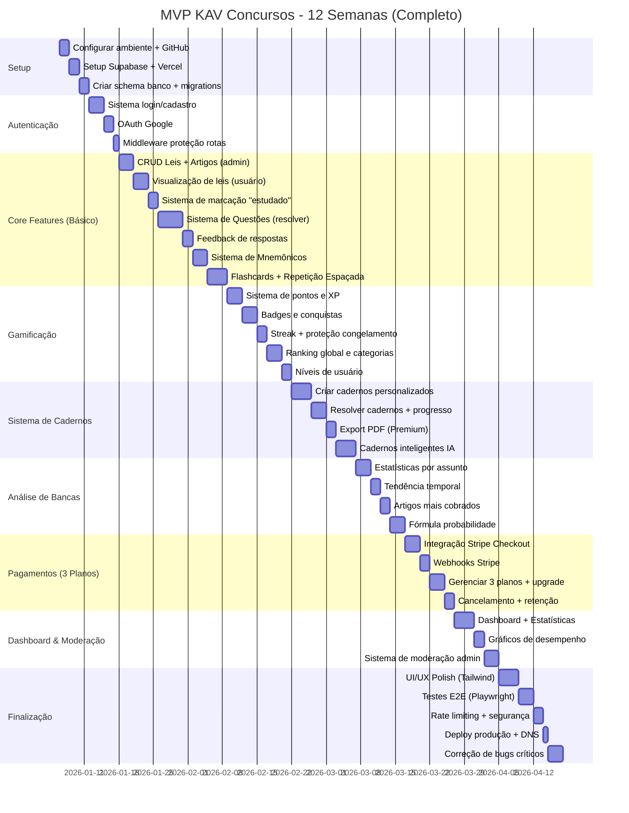

# Product Requirements Document (PRD) - KAV Concursos

**Versão:** 2.1 - **MVP EXPANDIDO** 🚀  
**Data:** 18/10/2025  
**Última Atualização:** 18/10/2025 - Revisão Estratégica de Questões  
**Autor:** Pedro  
**Status:** Em Desenvolvimento

> **🎯 CHANGELOG v2.1 (18/10/2025):**  
> 🔄 **MUDANÇA ESTRATÉGICA:** Removido sistema de questões avulsas  
> ✅ Sistema de Cadernos Personalizados como ÚNICO método de resolver questões  
> ✅ FREE: 2 cadernos ativos + 5 questões/dia  
> ✅ BÁSICO: 10 cadernos + questões ilimitadas + comentários comunidade/professor  
> ✅ PREMIUM: Cadernos ilimitados + cadernos IA + materiais extras + tudo do BÁSICO
>
> **🎯 CHANGELOG v2.0:**  
> ✅ MVP expandido de 8 para 12 semanas  
> ✅ Adicionados 3 planos (FREE, BÁSICO R$ 39,90, PREMIUM R$ 79,90)  
> ✅ Incluído Sistema de Gamificação completa (pontos, badges, ranking)  
> ✅ Incluído Sistema de Cadernos Personalizados + IA  
> ✅ Incluído Análise de Inteligência de Bancas  
> ✅ Projeções financeiras atualizadas com 3 planos  
> ✅ Cronograma detalhado com 11 milestones

---

## 📑 Índice

1. [Visão Geral do Produto](#1-visão-geral-do-produto)
2. [Objetivos e Metas](#2-objetivos-e-metas)
3. [Stakeholders](#3-stakeholders)
4. [Personas e Cenários de Uso](#4-personas-e-cenários-de-uso)
5. [Requisitos Funcionais](#5-requisitos-funcionais)
6. [Requisitos Não-Funcionais](#6-requisitos-não-funcionais)
7. [Escopo do MVP](#7-escopo-do-mvp)
8. [Estratégia de Validação](#8-estratégia-de-validação)
9. [Design e UX](#9-design-e-ux)
10. [Stack Tecnológica](#10-stack-tecnológica)
11. [Plano de Conteúdo Inicial](#11-plano-de-conteúdo-inicial)
12. [Cronograma de Desenvolvimento](#12-cronograma-de-desenvolvimento)
13. [Marketing e Go-to-Market](#13-marketing-e-go-to-market)
14. [Métricas e KPIs](#14-métricas-e-kpis)
15. [Orçamento e Projeções](#15-orçamento-e-projeções)
16. [Próximos Passos](#16-próximos-passos)
17. [Apêndices](#17-apêndices)

---

## 1. Visão Geral do Produto

### 1.1 Resumo Executivo

**Nome do Produto:** KAV Concursos  
**Tagline:** "Estude, Memorize, Aprove. A Lei Seca descomplicada para concursos públicos."  
**Categoria:** EdTech - SaaS de Preparação para Concursos Públicos  
**Status:** Pré-desenvolvimento (Planejamento)  
**Data Prevista MVP:** Abril 2026 (12 semanas de desenvolvimento - MVP Completo)  
**Investimento Inicial:** R$ 50/mês (GitHub Copilot apenas)

### 1.2 Propósito

Criar a **primeira plataforma integrada** que une:

- **Estudo de legislação literal** ("Lei Seca") com formatação didática
- **Técnicas mnemônicas validadas** por aprovados em concursos
- **Banco de questões especializado** em literalidade da lei
- **Análise estatística inteligente** de bancas e tendências

Oferecendo uma **experiência de aprendizado interativa, gamificada e baseada em dados** para candidatos a concursos públicos, especialmente carreiras policiais e militares.

### 1.3 Problema a Resolver

**Problema Principal:**  
Candidatos a concursos públicos enfrentam **três desafios simultâneos**:

1. **Memorização:** Dificuldade em decorar centenas de artigos literais de leis complexas
2. **Dispersão:** Materiais espalhados em múltiplas plataformas (PDFs de leis + plataforma de questões + grupos de mnemônicos no Telegram)
3. **Falta de Direcionamento:** Não sabem o que priorizar (quais artigos/leis caem mais em cada banca)

**Solução Atual do Mercado:**

- **QConcursos/TecConcursos:** Focam apenas em banco de questões, sem ensino da legislação
- **Decorando a Lei Seca (Instagram):** Materiais estáticos (PDFs/cards), sem interatividade
- **Cursinhos:** Videoaulas longas (10+ horas), sem técnicas mnemônicas validadas

**Nossa Solução:**  
Plataforma única que **integra os 3 pilares** (estudo + memorização + prática) com:

- Gamificação (badges, streaks, rankings)
- Repetição espaçada (algoritmo otimizado)
- **Inteligência de bancas** (análise estatística de o que cada banca cobra)

### 1.4 Oportunidade de Mercado

| Métrica                             | Valor                  | Fonte                |
| ----------------------------------- | ---------------------- | -------------------- |
| **Candidatos concursos Brasil/ano** | ~12 milhões            | IBGE 2024            |
| **Mercado EdTech Brasil**           | R$ 50 bilhões          | ABStartups 2025      |
| **Crescimento EdTech/ano**          | 18%                    | Research and Markets |
| **Ticket médio concurseiros**       | R$ 200-500/mês         | Pesquisa mercado     |
| **Concorrentes diretos**            | 0 (nicho não atendido) | Análise competitiva  |

**TAM (Total Addressable Market):**  
12 milhões candidatos × R$ 49,90/mês = **R$ 598,8 milhões/mês**

**SAM (Serviceable Addressable Market):**  
10% do TAM (carreiras policiais/militares) = **R$ 59,8 milhões/mês**

**SOM (Serviceable Obtainable Market):**  
0,5% do SAM (primeiros 3 anos) = **R$ 299 mil/mês** (6.000 assinantes)

**Diferencial Competitivo:**  
✅ Único produto que combina os 3 elementos (lei + mnemônicos + questões)  
✅ Inteligência de bancas (análise estatística inexistente no mercado)  
✅ Experiência gamificada e mobile-first  
✅ Custo-benefício (R$ 49,90 vs R$ 200-500 de cursinhos)

---

## 2. Objetivos e Metas

### 2.1 Objetivos de Negócio (OKRs - 12 meses)

**Objetivo 1: Validar Product-Market Fit**

- **KR1:** 1.000 usuários cadastrados nos primeiros 3 meses
- **KR2:** Taxa de conversão gratuito → pago ≥ 8%
- **KR3:** NPS ≥ 50 nos primeiros 6 meses
- **KR4:** Churn mensal < 15%

**Objetivo 2: Estabelecer Receita Recorrente**

- **KR1:** R$ 5.000 MRR até mês 3 (100 assinantes)
- **KR2:** R$ 20.000 MRR até mês 6 (400 assinantes)
- **KR3:** R$ 50.000 MRR até mês 12 (1.000 assinantes)
- **KR4:** CAC < 3x LTV

**Objetivo 3: Provar Eficácia Pedagógica**

- **KR1:** Melhoria de 25% na taxa de acerto em questões após 30 dias de uso
- **KR2:** 70% dos usuários completam pelo menos 1 lei completa
- **KR3:** 50+ depoimentos de aprovados usando a plataforma
- **KR4:** Tempo médio diário de estudo: 45+ minutos

### 2.2 Objetivos dos Usuários (Jobs to Be Done)

**Job Principal:**  
_"Quando estou estudando para concurso público, quero memorizar a legislação literal de forma eficiente, para aumentar minha pontuação em questões de Lei Seca sem gastar 10+ horas/dia estudando."_

**Jobs Secundários:**

1. Revisar artigos já estudados sem esquecer (repetição espaçada)
2. Praticar questões no mesmo lugar onde estudo a lei (integração)
3. Saber o que priorizar no estudo (análise de bancas)
4. Acompanhar meu progresso e identificar pontos fracos (dashboard)
5. Estudar em qualquer lugar e momento (mobile-friendly)

**Medidas de Sucesso:**

- ✅ Reduzir tempo de estudo da Lei Seca em 40%
- ✅ Aumentar taxa de acerto em questões literais em 30%
- ✅ Memorizar artigos-chave de forma permanente (retenção > 80% após 30 dias)

---

## 3. Stakeholders

### 3.1 Equipe Interna (Solo Founder + IA)

| Papel                | Responsável              | Responsabilidades                                 |
| -------------------- | ------------------------ | ------------------------------------------------- |
| **Product Owner**    | Pedro                    | Visão, priorização, decisões estratégicas, testes |
| **Developer**        | Pedro + GitHub Copilot   | Implementação técnica completa                    |
| **Designer**         | Pedro + v0.dev/Figma     | UI/UX, wireframes, protótipos                     |
| **Content Creator**  | Pedro + ChatGPT          | Mnemônicos, questões, artigos blog, copy          |
| **Marketer**         | Pedro + Canva/IA         | Conteúdo social, ads (futuro), SEO                |
| **Customer Support** | Pedro + Chatbot (futuro) | Atendimento, FAQ, tickets                         |

### 3.2 Stakeholders Externos

**Primários:**

- **Usuários Finais:** Candidatos a concursos (carreiras policiais/militares principalmente)
- **Beta Testers:** 50 usuários selecionados para validação MVP (primeiros 30 dias)

**Secundários:**

- **Micro-influencers:** Parceiros de divulgação orgânica (10-20k seguidores)
- **Professores:** Possíveis criadores de conteúdo exclusivo (fase 2)
- **Cursinhos:** Parcerias B2B white-label (fase 3)
- **Editoras Jurídicas:** Parcerias de conteúdo (fase 3)

---

## 4. Personas e Cenários de Uso

### 4.1 Persona Primária: Carlos - O Concurseiro Focado

**Demográfico:**

- **Idade:** 26 anos
- **Ocupação:** Trabalha meio período (entregador de aplicativo)
- **Localização:** Periferia de São Paulo
- **Renda:** R$ 2.000/mês
- **Educação:** Ensino superior incompleto (Direito - 4º semestre trancado)
- **Estado Civil:** Solteiro, mora com mãe e irmã

**Comportamento:**

- Estuda 4-6h/dia (noite após trabalho + fins de semana)
- Usa **smartphone 80%** do tempo (celular Samsung A54 melhor que notebook antigo)
- Segue 20+ perfis de concursos no Instagram (@decorealeiseca, @questoesconcursos)
- Já fez 5 concursos sem sucesso (PM-SP 2023, 2024; Guarda Civil; Bombeiros)
- Paga R$ 49,90/mês no QConcursos + R$ 0 em cursinhos (usa YouTube gratuito)
- Está há 18 meses estudando para PM-SP (próximo concurso: março 2026)

**Dores:**

- _"Erro muitas questões literais porque não consigo decorar os artigos"_ (taxa de acerto: 60%)
- _"Perco tempo buscando mnemônicos no Google e não sei se são confiáveis"_
- _"Fico desmotivado quando não vejo progresso"_ (sem dashboard visual)
- _"Não tenho dinheiro para pagar múltiplos cursos"_ (R$ 500/mês é inviável)
- _"Não sei se estou estudando as leis certas"_ (falta direcionamento)

**Ganhos Esperados:**

- Aumentar taxa de acerto de 60% → 85% em 3 meses
- Economizar 2h/dia estudando de forma mais eficiente
- Sentir-se confiante nas questões literais (segurança psicológica)
- Passar no concurso da PM-SP em março 2026

**Cenário de Uso Típico:**
21h30 - Carlos termina turno de trabalho
21h45 - Abre app no celular no ônibus (30 min trajeto)
→ Revisa 5 flashcards de mnemônicos pendentes
→ Resolve 10 questões de Direito Penal
→ Vê notificação: "Parabéns! 45 dias de streak 🔥"

22h15 - Chega em casa, estuda 2h no notebook
→ Lê CF/88 Art. 5º (Direitos Fundamentais) com mnemônicos destacados
→ Marca 15 artigos como "estudado"
→ Faz simulado de 30 questões cronometrado
→ Vê dashboard: "Você está 15% acima da média na comunidade!"

00h15 - Dorme motivado, app mostra: "Amanhã: revisar 8 artigos + 20 questões"

**Citação Real:**  
_"Se tivesse uma plataforma que juntasse tudo - a lei, os mnemônicos e as questões - no mesmo lugar, eu economizaria 1 hora por dia só de organização."_ - Carlos, em grupo de Telegram de concurseiros

---

### 4.2 Persona Secundária: Ana - A Servidora Buscando Progressão

**Demográfico:**

- **Idade:** 34 anos
- **Ocupação:** Técnica administrativa (TJ-SP, concursada desde 2018)
- **Localização:** Interior de São Paulo (Campinas)
- **Renda:** R$ 6.000/mês
- **Educação:** Bacharel em Direito (OAB aprovada)
- **Estado Civil:** Casada, 1 filho (6 anos)

**Comportamento:**

- Estuda 2h/dia (manhã antes do trabalho, 5h-7h)
- Usa **desktop** (trabalho) e **tablet** (casa)
- Prefere materiais organizados, profissionais e atualizados
- Já é aprovada, busca **promoção interna** (Analista Judiciário - Direito)
- Paga múltiplas assinaturas: Estratégia Concursos (R$ 149/mês), Gran Cursos (R$ 99/mês), QConcursos (R$ 79/mês)
- **Total gasto:** R$ 327/mês em educação

**Dores:**

- _"Tenho pouco tempo, preciso focar no que REALMENTE cai"_ (mãe + trabalho + estudo)
- _"Legislação muda muito, preciso estar sempre atualizada"_ (emendas constitucionais)
- _"Quero material sério, não 'aulinha de youtuber'"_ (busca qualidade profissional)
- _"Pago 3 plataformas e uso 30% de cada uma"_ (falta integração)

**Ganhos Esperados:**

- **Plataforma all-in-one** para cancelar 2 das 3 assinaturas (economia de R$ 200/mês)
- Atualizações automáticas de legislação (emendas, novas leis)
- Relatórios detalhados de desempenho (dashboard profissional)
- Aprovação em concurso de Analista Judiciário até dezembro 2026

**Cenário de Uso Típico:**
05h00 - Ana acorda, prepara café
05h30 - Abre plataforma no desktop
→ Dashboard mostra: "Recomendamos focar em Direito Constitucional esta semana (alta probabilidade TJ-SP)"
→ Estuda CF/88 Arts. 37-41 (Administração Pública)
→ Cria anotações personalizadas em cada artigo

05h00 - Ana acorda, prepara café
05h30 - Abre plataforma no desktop
→ Dashboard mostra: "Recomendamos focar em Direito Constitucional esta semana (alta probabilidade TJ-SP)"
→ Estuda CF/88 Arts. 37-41 (Administração Pública)
→ Cria anotações personalizadas em cada artigo

06h00 - Resolve caderno personalizado: "TJ-SP - Últimos 5 anos - Direito Administrativo"
→ 50 questões filtradas por banca e órgão
→ Lê comentários do professor em questões erradas (plano Básico)
→ Vê análise: "Seu ponto fraco: Licitações (45% acerto vs 72% comunidade)"
→ Cria novo caderno focado em licitações para revisar amanhã

07h00 - Prepara filho para escola, vai trabalhar
12h00 - Almoço: revisa 10 flashcards no celular (15 min)

**Citação Real:**  
_"Eu pagaria o dobro se tivesse uma plataforma que me dissesse exatamente o que estudar e quando, baseado no histórico da banca."_ - Ana, em pesquisa qualitativa

---

### 4.3 Persona Terciária (Futuro): Júlio - O Professor/Influencer

**Demográfico:**

- **Idade:** 42 anos
- **Ocupação:** Professor de Direito Penal (cursinho preparatório) + YouTuber
- **Localização:** Rio de Janeiro
- **Renda:** R$ 12.000/mês (cursinho + YouTube)
- **Educação:** Mestrado em Direito Penal
- **Seguidores:** 85k (Instagram) + 120k (YouTube)

**Caso de Uso:**

- **Fase 3** (pós-MVP): Parceria para criar conteúdo exclusivo na plataforma
- Grava videoaulas curtas explicando artigos complexos
- Cria mnemônicos validados profissionalmente
- Recebe % da receita de assinantes que vieram dele (programa de afiliados)

---

## 5. Requisitos Funcionais

### 5.1 Módulo de Autenticação e Gestão de Usuários

| ID        | Requisito                           | Prioridade      | Critérios de Aceitação                                                                                                                                                    |
| --------- | ----------------------------------- | --------------- | ------------------------------------------------------------------------------------------------------------------------------------------------------------------------- |
| **RF001** | Sistema de cadastro com email/senha | 🔴 Must Have    | - Validação de email (formato válido)<br>- Senha mínima 8 caracteres (1 maiúscula, 1 número)<br>- Email de confirmação obrigatório<br>- Mensagens de erro claras em PT-BR |
| **RF002** | Login com Google OAuth              | 🔴 Must Have    | - Redirect para Google<br>- Criar perfil automaticamente se não existir<br>- Sincronizar email e nome<br>- Avatar do Google                                               |
| **RF003** | Recuperação de senha                | 🟡 Should Have  | - Email com link expiração 24h<br>- Validação de nova senha<br>- Confirmação de senha alterada                                                                            |
| **RF004** | Edição de perfil                    | 🟢 Nice to Have | - Alterar nome, foto, concurso alvo<br>- Definir metas diárias (questões, tempo)<br>- Preferências de notificação                                                         |
| **RF005** | Deleção de conta (LGPD)             | 🟡 Should Have  | - Confirmação dupla ("Digite 'DELETAR' para confirmar")<br>- Exportar dados antes (JSON/CSV)<br>- Remover de Stripe<br>- Email de confirmação da deleção                  |

---

### 5.2 Módulo de Biblioteca de Leis

| ID        | Requisito                     | Prioridade      | Critérios de Aceitação                                                                                                                                                                                                                  |
| --------- | ----------------------------- | --------------- | --------------------------------------------------------------------------------------------------------------------------------------------------------------------------------------------------------------------------------------- |
| **RF006** | Listar disciplinas e leis     | 🔴 Must Have    | - Organização hierárquica: Disciplina → Lei → Capítulos<br>- Busca por nome/sigla (autocomplete)<br>- Badge "Mais Cobradas" nas top 5<br>- Contador de artigos por lei                                                                  |
| **RF007** | Visualizar lei completa       | 🔴 Must Have    | - Índice navegável (jump to artigo com smooth scroll)<br>- Texto formatado (negrito em palavras-chave, parágrafos numerados)<br>- Destaque visual artigos importantes (cor diferente)<br>- Breadcrumb: Home > Disciplina > Lei > Artigo |
| **RF008** | Marcar artigo como "Estudado" | 🔴 Must Have    | - Checkbox persistente (salvar no banco)<br>- Atualizar progresso automaticamente<br>- Exibir % conclusão da lei (ex: "45/250 artigos - 18%")<br>- Gráfico visual de progresso                                                          |
| **RF009** | Sistema de favoritos          | 🟡 Should Have  | - Ícone de estrela clicável em cada artigo<br>- Página "Meus Favoritos" com listagem<br>- Filtro por disciplina<br>- Remover favoritas em lote                                                                                          |
| **RF010** | Notas pessoais em artigos     | 🟢 Nice to Have | - Editor rich text (negrito, itálico, lista)<br>- Privado por usuário (não compartilhado)<br>- Busca em notas<br>- Exportar notas em PDF                                                                                                |
| **RF011** | Áudio narrado do artigo       | 🟢 Nice to Have | - Text-to-Speech (Google TTS ou similar)<br>- Play/pause/stop<br>- Velocidade ajustável (0.75x, 1x, 1.25x, 1.5x)<br>- Download de áudio (MP3)                                                                                           |

---

### 5.3 Módulo de Cadernos e Questões

> **⚠️ IMPORTANTE:** Sistema de questões avulsas foi **REMOVIDO**. Todas as questões são resolvidas **EXCLUSIVAMENTE através de Cadernos Personalizados**.

| ID        | Requisito                          | Prioridade     | Critérios de Aceitação                                                                                                                                                                                                                                                                           |
| --------- | ---------------------------------- | -------------- | ------------------------------------------------------------------------------------------------------------------------------------------------------------------------------------------------------------------------------------------------------------------------------------------------ |
| **RF012** | Sistema de cadernos personalizados | 🔴 Must Have   | - Criar caderno com nome + descrição<br>- Aplicar filtros: disciplina, banca, ano, órgão, dificuldade<br>- Preview de questões antes de criar<br>- Organizar em pastas (GERAL, PM-SP, PF, etc.)<br>- Limites por plano (ver RF031)<br>- Editar/deletar cadernos                                  |
| **RF013** | Resolver questões do caderno       | 🔴 Must Have   | - Exibir enunciado + 5 alternativas (A-E)<br>- Radio buttons para seleção<br>- Botão "Responder" desabilitado até selecionar<br>- Timer opcional (exibir tempo gasto)<br>- Navegação: anterior/próxima questão<br>- Progresso: "5/30 questões"                                                   |
| **RF014** | Feedback imediato após responder   | 🔴 Must Have   | - Verde se correto, vermelho se errado<br>- Mostrar gabarito correto destacado<br>- Exibir explicação oficial<br>- Link direto para artigo relacionado da lei<br>- Sugestão de mnemônico (se existir)<br>- Estatística: "72% acertaram esta questão"                                             |
| **RF015** | Comentários nas questões           | 🔴 Must Have   | - **FREE:** Sem acesso a comentários<br>- **BÁSICO:** Ver comentários da comunidade + comentário do professor<br>- **PREMIUM:** Tudo do BÁSICO + pode comentar<br>- Sistema de votação (upvote/downvote)<br>- Moderação comunitária (reportar spam)<br>- Filtrar por "Mais úteis"                |
| **RF016** | Materiais extras da questão        | 🔴 Must Have   | - **FREE:** Sem acesso<br>- **BÁSICO:** Sem acesso<br>- **PREMIUM:** Vídeo-aulas relacionadas, PDFs de resumo, links externos<br>- Badge "Material Extra" visível para todos (teaser)                                                                                                            |
| **RF017** | Filtros avançados de questões      | 🔴 Must Have   | - Por disciplina (múltipla seleção)<br>- Por lei específica<br>- Por banca (CESPE, FCC, VUNESP, etc.)<br>- Por ano (range slider ou checkboxes)<br>- Por órgão (PM-SP, PRF, PF, etc.)<br>- Por dificuldade (fácil/médio/difícil)<br>- Somente não respondidas<br>- Somente erradas anteriormente |
| **RF018** | Simulados cronometrados            | 🟡 Should Have | - Criar caderno em "Modo Simulado"<br>- Timer visível e decrescente<br>- Não permitir voltar questão (modo prova real)<br>- Finalização automática ao terminar tempo<br>- Relatório final: tempo total, acertos, nota, comparação com comunidade                                                 |
| **RF019** | Estatística da questão             | � Must Have    | - Exibir "X% acertaram" (taxa de acerto geral)<br>- Dificuldade calculada automaticamente<br>- Quantidade de respostas<br>- Gráfico de distribuição de respostas<br>- Seu histórico nesta questão (se já respondeu antes)                                                                        |
| **RF020** | Progresso do caderno               | 🔴 Must Have   | - Barra visual de progresso<br>- Salvar estado: pode pausar e continuar depois<br>- Marcar caderno como "Concluído"<br>- Calcular taxa de acerto final<br>- Gerar relatório de desempenho                                                                                                        |
| **RF021** | Cadernos inteligentes (Premium)    | 🟡 Should Have | - IA analisa seu desempenho + estatísticas da banca<br>- Cria caderno personalizado com pontos fracos<br>- Prioriza artigos com alta probabilidade de cobrança<br>- Adapta dificuldade dinamicamente                                                                                             |

---

### 5.4 Módulo de Mnemônicos e Flashcards

| ID        | Requisito                        | Prioridade     | Critérios de Aceitação                                                                                                                                                                                                                                                   |
| --------- | -------------------------------- | -------------- | ------------------------------------------------------------------------------------------------------------------------------------------------------------------------------------------------------------------------------------------------------------------------ |
| **RF019** | Visualizar mnemônicos por artigo | 🔴 Must Have   | - Listar ordenado por votos (mais úteis primeiro)<br>- Badge "Validado" (mnemônico aprovado por moderador)<br>- Autor e data de criação<br>- Sistema de votação (útil/não útil)                                                                                          |
| **RF020** | Criar mnemônico                  | 🔴 Must Have   | - Campo texto (min 10 chars, max 500)<br>- Associar a artigo específico<br>- Validação anti-spam (max 5 por dia por usuário)<br>- Preview antes de publicar                                                                                                              |
| **RF021** | Sistema de votação de mnemônicos | 🔴 Must Have   | - Botões "👍 Útil" / "👎 Não útil"<br>- 1 voto por usuário por mnemônico<br>- Atualizar score em tempo real<br>- Badge especial para autor de mnemônicos com +100 votos                                                                                                  |
| **RF022** | Flashcards com flip animation    | 🔴 Must Have   | - **Frente:** Artigo da lei (ex: "CF Art. 5º, LXXVIII")<br>- **Verso:** Mnemônico<br>- Animação smooth ao clicar (CSS flip 3D)<br>- Navegação: próximo/anterior<br>- Progresso: "5/20 flashcards"                                                                        |
| **RF023** | Sistema de repetição espaçada    | 🔴 Must Have   | - Algoritmo: SM-2 (SuperMemo 2)<br>- Botões após revisar: "Difícil" (1d), "Médio" (3d), "Fácil" (7d), "Muito Fácil" (15d)<br>- Calcular próxima revisão automaticamente<br>- Notificar quando houver revisões pendentes<br>- Dashboard: "5 flashcards para revisar hoje" |
| **RF024** | Buscar mnemônicos                | 🟡 Should Have | - Por palavra-chave<br>- Por lei/artigo<br>- Por autor<br>- Por tag (se implementado sistema de tags)                                                                                                                                                                    |

---

### 5.5 Módulo de Dashboard e Estatísticas

| ID        | Requisito                      | Prioridade      | Critérios de Aceitação                                                                                                                                                                                                                                                                                                                 |
| --------- | ------------------------------ | --------------- | -------------------------------------------------------------------------------------------------------------------------------------------------------------------------------------------------------------------------------------------------------------------------------------------------------------------------------------- |
| **RF025** | Dashboard principal            | 🔴 Must Have    | - **Cards de métricas:**<br> • Total questões respondidas (hoje/semana/total)<br> • Taxa de acerto geral (%)<br> • Leis em progresso (lista com %)<br> • Streak de dias consecutivos 🔥<br> • Revisões pendentes hoje<br>- **Gráficos:**<br> • Evolução de acertos ao longo do tempo (linha)<br> • Distribuição por disciplina (pizza) |
| **RF026** | Estatísticas por disciplina    | 🔴 Must Have    | - Gráfico de barras: desempenho por matéria<br>- Identificar pontos fracos (abaixo de 70%)<br>- Sugestões automáticas: "Revisar Direito Penal (52% acerto)"<br>- Comparação com média da comunidade                                                                                                                                    |
| **RF027** | Gráfico de evolução temporal   | 🟡 Should Have  | - Linha do tempo: questões/dia últimos 30 dias<br>- Taxa de acerto ao longo do tempo<br>- Marcar eventos importantes (ex: "Simulado 1")<br>- Exportar gráfico (PNG)                                                                                                                                                                    |
| **RF028** | Relatório de simulados         | 🟡 Should Have  | - Histórico completo de simulados<br>- Comparação de desempenho entre simulados<br>- Identificar assuntos mais errados<br>- Exportar PDF com análise detalhada                                                                                                                                                                         |
| **RF029** | Sistema de conquistas (badges) | 🟡 Should Have  | - Desbloqueio automático ao atingir metas<br>- Exemplos: "100 questões", "Streak 30 dias", "Lei completa"<br>- Notificação visual com animação<br>- Galeria de badges no perfil<br>- Compartilhar badge nas redes sociais                                                                                                              |
| **RF030** | Ranking entre usuários         | 🟢 Nice to Have | - Semanal/mensal<br>- Filtrar por concurso alvo (PM-SP, PRF, etc.)<br>- Privacidade: opt-in (usuário escolhe participar)<br>- Exibir top 10 + posição do usuário                                                                                                                                                                       |

---

### 5.6 Módulo de Assinaturas e Pagamentos

| ID        | Requisito                    | Prioridade     | Critérios de Aceitação                                                                                                                                                                                                                                                                                                                                 |
| --------- | ---------------------------- | -------------- | ------------------------------------------------------------------------------------------------------------------------------------------------------------------------------------------------------------------------------------------------------------------------------------------------------------------------------------------------------ |
| **RF031** | Plano FREE com limites       | 🔴 Must Have   | - **Limites:**<br> • 2 cadernos ativos simultaneamente<br> • 5 questões/dia (reset 00:00 BRT)<br> • Sem acesso a comentários (comunidade/professor)<br> • Sem acesso a materiais extras<br> • Ver apenas top 3 mnemônicos por artigo<br> • Flashcards limitados (10 ativos)<br>- Paywall quando exceder limites<br>- Botão "Upgrade" destacado         |
| **RF032** | Plano BÁSICO (R$ 39,90/mês)  | 🔴 Must Have   | - **Recursos:**<br> • 10 cadernos ativos<br> • Questões ilimitadas<br> • ✅ Acesso a comentários da comunidade<br> • ✅ Acesso a comentários do professor<br> • ❌ SEM materiais extras (vídeos, PDFs)<br> • Mnemônicos ilimitados<br> • Flashcards ilimitados<br> • Análise de bancas básica<br>- Stripe Checkout para pagamento                      |
| **RF033** | Plano PREMIUM (R$ 79,90/mês) | 🔴 Must Have   | - **Recursos:**<br> • Cadernos ilimitados<br> • Questões ilimitadas<br> • ✅ Comentários comunidade + professor<br> • ✅ Materiais extras (vídeo-aulas, PDFs, links)<br> • ✅ Cadernos inteligentes criados por IA<br> • ✅ Exportar cadernos em PDF<br> • ✅ Análise avançada de bancas<br> • ✅ Estatísticas detalhadas<br> • ✅ Suporte prioritário |
| **RF034** | Checkout Stripe              | 🔴 Must Have   | - Redirect para Stripe Checkout (hosted page)<br>- Suporte a cartão de crédito/débito<br>- Processar pagamento via webhook<br>- Atualizar plano do usuário automaticamente<br>- Email de confirmação de assinatura                                                                                                                                     |
| **RF035** | Gerenciar assinatura         | 🔴 Must Have   | - Ver dados da assinatura (plano atual, próxima cobrança, valor)<br>- Cancelar a qualquer momento (self-service)<br>- Trocar plano (upgrade/downgrade com proration)<br>- Reativar assinatura cancelada                                                                                                                                                |
| **RF036** | Histórico de pagamentos      | 🟡 Should Have | - Listar todas as faturas<br>- Download de recibos (PDF)<br>- Status de cada pagamento (pago, pendente, falhou)<br>- Reenviar fatura por email                                                                                                                                                                                                         |
| **RF037** | Cupons de desconto           | 🟡 Should Have | - Aplicar código no checkout<br>- Validar cupom (existe, não expirou, não foi usado)<br>- Desconto % ou valor fixo<br>- Limitar uso (ex: "Válido para primeiros 100 usuários")                                                                                                                                                                         |

---

### 5.7 Módulo de Administração (Admin)

| ID        | Requisito                   | Prioridade     | Critérios de Aceitação                                                                                                                                                                                                                                                                    |
| --------- | --------------------------- | -------------- | ----------------------------------------------------------------------------------------------------------------------------------------------------------------------------------------------------------------------------------------------------------------------------------------- |
| **RF038** | CRUD de leis e artigos      | 🔴 Must Have   | - Criar, editar, deletar leis<br>- Adicionar artigos em lote (importar CSV/JSON)<br>- Marcar artigos "Mais Cobrados"<br>- Validação: campos obrigatórios, limites de caracteres                                                                                                           |
| **RF039** | CRUD de questões            | 🔴 Must Have   | - Form completo: enunciado + 5 alternativas + gabarito + explicação<br>- Associar a artigo (autocomplete)<br>- Tags: banca, ano, órgão, dificuldade<br>- Preview antes de publicar<br>- Adicionar comentário do professor (texto markdown)<br>- Upload de materiais extras (vídeos, PDFs) |
| **RF040** | Aprovar/reprovar mnemônicos | 🔴 Must Have   | - Fila de moderação (somente não validados)<br>- Botões: "Aprovar", "Reprovar", "Editar"<br>- Marcar como "Validado" (badge verde)<br>- Deletar spam/conteúdo inadequado                                                                                                                  |
| **RF041** | Moderar comentários         | 🔴 Must Have   | - Fila de comentários reportados<br>- Deletar comentários inadequados<br>- Banir usuários por spam/abuso<br>- Responder como "Professor" (badge especial)                                                                                                                                 |
| **RF042** | Dashboard admin             | 🟡 Should Have | - **Métricas:**<br> • Total usuários (free/básico/premium)<br> • Receita MRR<br> • Conteúdo pendente moderação<br> • Taxa de conversão<br> • Churn mensal<br> • Questões mais erradas<br> • Comentários com mais reports                                                                  |

---

### 5.8 Sistema de Inteligência de Bancas (Diferencial Competitivo)

| ID        | Requisito                            | Prioridade     | Critérios de Aceitação                                                                                                                                                                                                                                                                                                                       |
| --------- | ------------------------------------ | -------------- | -------------------------------------------------------------------------------------------------------------------------------------------------------------------------------------------------------------------------------------------------------------------------------------------------------------------------------------------- |
| **RF043** | Índice hierárquico com estatísticas  | 🔴 Must Have   | - Exibir disciplina → assuntos → subassuntos<br>- Contador de questões em cada nível<br>- Percentual do total (ex: "155 (28.65%)")<br>- Ordenação: Índice, Relevância, Pontos Fracos<br>- Expansível/colapsável (accordion)                                                                                                                  |
| **RF044** | Filtros com preview de estatísticas  | 🔴 Must Have   | - Ao selecionar filtros para criar caderno, exibir:<br> • Total de questões encontradas<br> • Distribuição por assunto (gráfico barras)<br> • Dificuldade média estimada<br> • Comparação seu desempenho vs comunidade<br> • Tempo médio de resolução                                                                                        |
| **RF045** | Análise de incidência por banca      | 🔴 Must Have   | - Dashboard: Banca + Disciplina<br>- Mostrar:<br> • Assuntos mais cobrados (top 10 com %)<br> • Artigos "queridinhos" da banca<br> • Tendência temporal (crescente/estável/decrescente)<br> • Probabilidade de cair na próxima prova (0-100%)<br>- **FREE:** Ver top 3 apenas<br>- **BÁSICO:** Ver top 10<br>- **PREMIUM:** Análise completa |
| **RF046** | Recomendações inteligentes (Premium) | 🔴 Must Have   | - Algoritmo que cruza:<br> • Seu histórico de respostas<br> • Estatísticas da banca do seu concurso alvo<br> • Edital (quando disponível)<br>- Sugestões:<br> • "Foque em X (alta probabilidade + você está abaixo da média)"<br> • "Revisar Y (você domina, mas não revisa há 30 dias)"<br>- Gera cadernos inteligentes automaticamente     |
| **RF047** | Heatmap de artigos cobrados          | 🟡 Should Have | - Visualização colorida: verde (muito cobrado) → vermelho (pouco)<br>- Por banca<br>- Top 10 artigos mais cobrados com contador<br>- **PREMIUM apenas**                                                                                                                                                                                      |
| **RF048** | Comparador de bancas (Premium)       | 🟡 Should Have | - Tabela comparativa:<br> • Banca A vs Banca B no mesmo assunto<br> • Dificuldade, artigo mais cobrado, estilo (literal/interpretativa)<br>- Insights: "CESPE foca em literalidade (80%)"                                                                                                                                                    |

---

## 6. Requisitos Não-Funcionais

### 6.1 Performance

| ID         | Requisito                    | Especificação                                 | Métrica de Sucesso             |
| ---------- | ---------------------------- | --------------------------------------------- | ------------------------------ |
| **RNF001** | Tempo de carregamento página | First Contentful Paint < 1.5s                 | Lighthouse Score > 90          |
| **RNF002** | Tempo resposta API           | p95 < 500ms                                   | Monitorar com Vercel Analytics |
| **RNF003** | Suporte usuários simultâneos | 1.000 usuários concorrentes sem degradação    | Load test com k6 ou Artillery  |
| **RNF004** | Bundle JavaScript            | < 200 KB (gzipped)                            | Next.js Bundle Analyzer        |
| **RNF005** | Imagens otimizadas           | Lazy loading + WebP + dimensionamento correto | Next.js Image component        |

### 6.2 Usabilidade

| ID         | Requisito                   | Especificação                                                                 |
| ---------- | --------------------------- | ----------------------------------------------------------------------------- |
| **RNF006** | Responsividade              | Mobile-first, funcional em 320px+ (iPhone SE) até 2560px (desktop 4K)         |
| **RNF007** | Acessibilidade              | WCAG 2.1 nível AA (contraste, navegação teclado, ARIA labels, screen readers) |
| **RNF008** | Navegação intuitiva         | Usuário consegue resolver 1ª questão em < 2 minutos sem tutorial              |
| **RNF009** | Compatibilidade navegadores | Chrome, Firefox, Safari, Edge (últimas 2 versões)                             |
| **RNF010** | PWA                         | Funcionar offline (service worker), instalável, push notifications            |

### 6.3 Segurança

| ID         | Requisito          | Especificação                                                       |
| ---------- | ------------------ | ------------------------------------------------------------------- |
| **RNF011** | Autenticação       | JWT tokens (Supabase Auth) com expiração 7 dias, refresh automático |
| **RNF012** | Senhas             | Hash bcrypt (salt rounds: 10), NUNCA armazenar plain text           |
| **RNF013** | HTTPS obrigatório  | SSL/TLS 1.3, HSTS habilitado, certificado válido                    |
| **RNF014** | Proteção CSRF      | Tokens CSRF em forms, SameSite cookies                              |
| **RNF015** | Rate limiting      | 100 requests/min por IP, 1000/hora por usuário autenticado          |
| **RNF016** | SQL Injection      | Usar prepared statements (Supabase RLS), NUNCA raw queries          |
| **RNF017** | XSS Protection     | Sanitizar inputs (DOMPurify), Content-Security-Policy headers       |
| **RNF018** | Validação de input | Zod schemas em TODAS as APIs, nunca confiar no frontend             |

### 6.4 Confiabilidade

| ID         | Requisito                | Especificação                                                             |
| ---------- | ------------------------ | ------------------------------------------------------------------------- |
| **RNF019** | Disponibilidade (uptime) | 99.5% (permitir ~3.6h downtime/mês, SLA Vercel + Supabase)                |
| **RNF020** | Backup de dados          | Supabase backup automático diário, retenção 7 dias (ponto de restauração) |
| **RNF021** | Recuperação de falhas    | RTO: 2 horas, RPO: 24 horas                                               |
| **RNF022** | Monitoramento            | Logs de erro (Sentry), alertas uptime (UptimeRobot ou similar)            |

### 6.5 Escalabilidade

| ID         | Requisito             | Especificação                                                              |
| ---------- | --------------------- | -------------------------------------------------------------------------- |
| **RNF023** | Database scaling      | Supabase Free: 500MB (MVP até ~5k usuários), migrar para Pro se necessário |
| **RNF024** | CDN para assets       | Vercel Edge Network, cache estático 365 dias                               |
| **RNF025** | Serverless functions  | Escala automática (Vercel), cold start < 1s                                |
| **RNF026** | Otimização de queries | Índices no banco, N+1 query prevention, React Query cache                  |

### 6.6 Legal e Compliance

| ID         | Requisito               | Especificação                                                                   |
| ---------- | ----------------------- | ------------------------------------------------------------------------------- |
| **RNF027** | LGPD                    | Coletar apenas dados essenciais, permitir exportação/deleção, consent explícito |
| **RNF028** | Termos de Uso           | Aceite obrigatório no cadastro, versionamento, notificar mudanças importantes   |
| **RNF029** | Política de Privacidade | Documento claro sobre uso de dados, cookies, terceiros (Stripe, Google)         |
| **RNF030** | Direitos autorais       | Questões de concursos públicos (domínio público após edital), citar fonte       |
| **RNF031** | Política de reembolso   | 7 dias de garantia (Lei do Consumidor CDC Art. 49)                              |

---

## 7. Escopo do MVP

### 7.1 IN SCOPE (8 Semanas de Desenvolvimento)

**✅ Funcionalidades Essenciais:**

**Autenticação:**

- [x] Cadastro com email/senha
- [x] Login com Google OAuth
- [x] Recuperação de senha
- [x] Middleware de proteção de rotas

**Biblioteca de Leis:**

- [x] 3 leis completas (CF/88, CP, CPP)
- [x] ~500 artigos selecionados (mais cobrados)
- [x] Visualização com destaque de artigos importantes
- [x] Sistema de marcação "estudado"
- [x] Índice navegável

**Questões e Cadernos:**

- [x] **Sistema de Cadernos Personalizados** (ÚNICO método de resolver questões)
- [x] 300 questões de múltipla escolha distribuídas em cadernos
- [x] Criar caderno com filtros avançados (disciplina, banca, ano, órgão, dificuldade)
- [x] Preview de estatísticas antes de criar caderno
- [x] Sistema de resposta com feedback imediato
- [x] Progresso salvo automaticamente (pode pausar e continuar)
- [x] Limites por plano:
  - FREE: 2 cadernos ativos + 5 questões/dia
  - BÁSICO: 10 cadernos + questões ilimitadas
  - PREMIUM: Cadernos ilimitados + cadernos IA
- [x] Comentários da comunidade + professor (BÁSICO e PREMIUM)
- [x] Materiais extras (vídeos, PDFs) - PREMIUM apenas
- [x] Estatísticas por questão (taxa de acerto geral, distribuição)
- [x] Modo simulado cronometrado (opcional)
- [x] Relatório de desempenho ao concluir caderno
- [x] Exportar cadernos em PDF (PREMIUM)

**Mnemônicos:**

- [x] 50 mnemônicos validados manualmente
- [x] Sistema de visualização por artigo
- [x] Sistema de votação (útil/não útil)
- [x] Criar mnemônico (usuários)

**Flashcards:**

- [x] Sistema de flashcards com flip animation
- [x] Repetição espaçada básica (1d, 3d, 7d)
- [x] Notificação de revisões pendentes

**Dashboard:**

- [x] Métricas básicas (questões respondidas, taxa de acerto)
- [x] Progresso em leis (%)
- [x] Streak de dias consecutivos

**Gamificação:**

- [x] Sistema de pontos (responder questões, criar mnemônicos, streak, concluir cadernos)
- [x] Badges e conquistas (Primeira Questão, Caderno Completo, Aprovado Virtual, Mestre da Lei)
- [x] Streak de dias consecutivos com proteção de congelamento (Premium)
- [x] Ranking global e por categoria (semanal/mensal/all-time)
- [x] Níveis de usuário (Iniciante → Especialista → Mestre)
- [x] Pontuação extra por concluir caderno com 100% acerto

**Sistema de Cadernos (Detalhamento):**

- [x] Criar/editar/deletar cadernos personalizados
- [x] Filtros avançados: disciplina, lei específica, banca, ano, órgão, dificuldade
- [x] Organizar em pastas/tags (GERAL, PM-SP, PF, TJ-SP, etc)
- [x] Preview estatísticas: total questões, distribuição por assunto, dificuldade média
- [x] Limites por plano (FREE: 2, BÁSICO: 10, PREMIUM: ilimitado)
- [x] Resolver com progresso salvo (pausar e continuar)
- [x] Marcar caderno como "Concluído"
- [x] Modo simulado com timer decrescente (opcional)
- [x] Filtrar apenas questões não respondidas ou apenas erradas
- [x] Exportar caderno em PDF com gabaritos (Premium)
- [x] Cadernos inteligentes com IA (Premium) - analisa pontos fracos + estatísticas de banca
- [x] Duplicar caderno existente
- [x] Compartilhar caderno com comunidade (Premium)

**Análise de Bancas:**

- [x] Estatísticas de incidência por assunto
  - FREE: Ver top 3 apenas
  - BÁSICO: Ver top 10
  - PREMIUM: Análise completa + heatmap + comparador
- [x] Tendência temporal (últimos 2 anos vs 5 anos)
- [x] Artigos mais cobrados por banca
- [x] Fórmula de probabilidade de cobrança (incidência + frequência + tendência + relevância)
- [x] Atualização automática a cada 50 novas questões
- [x] Dashboard interativo com filtros por banca/disciplina

**Pagamentos:**

- [x] Plano FREE (2 cadernos, 5 questões/dia, sem comentários, sem materiais extras)
- [x] Plano BÁSICO (R$ 39,90/mês - 10 cadernos, questões ilimitadas, comentários comunidade/professor)
- [x] Plano PREMIUM (R$ 79,90/mês - cadernos ilimitados, cadernos IA, materiais extras, análise avançada)
- [x] Checkout Stripe com múltiplos planos
- [x] Webhook para atualizar assinatura
- [x] Cancelamento self-service com oferta de retenção (20% desconto)
- [x] Upgrade/downgrade de planos com proration
- [x] Trial de 7 dias (BÁSICO) ou 14 dias (PREMIUM)

**Moderação:**

- [x] Sistema de validação de mnemônicos (admin)
- [x] Sistema de moderação de comentários (reportar spam/abuso)
- [x] Fila de moderação com critérios de aprovação
- [x] Relatório de conteúdo impróprio
- [x] Dashboard de moderação com métricas
- [x] Adicionar comentário do professor em questões (admin)
- [x] Upload de materiais extras (vídeos, PDFs) por questão (admin)

**Infraestrutura:**

- [x] Deploy na Vercel
- [x] Banco Supabase (PostgreSQL + RLS)
- [x] Responsivo mobile-first
- [x] PWA básico (instalável)
- [x] Rate limiting e proteção contra abuso
- [x] Logs e monitoramento (Sentry)

---

### 7.2 OUT OF SCOPE (Roadmap Pós-MVP)

**❌ Funcionalidades Adiadas para Versões Futuras:**

**Fase 2 (Mês 4-6):**

- Mapas mentais interativos
- Plano de estudos personalizado com IA + cronograma adaptativo
- Simulados cronometrados avançados com ranking
- Geração de mnemônicos via IA (GPT-4)
- Sistema de recompensas e moeda virtual

**Fase 3 (Mês 7-9):**

- Comunidade/Fórum de discussão
- Comentários em questões
- Recomendações inteligentes personalizadas com ML
- Videoaulas curtas integradas
- Integração com editais em tempo real
- Certificados de conclusão
- Sistema de afiliados

**Fase 4 (Ano 2):**

- Aplicativo nativo (iOS/Android com React Native)
- Videoaulas curtas por professores
- API pública para integrações
- White-label para cursinhos (B2B)
- Marketplace de conteúdo (professores vendem material)

---

### 7.3 Métricas de Sucesso do MVP

**Validação Product-Market Fit:**

- ✅ 50 beta testers nos primeiros 15 dias
- ✅ 10 assinantes pagos no primeiro mês (R$ 400 MRR)
- ✅ Taxa de conversão ≥ 5% (free → paid)
- ✅ NPS ≥ 40
- ✅ Tempo médio na plataforma > 20 min/sessão
- ✅ Retention D7 ≥ 25% (voltam após 7 dias)
- ✅ Nenhum bug crítico (P0) em produção

**Critérios de Pivô:**
Se após 2 meses de MVP:

- Taxa de conversão < 3%
- Churn mensal > 30%
- NPS < 20
- Tempo médio uso < 10 min/sessão

**Então:** Reavaliar proposta de valor, fazer entrevistas com usuários, pivotar features.

---

## 8. Estratégia de Validação

### 8.1 Métricas Pirate (AARRR)

**Acquisition (Aquisição):**

- Visitantes únicos landing page: 500/mês (Mês 1-3)
- Cadastros: 100/mês (taxa conversão 20% do tráfego)
- Custo por aquisição (CAC): R$ 0 (orgânico no MVP)
- Fontes: Instagram, TikTok, grupos Telegram/WhatsApp

**Activation (Ativação):**

- Usuário responde 1ª questão: 70% dos cadastrados
- Usuário marca 1º artigo como estudado: 50%
- Usuário cria 1º flashcard: 30%
- Tempo até primeira ação: < 5 minutos (onboarding eficaz)

**Retention (Retenção):**

- D1 (retornam dia seguinte): 40%
- D7 (retornam após 7 dias): 25%
- D30 (retornam após 30 dias): 15%
- Frequência ideal: 4+ sessões/semana (usuário engajado)

**Revenue (Receita):**

- Taxa conversão free → paid: 8% (meta conservadora)
- MRR mês 1: R$ 400 (10 assinantes × R$ 39,90)
- MRR mês 3: R$ 2.000 (50 assinantes)
- MRR mês 6: R$ 8.000 (200 assinantes)
- Churn mensal: < 15%
- LTV (Lifetime Value): R$ 400 (10 meses de média)
- CAC (futuro com ads): < R$ 130 (LTV/CAC ratio > 3)

**Referral (Indicação):**

- % usuários que indicam: 10%
- Viral coefficient (K): 0.3 (cada usuário traz 0.3 novos)
- Sistema de referral: "Indique 3 amigos, ganhe 1 mês grátis"

---

### 8.2 Testes de Validação Pré-Lançamento

**Semana -4: Landing Page + Lista de Espera**

- **Hipótese:** "Concurseiros têm interesse em plataforma integrada Lei Seca"
- **Métrica sucesso:** 200 emails em 2 semanas
- **Validação:** Se ≥ 200 emails, desenvolver MVP. Se < 100, reavaliar proposta.
- **Landing Page:**
  - Headline: "Pare de Perder Pontos em Lei Seca. Estude, Memorize, Aprove."
  - Vídeo explicativo: 60 segundos
  - CTA: "Entrar na Lista VIP (50% OFF no lançamento)"

**Semana -2: Protótipo Figma**

- **Hipótese:** "Interface é intuitiva para público-alvo"
- **Teste:** 5 entrevistas de usuários (task analysis)
- **Tarefas:**
  1. "Encontre o Art. 121 do CP"
  2. "Resolva 1 questão"
  3. "Adicione um mnemônico"
- **Métrica sucesso:** 80% completam sem ajuda

**Semana 0-2: Beta Fechado (10 usuários)**

- **Hipótese:** "Usuários conseguem estudar e ver valor"
- **Métrica sucesso:** 60% usam 3+ vezes na primeira semana
- **Feedback qualitativo:** Entrevistas 30min (Google Meet)
- **Perguntas:**
  - "O que você mais gostou?"
  - "O que faltou?"
  - "Você pagaria R$ 49,90/mês? Por quê?"

**Semana 3-4: Beta Aberto (50 usuários)**

- **Hipótese:** "Plataforma é estável e funcional"
- **Métrica sucesso:** 0 bugs críticos (P0), uptime > 98%
- **NPS:** ≥ 40 (pergunta: "Recomendaria a um amigo?")
- **Coleta feedback:** Formulário in-app + intercom

---

### 8.3 Testes A/B (Pós-Lançamento)

**Teste 1: Onboarding**

- **Variante A:** Onboarding com tutorial interativo (4 steps)
- **Variante B:** Sem tutorial, direto ao dashboard
- **Métrica:** Taxa de ativação (resolver 1ª questão)
- **Hipótese:** Tutorial aumenta ativação em 15%

**Teste 2: Pricing**

- **Variante A:** R$ 39,90/mês
- **Variante B:** R$ 49,90/mês
- **Métrica:** Taxa de conversão × receita total
- **Hipótese:** R$ 49,90 diminui conversão 20% mas aumenta receita 35%

**Teste 3: CTA no Paywall**

- **Variante A:** "Upgrade para Premium"
- **Variante B:** "Desbloquear Questões Ilimitadas"
- **Métrica:** Click-through rate no botão
- **Hipótese:** Variante B converte 10% mais

---

## 9. Design e UX

### 9.1 Princípios de Design

1. **Mobile-First:** 70% dos concurseiros estudam no celular (dados persona)
2. **Progressão Clara:** Usuário sempre sabe "onde estou, quanto falta"
3. **Feedback Imediato:** Toda ação tem resposta instantânea (loading states, confirmações)
4. **Gamificação Sutil:** Motivar sem infantilizar (badges, streaks, níveis)
5. **Carga Cognitiva Baixa:** Interface limpa, sem distrações, foco no conteúdo

### 9.2 Fluxo de Onboarding (FTUE - First Time User Experience)

Cadastro → Confirmação Email → Login

Modal Boas-Vindas:
"👋 Bem-vindo ao KAV Concursos!
Vamos personalizar sua experiência em 3 perguntas rápidas."

Questionário Rápido:

Qual concurso pretende prestar? [Dropdown: PM-SP, PRF, PF, Outro]

Quanto tempo estuda por dia? [Slider: 0-8h]

Já usa plataforma de questões? [QConcursos / TecConcursos / Nenhuma]

Sugestão Personalizada:
"Baseado no seu perfil, recomendamos começar estudando:
📖 CP Art. 121 (Homicídio) - Muito cobrado na PM-SP"
[Botão: "Começar Agora"]

Tutorial Interativo (4 steps - tooltips):
Step 1: "📖 Leia o artigo"
Step 2: "🧠 Veja o mnemônico validado"
Step 3: "🃏 Crie um flashcard para revisar"
Step 4: "❓ Resolva 1 questão relacionada"

Primeira Conquista:
🎉 "Parabéns! Você completou seu primeiro artigo!"
Badge desbloqueado: "Iniciante"

Dashboard:
"Complete mais 9 questões hoje para manter seu streak 🔥"
[Botão: "Resolver Questões"]

---

### 9.3 Wireframes Principais (Descrição para Figma/v0.dev)

#### Wireframe 1: Dashboard

┌─────────────────────────────────────────────────────────┐
│ 🏠 Dashboard 🔔(3) [Buscar...] 👤 Avatar │
├─────────────────────────────────────────────────────────┤
│ │
│ 🔥 Streak: 12 dias | 🎯 Meta Hoje: 8/15 questões │
│ ─────────────────────────────────────────────────────── │
│ │
│ 📊 Seu Desempenho │
│ ┌──────────────┬──────────────┬──────────────┐ │
│ │ Taxa Acerto │ Leis │ Revisões │ │
│ │ │ Completas │ Pendentes │ │
│ │ 74% ↑+5% │ 2/15 │ 5 │ │
│ └──────────────┴──────────────┴──────────────┘ │
│ │
│ 📈 Evolução (Últimos 7 dias) │
│ [Gráfico de linha: questões por dia] │
│ │
│ 📚 Leis em Progresso │
│ - CF/88: [═══════════════════35%] 105/300 artigos │
│ - CP: [════════20%] 40/200 artigos │
│ [Continuar Estudando →] │
│ │
│ 🔄 Flashcards para Revisar │
│ Você tem 5 flashcards pendentes para hoje │
│ [Revisar Agora →] │
│ │
│ 🎯 Ações Rápidas │
│ [📖 Estudar Lei] [❓ Questões] [📊 Estatísticas] │
│ │
└─────────────────────────────────────────────────────────┘

#### Wireframe 2: Questão com Feedback

┌─────────────────────────────────────────────────────────┐
│ ← Voltar Questão 5/30 [⏱️ 02:35] [⚙️] │
├─────────────────────────────────────────────────────────┤
│ │
│ 🏷️ Código Penal - Art. 121 | CESPE | 2024 | PM-SP │
│ │
│ É crime de homicídio simples: │
│ │
│ ( ) A. Matar alguém por motivo fútil │
│ │
│ (- ) B. Matar alguém │ ← RESPOSTA SELECIONADA
│ │
│ ( ) C. Matar alguém mediante promessa de recompensa │
│ │
│ ( ) D. Matar alguém por motivo torpe │
│ │
│ ( ) E. Matar alguém à traição │
│ │
│ [Responder] │
│ │
│ ─────────────────────────────────────────────────────── │
│ ✅ CORRETO! +5 pontos │
│ ─────────────────────────────────────────────────────── │
│ │
│ 📖 Artigo relacionado: │
│ CP Art. 121 - Matar alguém: │
│ Pena - reclusão, de 6 a 20 anos. │
│ [Ver Lei Completa →] │
│ │
│ 🧠 Mnemônico sugerido: │
│ "MAR" - Matar Alguém Rola (homicídio simples) │
│ 👍 142 útil | 👎 8 não útil │
│ [Adicionar aos Meus Flashcards] │
│ │
│ 📊 72% dos usuários acertaram esta questão │
│ │
│ [◄ Anterior] [Próxima ►] [Salvar para Revisar] │
│ │
└─────────────────────────────────────────────────────────┘

#### Wireframe 3: Biblioteca de Leis (Mobile)

┌──────────────────────────────┐
│ ← KAV Concursos │
│ [🔍 Buscar lei ou artigo...] │
├──────────────────────────────┤
│ │
│ 📁 Direito Penal │
│ ├── 📄 Código Penal │
│ │ └── 361 artigos │
│ │ [Mais Cobrado] 🔥 │
│ ├── 📄 Lei de Drogas │
│ │ └── 75 artigos │
│ └── 📄 Lei Maria da Penha │
│ └── 46 artigos │
│ │
│ 📁 Direito Constitucional │
│ ├── 📄 CF/88 ⭐ Top 1 │
│ │ └── 250 artigos │
│ │ [▓▓▓▓▓░░░ 35% completo] │
│ └── 📄 EC Recentes │
│ └── 12 emendas │
│ │
│ 📁 Direito Processual Penal │
│ └── 📄 CPP │
│ └── 811 artigos │
│ [▓▓░░░░░░ 20% completo] │
│ │
│ 📁 Direito Administrativo │
│ └── 📄 Lei 8.112/90 │
│ └── 253 artigos │
│ │
└──────────────────────────────┘

#### Wireframe 4: Visualizar Artigo + Mnemônicos

┌─────────────────────────────────────────────────────────┐
│ ← Código Penal [🔍 Buscar artigo] [☰ Índice] │
├─────────────────────────────────────────────────────────┤
│ │
│ 📍 Parte Especial > Título I - Crimes contra a Pessoa │
│ │
│ ┌─────────────────────────────────────────────────────┐ │
│ │ 🔥 MUITO COBRADO │ │
│ │ │ │
│ │ Art. 121 - Homicídio Simples │ │
│ │ │ │
│ │ Matar alguém: │ │
│ │ Pena - reclusão, de seis a vinte anos. │ │
│ │ │ │
│ │ ☑️ Marcar como estudado │ │
│ │ ⭐ Adicionar aos favoritos │ │
│ └─────────────────────────────────────────────────────┘ │
│ │
│ 🧠 Mnemônicos (3 disponíveis) │
│ │
│ ┌─────────────────────────────────────────────────────┐ │
│ │ "MAR - Matar Alguém Rola" │ │
│ │ │ │
│ │ Homicídio simples: sem qualificadora ou privilégio│ │
│ │ │ │
│ │ 👤 @carlosjuris | 📅 15/08/2025 │ │
│ │ 👍 142 útil | 👎 8 não útil │ │
│ │ │ │
│ │ [✅ Útil] [➕ Adicionar Flashcard] │ │
│ └─────────────────────────────────────────────────────┘ │
│ │
│ ┌─────────────────────────────────────────────────────┐ │
│ │ "HOM-I-C-I-D-I-O: Homem Mata, Cadeia Inevitável" │ │
│ │ │ │
│ │ 👤 @anaoab | 📅 20/09/2025 │ │
│ │ 👍 85 útil | 👎 12 não útil │ │
│ │ [✅ Útil] [➕ Adicionar Flashcard] │ │
│ └─────────────────────────────────────────────────────┘ │
│ │
│ [+ Criar Meu Próprio Mnemônico] │
│ │
│ ❓ Questões Relacionadas (80 disponíveis) │
│ [Resolver Questões sobre este Artigo →] │
│ │
│ ─────────────────────────────────────────────────────── │
│ │
│ [◄ Art. 120] [Próximo Art. 122 ►] │
│ │

---

### 9.4 Paleta de Cores e Identidade Visual

**Cores Primárias:**
--primary-blue: #2563EB; /_ Azul confiança - CTAs, links /
--primary-blue-dark: #1E40AF; Hover states /
--primary-blue-light: #DBEAFE; Backgrounds suaves _/

--success-green: #10B981; /_ Acertos, confirmações /
--error-red: #EF4444; Erros, alternativa errada /
--warning-orange: #F59E0B; Avisos, revisão pendente /
--info-blue: #3B82F6; Informações neutras _/

--text-primary: #111827; /_ Texto principal (gray-900) /
--text-secondary: #6B7280; Texto secundário (gray-500) /
--text-disabled: #9CA3AF; Texto desabilitado (gray-400) _/

--bg-primary: #FFFFFF; /_ Background principal /
--bg-secondary: #F9FAFB; Background secundário (gray-50) /
--bg-tertiary: #F3F4F6; Background cards (gray-100) _/

--border: #E5E7EB; /_ Bordas sutis (gray-200) /
--border-focus: #2563EB; Bordas em foco _/

**Tipografia:**
/_ Headers _/
font-family: 'Inter', -apple-system, BlinkMacSystemFont, 'Segoe UI', sans-serif;
/_ Body _/
font-family: 'Inter', sans-serif;
/_ Monospace (artigos de lei) /
font-family: 'JetBrains Mono', 'Fira Code', 'Courier New', monospace;
font-weight: 400;
Melhor leitura de textos legais numerados _/

**Tamanhos:**
/_ Mobile /
--text-xs: 0.75rem; 12px - labels pequenos /
--text-sm: 0.875rem; 14px - texto secundário /
--text-base: 1rem; 16px - texto principal /
--text-lg: 1.125rem; 18px - subtítulos /
--text-xl: 1.25rem; 20px - títulos cards /
--text-2xl: 1.5rem; 24px - títulos seções /
--text-3xl: 1.875rem; 30px - títulos principais _/

/_ Desktop (aumentar 1 nível) /
--text-base: 1.125rem; 18px /
--text-lg: 1.25rem; 20px /
/_ ... \*/

**Ícones:**

- **Biblioteca:** Lucide React (consistente, open-source, tree-shakeable)
- **Exemplos:** `<BookOpen />`, `<CheckCircle2 />`, `<TrendingUp />`

**Componentes de UI:**

- **Base:** shadcn/ui (Radix UI + Tailwind)
- **Customização:** Adicionar layer próprio com brand colors

**Logo:**

- **Conceito:** Escudo (segurança, aprovação) + Livro (conhecimento)
- **Cores:** Azul primário + gradiente sutil
- **Tipografia:** Inter Bold, all caps "KAV Concursos"

---

### 9.5 Acessibilidade (WCAG 2.1 AA)

**Contraste:**

- Texto sobre fundo: mínimo 4.5:1 (AA)
- Títulos grandes: mínimo 3:1
- Componentes interativos: 3:1

**Navegação por Teclado:**

- `Tab` / `Shift+Tab`: navegar entre elementos
- `Enter` / `Space`: ativar botões/links
- `Esc`: fechar modals
- `Arrow keys`: navegar entre alternativas de questão

**ARIA Labels:**

```html
<button aria-label="Responder questão" disabled="{!selected}">Responder</button>

<input
  type="radio"
  aria-label="Alternativa A: Matar alguém por motivo fútil"
  name="resposta"
/>

<div role="alert" aria-live="polite">✅ Resposta correta!</div>
```

**Focus Visible:**

```css
/* Sempre exibir outline em foco */
*:focus-visible {
  outline: 2px solid #2563eb;
  outline-offset: 2px;
}
```

**Screen Readers:**

- Usar `<main>`, `<nav>`, `<article>` semanticamente
- Textos alternativos em imagens
- Labels em inputs
- Status de loading: `aria-busy="true"`

---

## 10. Stack Tecnológica

### 10.1 Resumo da Stack

```yaml
Frontend:
  Framework: Next.js 14.2.5 (App Router)
  Language: TypeScript 5.5.4 (Strict Mode)
  Styling: Tailwind CSS 3.4.10
  UI Components: shadcn/ui (Radix UI)
  Icons: Lucide React

Backend:
  Runtime: Node.js 20 LTS
  Serverless: Vercel Edge Functions
  Database: Supabase (PostgreSQL 15)
  Auth: Supabase Auth (JWT)
  Storage: Supabase Storage

Payments:
  Provider: Stripe
  SDK: stripe 16.8.0

State Management:
  Server State: TanStack Query (React Query) 5.51.1
  Form State: React Hook Form 7.52.0
  Validation: Zod 3.23.8

Dev Tools:
  AI Assistant: GitHub Copilot
  Package Manager: pnpm
  Linting: ESLint + Prettier
  Testing: Vitest (unit) + Playwright (e2e)
```

**Justificativas Técnicas:**

**Next.js 14 App Router:**

- ✅ Server Components (performance)
- ✅ Server Actions (simplificar APIs)
- ✅ Streaming SSR
- ✅ SEO nativo
- ✅ Image optimization

**Supabase vs Firebase:**

- ✅ PostgreSQL (mais robusto que Firestore)
- ✅ RLS (Row Level Security) nativo
- ✅ Open-source (sem vendor lock-in)
- ✅ Self-hostable (futuro)
- ✅ Custo menor em escala

**Stripe vs PagSeguro:**

- ✅ Documentação superior
- ✅ Webhooks confiáveis
- ✅ Customer Portal pronto
- ✅ Usado globalmente (credibilidade)
- ❌ Taxas ligeiramente maiores (4,99% vs 4,39%)

11. Plano de Conteúdo Inicial
    11.1 Leis Prioritárias MVP (3 leis)
    Lei Artigos Total Artigos MVP Justificativa
    Constituição Federal 1988 250 150 (Arts 1-250 selecionados) Base de todos concursos, top 1 mais cobrada
    Código Penal 361 200 (Parte Geral + Crimes + Penas) Essencial carreiras policiais, 100% literal
    Código Processo Penal 811 150 (Arts principais) Alta incidência, complementar ao CP
    Total MVP: ~500 artigos selecionados

Critérios de Seleção:

Frequência de cobrança em concursos (últimos 5 anos)

Artigos presentes em 80%+ dos editais

Balanceamento: cobertura completa dos temas principais

11.2 Questões Iniciais (300 total)
Disciplina Quantidade Bancas Anos
Direito Constitucional 100 CESPE (50), FCC (30), VUNESP (20) 2020-2025
Direito Penal 100 CESPE (40), VUNESP (35), FGV (25) 2020-2025
Direito Processual Penal 100 CESPE (45), FCC (30), IBFC (25) 2020-2025
Critérios de Qualidade:

✅ Apenas questões literais (não interpretação jurisprudencial)

✅ Bancas renomadas (CESPE, FCC, VUNESP, FGV, IBFC)

✅ Legislação atualizada (sem leis revogadas)

✅ Dificuldade mista: 40% fácil, 40% média, 20% difícil

✅ Gabarito oficial + explicação quando possível

Fonte das Questões:

Editais publicados (domínio público após aplicação)

QConcursos (inspiração de formato)

Citar sempre: "Questão originalmente aplicada por [BANCA] no concurso [ÓRGÃO/ANO]"

11.3 Mnemônicos Iniciais (50 validados)
Top 20 Artigos com Mnemônicos MVP:

Artigo Mnemônico Categoria
CF Art. 5º, LXXVIII (Duração razoável processo) "RDP - Rápido Demais, Porfa!" Direitos Fundamentais
CP Art. 121 (Homicídio) "MAR - Matar Alguém Rola" Crimes contra a vida
CP Art. 129 (Lesão Corporal) "O-FEN-D-ER" Crimes contra a pessoa
CP Art. 155 (Furto) "FURTA e LEVA Coisa Alheia Móvel" Crimes patrimônio
CP Art. 157 (Roubo) "ROUBA com VIOLÊNCIA" Crimes patrimônio
CPP Art. 301 (Prisão em Flagrante) "QUEM PODE PRENDER: TODO MUNDO!" Prisão
CF Art. 37 (Princípios Admin) "LIMPE - Legalidade, Impessoalidade, Moralidade, Publicidade, Eficiência" Administração Pública
... ... ...
Processo de Validação:

Buscar em fóruns de concursos (Direção Concursos, PCI Concursos)

Testar com 10 concurseiros (entrevista)

Aprovar se ≥ 70% consideram útil

Criar novos quando necessário (com ChatGPT + validação humana)

Fontes:

Instagram: @decorealeiseca, @mnemonicosjuridicos

YouTube: canais de professores de cursinho

Grupos Telegram: "Mnemônicos Lei Seca"

- Criação própria: Pedro + ChatGPT + validação

---

## 12. Cronograma de Desenvolvimento

### 12.1 Roadmap MVP Expandido (12 Semanas)



**Total:** 84 dias úteis (12 semanas × 7 dias)  
**Prazo estimado:** Janeiro a Março 2026

### 12.2 Milestones e Entregas

| Milestone              | Data Alvo  | Entregável                                     | Critério de Aceite                                        |
| ---------------------- | ---------- | ---------------------------------------------- | --------------------------------------------------------- |
| **M0: Planejamento**   | Semana 0   | PRD + Arquitetura + Wireframes                 | Documentação completa aprovada                            |
| **M1: Setup Completo** | 13/01/2026 | Projeto Next.js + Supabase + Deploy inicial    | pnpm build sem erros, deploy Vercel OK                    |
| **M2: Autenticação**   | 20/01/2026 | Login/Cadastro + OAuth Google                  | Usuário consegue criar conta e logar                      |
| **M3: Core MVP**       | 10/02/2026 | Leis + Questões + Mnemônicos + Flashcards      | Usuário consegue estudar lei, resolver questão            |
| **M4: Gamificação**    | 24/02/2026 | Pontos + Badges + Ranking + Streak             | Sistema de pontos funcionando, badges desbloqueando       |
| **M5: Cadernos**       | 10/03/2026 | Cadernos personalizados + IA + Export PDF      | Usuário cria caderno, resolve, exporta PDF (Premium)      |
| **M6: Análise Bancas** | 20/03/2026 | Estatísticas de bancas + probabilidade         | Dashboard exibe análise para plano Premium                |
| **M7: Pagamentos**     | 27/03/2026 | Stripe checkout 3 planos + webhooks            | Usuário consegue assinar FREE/BÁSICO/PREMIUM e cancelar   |
| **M8: Dashboard**      | 03/04/2026 | Estatísticas + gráficos + moderação            | Dashboard exibe métricas em tempo real, fila de moderação |
| **M9: Polish**         | 10/04/2026 | UI/UX finalizado + testes + segurança          | 0 bugs P0, Lighthouse > 90, rate limiting OK              |
| **M10: Beta Privado**  | 14/04/2026 | 20 beta testers (10 free, 5 básico, 5 premium) | Feedback positivo de 70%+ usuários, testes em 3 planos    |
| **M11: Lançamento**    | 21/04/2026 | Marketing + SEO + conteúdo + Product Hunt      | Landing page no ar, primeiros 100 cadastros, 5 pagos      |

### 12.3 Riscos e Mitigações

| Risco                                        | Probabilidade | Impacto | Mitigação                                                                |
| -------------------------------------------- | ------------- | ------- | ------------------------------------------------------------------------ |
| GitHub Copilot não gera código esperado      | Média         | Alto    | Complementar com ChatGPT, aprender Next.js via docs oficiais, Cursor AI  |
| Limite Vercel/Supabase excedido              | Baixa         | Médio   | Monitorar uso semanal, otimizar queries, upgrade se necessário           |
| Baixa conversão free→paid                    | Média         | Alto    | A/B test preços (R$ 39 vs R$ 49), melhorar onboarding, trial 7 dias      |
| Bugs críticos em produção                    | Média         | Alto    | Testes E2E antes deploy, Sentry monitoring, hotfix em < 2h               |
| Concorrente lança produto similar            | Baixa         | Alto    | Lançar rápido (12 semanas), focar diferencial (inteligência bancas + IA) |
| Questões removidas por copyright             | Baixa         | Médio   | Usar apenas questões públicas, criar originais, disclaimer claro         |
| Stripe não aprova conta                      | Baixa         | Crítico | Aplicar com antecedência (semana 0), ter docs preparados                 |
| Desistência por sobrecarga                   | Média         | Crítico | Dividir em sprints semanais, celebrar pequenas vitórias, buscar apoio    |
| Complexidade da IA de cadernos               | Alta          | Médio   | Começar com regras simples (heurísticas), evoluir para ML depois         |
| Cálculo de probabilidade de bancas impreciso | Média         | Médio   | Validar fórmula com concurseiros, ajustar pesos com feedback             |

**⚠️ NOTA IMPORTANTE:** O MVP expandido (12 semanas) aumenta o risco de burnout e scope creep. Para mitigar:

- ✅ Dividir em 3 fases internas (Semanas 1-4: Core | Semanas 5-8: Gamificação/Cadernos | Semanas 9-12: Bancas/Polish)
- ✅ Ter critérios claros de "Done" para cada milestone
- ✅ Realizar code reviews semanais (self-review + Copilot feedback)
- ✅ Manter lista de "Nice to Have" separada para pós-lançamento

---

## 13. Marketing e Go-to-Market

### 13.1 Estratégia Pré-Lançamento (4 semanas antes)

**Objetivo:** 500 emails na lista de espera

**Semana -4: Landing Page**

```markdown
Estrutura:
├── Hero Section
│ ├── Headline: "Pare de Perder Pontos em Lei Seca. Estude, Memorize, Aprove."
│ ├── Subheadline: "A única plataforma que une legislação + mnemônicos + questões"
│ ├── Vídeo explicativo: 60s (Loom ou similar)
│ └── CTA: [Entrar na Lista VIP - 50% OFF no Lançamento]
│
├── Problema/Solução (3 cards)
│ ├── ❌ "Erro muitas questões literais" → ✅ "Mnemônicos validados"
│ ├── ❌ "Materiais espalhados" → ✅ "Tudo em um lugar"
│ └── ❌ "Não sei o que estudar" → ✅ "Inteligência de bancas"
│
├── Funcionalidades (screenshots)
│ ├── 📖 Biblioteca de Leis
│ ├── 🧠 Mnemônicos Validados
│ ├── ❓ Banco de Questões
│ └── 📊 Dashboard de Progresso
│
├── Social Proof
│ ├── "600+ concurseiros na lista de espera"
│ └── Depoimentos beta testers (quando disponível)
│
└── Footer
├── FAQ (5 perguntas)
└── CTA repetido

Tech Stack Landing:

- Next.js (SSG)
- Tailwind CSS
- Form: Resend (capturar email) ou Supabase
- Analytics: Vercel Analytics
```

**Semana -3 a -1: Conteúdo Orgânico**

**Instagram (3 posts/dia):**

Segunda: Mnemônico viral
"Art. 121 CP - Homicídio
MAR: Matar Alguém Rola 🔥
Salva esse post e decoraanow!"

Quarta: Dica de estudo
"5 Artigos que SEMPRE caem em PM-SP
Você sabe quais são? Comenta aqui 👇"

Sexta: Behind the scenes
"Estamos construindo algo incrível...
Quer ser beta tester? Link na bio 🚀"
TikTok (1 vídeo/dia):

Formato: "POV: Você decorou a Lei Seca e acertou TODAS as questões"

Duração: 15-30s

Hook: 3 primeiros segundos cruciais

CTA no final: "Link na bio para lista VIP"

Telegram/WhatsApp:

Criar grupo "Lei Seca VIP - Acesso Antecipado"

Postar 1 mnemônico exclusivo/dia

Fazer enquetes: "Qual banca você vai prestar?"

- Anunciar: "Faltam X dias para o lançamento!"

### 13.2 Estratégia Lançamento (Semanas 0-4)

**Fase 1: Soft Launch (Semana 0-1)**

- Liberar para 50 primeiros da lista de espera
- Oferta especial: 70% OFF vitalício (R$ 11,97/mês)
- Incentivo: "Ajude a construir, ganhe desconto eterno"
- Feedback ativo: entrevistas 30min

**Fase 2: Public Launch (Semana 2)**

Dia 1: Lançamento oficial

- Post LinkedIn: "Como construí plataforma de concursos sozinho com IA"
- Stories Instagram: "LANÇAMOS! Link nos stories"
- Email lista espera: "Sua conta está pronta. Entre agora!"

Dia 3: Live Instagram

- Demonstração ao vivo da plataforma
- Q&A com perguntas audiência
- Sorteio: 5 assinaturas grátis (3 meses)

Dia 7: Conteúdo parceiros

- Enviar para 10 micro-influencers
- Pedir post honesto (não precisa ser positivo forçado)
- Oferta: "Conta Premium grátis + 10% comissão indicações"

**Fase 3: Crescimento Orgânico (Semana 3-4)**

**SEO:** Publicar 3 artigos/semana no blog

- "Como estudar CF Art. 5º para concursos 2026"
- "10 Mnemônicos de Direito Penal que você precisa saber"
- "Análise: O que a CESPE mais cobra em Lei Seca"

**YouTube Shorts:** Repurpose TikToks

**Community-Led Growth:**

- Responder TODAS as dúvidas em grupos Facebook/Telegram
- Compartilhar mnemônicos gratuitos (com assinatura no rodapé)
- Ser útil ANTES de vender

### 13.3 Canais de Aquisição (Custo Zero no MVP)

| Canal | Esforço | ROI Esperado | Tática |
| ----- | ------- | ------------ | ------ |

Instagram Alto Médio 3 posts/dia, Reels virais, Stories interativos
TikTok Médio Alto 1 vídeo/dia, trending sounds, POVs engraçados
SEO (Blog) Alto Alto (long-term) 3 artigos/semana, keywords long-tail
Grupos Telegram/WhatsApp Médio Médio Participar de 20+ grupos, ajudar genuinamente
YouTube Shorts Baixo Médio Repurpose TikToks, 5/semana
LinkedIn Baixo Baixo 1 post/semana (indie hacking journey)
Programa Referral Baixo Alto "Indique 3, ganhe 1 mês grátis"
Meta Aquisição Orgânica:

Mês 1: 100 cadastros

Mês 2: 200 cadastros (+100%)

Mês 3: 400 cadastros (+100%)

14. Métricas e KPIs
    14.1 North Star Metric
    "Questões respondidas corretamente por usuários ativos mensais"

Por quê:

✅ Reflete engajamento real (usuários estão estudando)

✅ Indica eficácia pedagógica (questões corretas = aprendizado)

✅ Correlaciona com retenção (usuários vendo valor voltam)

✅ Fácil de medir e comunicar

Meta: 10.000 questões corretas/mês até M6

14.2 Dashboard de Métricas (Atualização Semanal)
Categoria Métrica Ferramenta Meta M1 Meta M3 Meta M6
Aquisição Visitantes únicos Google Analytics 500 2.000 5.000
Cadastros Supabase 100 500 1.500
Taxa conversão visita→cadastro GA 20% 25% 30%
Ativação % resolveu 1ª questão Mixpanel/PostHog 70% 80% 85%
Tempo até 1ª ação Analytics <5min <3min <2min
% completou onboarding Analytics 60% 75% 85%
Retenção D1 Retention Analytics 40% 45% 50%
D7 Retention Analytics 25% 35% 40%
DAU/MAU ratio Analytics 0.3 0.4 0.45
Receita Assinantes pagos Stripe 10 50 200
MRR Stripe R$ 400 R$ 2k R$ 8k
Taxa conversão free→paid Stripe 8% 10% 12%
Churn mensal Stripe <20% <15% <10%
LTV Cálculo R$ 400 R$ 500 R$ 600
Referral NPS Typeform 40 60 70
% que indicam Analytics 5% 10% 15%
Viral coefficient (K) Cálculo 0.2 0.3 0.4
14.3 Relatórios e Cadência
Relatório Semanal (Segunda-feira 9h):

Email automático com top 5 métricas

Comparação com semana anterior

Ações sugeridas se métrica crítica

Reunião Mensal (Solo - 1h):

Análise profunda de todas as métricas

Identificar gargalos (funil AARRR)

Decidir prioridades próximo mês

Ajustar roadmap se necessário

Review Trimestral:

Avaliar OKRs

Decisão pivot ou persevere

Feedback de usuários (entrevistas)

Atualizar PRD

15. Orçamento e Projeções Financeiras
    15.1 Custos Mensais (12 Meses)
    Item Mês 1-3 Mês 4-6 Mês 7-12 Observações
    GitHub Copilot R$ 50 R$ 50 R$ 50 Essencial para desenvolvimento
    Vercel R$ 0 R$ 0 R$ 100 Upgrade quando > 100GB bandwidth
    Supabase R$ 0 R$ 0 R$ 125 Upgrade quando > 500MB DB
    Resend (email) R$ 0 R$ 0 R$ 40 100 emails/dia grátis
    Domínio (.com.br) R$ 40 - R$ 40 Renovação anual
    Sentry (errors) R$ 0 R$ 0 R$ 0 5k eventos/mês grátis
    Google Analytics R$ 0 R$ 0 R$ 0 Grátis
    Canva Pro R$ 0 R$ 45 R$ 45 Para marketing
    Total R$ 90 R$ 95 R$ 400
    Investimento Total Ano 1: ~R$ 2.500

### 15.2 Projeções de Receita (Cenário Conservador) - 3 Planos

| Mês | Usuários Free | **Básico** (R$ 39,90) | **Premium** (R$ 79,90) | **Total Pagos** | Conversão | MRR       | Receita Líquida\* | Custos | Lucro     |
| --- | ------------- | --------------------- | ---------------------- | --------------- | --------- | --------- | ----------------- | ------ | --------- |
| 1   | 85            | 8                     | 2                      | 10              | 10%       | R$ 479    | R$ 455            | R$ 90  | R$ 365    |
| 2   | 165           | 15                    | 5                      | 20              | 10%       | R$ 998    | R$ 948            | R$ 90  | R$ 858    |
| 3   | 350           | 35                    | 15                     | 50              | 12%       | R$ 2.594  | R$ 2.464          | R$ 90  | R$ 2.374  |
| 4   | 630           | 60                    | 30                     | 90              | 12%       | R$ 4.791  | R$ 4.551          | R$ 95  | R$ 4.456  |
| 5   | 980           | 85                    | 45                     | 130             | 12%       | R$ 6.986  | R$ 6.637          | R$ 95  | R$ 6.542  |
| 6   | 1.280         | 115                   | 65                     | 180             | 13%       | R$ 9.779  | R$ 9.290          | R$ 95  | R$ 9.195  |
| 9   | 2.350         | 210                   | 140                    | 350             | 14%       | R$ 19.565 | R$ 18.587         | R$ 400 | R$ 18.187 |
| 12  | 3.800         | 350                   | 250                    | 600             | 15%       | R$ 33.915 | R$ 32.219         | R$ 400 | R$ 31.819 |

**Premissas:**

- **Mix de Planos:** 70% Básico (R$ 39,90) + 30% Premium (R$ 79,90)
- **Receita Líquida:** Após taxas Stripe (4,99% + R$ 0,39 por transação)
- **Conversão:** Aumenta gradualmente de 10% (mês 1) para 15% (mês 12)

**Breakeven:** Mês 1 ✅  
**ROI 12 meses:** R$ 150.000+ lucro acumulado / R$ 2.500 investido = **6.000% ROI**  
**Payback:** < 1 mês

---

### 15.3 Projeções de Receita (Cenário Otimista) - 3 Planos

| Mês | **Básico** | **Premium** | **Total Pagos** | MRR       | ARR        |
| --- | ---------- | ----------- | --------------- | --------- | ---------- |
| 3   | 50         | 30          | 80              | R$ 4.392  | R$ 52.704  |
| 6   | 180        | 120         | 300             | R$ 16.776 | R$ 201.312 |
| 12  | 550        | 450         | 1.000           | R$ 57.900 | R$ 694.800 |

**Se atingir 1.000 assinantes em 12 meses:**

- **Receita anual:** R$ 694.800
- **Lucro líquido:** ~R$ 650.000 (após custos)
- **Negócio sustentável e escalável** ✅

**Potencial LTV (Lifetime Value):**

- Churn estimado: 12% ao mês (conservador)
- LTV Básico: R$ 39,90 × 8 meses = **R$ 319,20**
- LTV Premium: R$ 79,90 × 10 meses = **R$ 799,00**
- CAC alvo: < R$ 100 (orgânico + anúncios futuros)
- **Ratio LTV/CAC:** 3:1 a 8:1 ✅ Excelente

16. Próximos Passos Imediatos
    16.1 Esta Semana (Ações Práticas)
    🚀 Hoje (2 horas):

Criar conta GitHub (se não tiver)

Ativar trial GitHub Copilot (30 dias grátis)

Criar conta Vercel + conectar GitHub

Criar conta Supabase (plano gratuito)

Criar conta Stripe (modo teste)

Baixar VS Code + extensão Copilot

📝 Amanhã (3 horas):

Assistir "Next.js 14 Tutorial" (1h - YouTube)

Criar projeto: npx create-next-app@latest lei-seca-pro

Primeiro deploy Vercel (push to GitHub)

Configurar Supabase (pegar API keys)

Criar primeira tabela (users/profiles) via SQL Editor

📚 Dias 3-7 (15 horas total - 3h/dia):

Implementar login básico (email/senha)

Criar tela dashboard simples

Começar Instagram: criar conta + postar 1º mnemônico

Escrever 1º rascunho landing page (Notion/Google Docs)

Criar Google Form para lista de espera

Capturar primeiros 20 emails (amigos, família, grupos)

### 16.2 Checklist Pré-Desenvolvimento

```markdown
## ✅ Setup Inicial

- [ ] Node.js 20+ instalado (`node --version`)
- [ ] Git configurado (`git config --global user.name "Seu Nome"`)
- [ ] VS Code instalado
- [ ] Extensões VS Code:
  - [ ] GitHub Copilot
  - [ ] ESLint
  - [ ] Prettier
  - [ ] Tailwind CSS IntelliSense
  - [ ] Error Lens

## ✅ Contas Criadas

- [ ] GitHub (repositório `lei-seca-pro` criado)
- [ ] Vercel (projeto conectado ao GitHub)
- [ ] Supabase (database provisionado)
- [ ] Stripe (conta verificada, modo teste ativo)
- [ ] Google Cloud (OAuth credentials criadas)
- [ ] Resend (API key obtida)
- [ ] Domínio registrado (Registro.br ou similar)

## ✅ Conteúdo Preparado

- [ ] 50 mnemônicos documentados (Google Sheets)
- [ ] 100 questões formatadas (CSV com colunas: enunciado, A, B, C, D, E, gabarito, banca, ano)
- [ ] Textos 3 leis principais (markdown ou TXT)
- [ ] Logo criado (Canva ou Figma)
- [ ] Nome domínio decidido (ex: leisecapro.com.br)

## ✅ Marketing

- [ ] Instagram criado (@leisecapro ou similar)
- [ ] Landing page texto escrito (copy completo)
- [ ] 10 posts agendados (Buffer ou Later)
- [ ] Lista de 50 grupos Facebook/Telegram concursos
- [ ] Vídeo explicativo roteiro (60s)

17. Apêndices
    17.1 Glossário
    Termo Definição
    Lei Seca Texto literal da legislação, sem interpretação doutrinária ou jurisprudencial
    Mnemônico Técnica de memorização usando acrônimos, rimas, histórias ou associações
    Flashcard Cartão de estudo com pergunta (frente) e resposta (verso) para revisão
    Repetição Espaçada Algoritmo que otimiza revisões baseado na curva de esquecimento de Ebbinghaus
    MRR Monthly Recurring Revenue (Receita Recorrente Mensal)
    ARR Annual Recurring Revenue (Receita Recorrente Anual)
    Churn Taxa de cancelamento de assinaturas
    NPS Net Promoter Score (métrica de satisfação: "Recomendaria?")
    DAU/MAU Daily Active Users / Monthly Active Users (razão de engajamento)
    LTV Lifetime Value (valor total que usuário gera durante vida útil)
    CAC Customer Acquisition Cost (custo para adquirir 1 cliente)
    RLS Row Level Security (segurança nível de linha no PostgreSQL)
    PWA Progressive Web App (aplicação web instalável e offline)
    MVP Minimum Viable Product (produto mínimo viável)
    OKR Objectives and Key Results (objetivos e resultados-chave)
    17.2 Referências
    Documentação Técnica:

Next.js 14 Documentation: https://nextjs.org/docs

Supabase Documentation: https://supabase.com/docs

Stripe Billing Guide: https://stripe.com/docs/billing

Tailwind CSS: https://tailwindcss.com/docs

shadcn/ui: https://ui.shadcn.com

React Query: https://tanstack.com/query/latest/docs/react/overview

Compliance: 7. LGPD Lei 13.709/2018: http://www.planalto.gov.br/ccivil_03/_ato2015-2018/2018/lei/l13709.htm 8. WCAG 2.1 Guidelines: https://www.w3.org/WAI/WCAG21/quickref/ 9. CDC (Código Defesa Consumidor): Lei 8.078/1990

Inspiração Produto: 10. QConcursos: https://www.qconcursos.com 11. TecConcursos: https://www.tecconcursos.com.br 12. Quizlet (flashcards): https://quizlet.com 13. Anki (repetição espaçada): https://apps.ankiweb.net

Marketing: 14. "Hooked" (Nir Eyal) - Gamificação 15. "Traction" (Gabriel Weinberg) - Canais de aquisição 16. "The Lean Startup" (Eric Ries) - MVP e validação

17.3 Contato e Suporte
Desenvolvedor/Product Owner: Pedro
Email: pedro@leisecapro.com.br (criar)
GitHub: https://github.com/pedro/lei-seca-pro
Documentação: https://docs.leisecapro.com (criar no Notion)
Status Page: https://status.leisecapro.com (quando necessário)

Suporte Usuários (Pós-Lançamento):

Email: suporte@leisecapro.com.br

Chat in-app (Intercom ou similar - Fase 2)

FAQ: https://leisecapro.com.br/faq

17.4 Controle de Versões do PRD
Versão Data Autor Mudanças Principais
0.1 17/10/2025 Pedro Rascunho inicial
1.0 18/10/2025 Pedro Versão completa aprovada
| 1.1 | [futura] | Pedro | Ajustes pós-validação beta testers |
| 2.0 | [futura] | Pedro | Roadmap Fase 2 detalhado (meses 4-6) |

### 17.5 Aprovações

| Stakeholder | Cargo         | Assinatura  | Data       |
| ----------- | ------------- | ----------- | ---------- |
| Pedro       | Founder & CEO | ✅ Aprovado | 18/10/2025 |

---

## 🎯 Conclusão

Este PRD é um documento vivo. À medida que validamos hipóteses com usuários reais, faremos ajustes. O sucesso do produto não está em seguir o plano à risca, mas em aprender rápido e adaptar.

**Próxima ação:** Começar o desenvolvimento seguindo o arquivo `02-ARQUITETURA-SISTEMA.md` e usando as instruções do `copilot-instructions.md`.

**Meta:** MVP funcional em 8 semanas. Vamos fazer acontecer! 🚀

---

**Fim do arquivo 01-PRD-COMPLETO.md**
```
