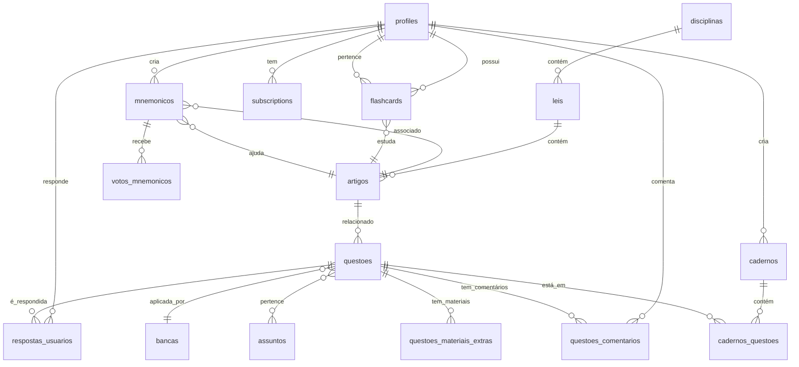

# Database Schema - KAV Concursos (Supabase PostgreSQL)

**Versão:** 2.0  
**Data:** 18/10/2025  
**Database:** PostgreSQL 15.6 (Supabase)  
**Charset:** UTF-8

> **⚠️ MUDANÇAS ESTRATÉGICAS v2.0:**
>
> - **Questões Avulsas REMOVIDAS**: Todas questões devem estar em cadernos
> - **Novas tabelas**: `questoes_comentarios` (BÁSICO+) e `questoes_materiais_extras` (PREMIUM)
> - **RLS policies atualizadas**: Controle de acesso por plano (FREE/BÁSICO/PREMIUM)
> - **Limites de cadernos**: FREE (2), BÁSICO (10), PREMIUM (ilimitado)
> - **Ver CHANGELOG-CADERNOS-v2.1.md** para detalhes completos

---

## 📑 Índice

1. [Visão Geral](#1-visão-geral)
2. [Diagrama ER](#2-diagrama-er)
3. [Tabelas Principais](#3-tabelas-principais)
4. [Migrations SQL](#4-migrations-sql)
5. [Row Level Security (RLS)](#5-row-level-security-rls)
6. [Índices e Performance](#6-índices-e-performance)
7. [Triggers e Functions](#7-triggers-e-functions)
8. [Queries Comuns](#8-queries-comuns)
9. [Backup e Restore](#9-backup-e-restore)

---

## 1. Visão Geral

### 1.1 Estatísticas Estimadas

| Tabela                           | Registros MVP | Registros Ano 1 | Storage Estimado |
| -------------------------------- | ------------- | --------------- | ---------------- |
| **profiles**                     | 1.000         | 10.000          | 5 MB             |
| **disciplinas**                  | 10            | 15              | < 1 MB           |
| **leis**                         | 3             | 20              | < 1 MB           |
| **artigos**                      | 500           | 5.000           | 20 MB            |
| **questoes**                     | 300           | 10.000          | 50 MB            |
| **mnemonicos**                   | 50            | 5.000           | 10 MB            |
| **respostas_usuarios**           | 30.000        | 1.000.000       | 100 MB           |
| **flashcards**                   | 5.000         | 200.000         | 30 MB            |
| **cadernos**                     | 500           | 20.000          | 5 MB             |
| **questoes_comentarios** 🆕      | 5.000         | 100.000         | 50 MB            |
| **questoes_materiais_extras** 🆕 | 1.000         | 20.000          | 15 MB            |
| **Total**                        | -             | -               | **~286 MB**      |

**Plano Supabase:**

- MVP: Free (500 MB) ✅
- Ano 1: Free (se otimizado) ou Pro (8 GB - R$ 125/mês)

**Notas v2.0:**

- `questoes_comentarios`: Média 500 bytes/comentário (só BÁSICO e PREMIUM)
- `questoes_materiais_extras`: Apenas metadados (URLs, não arquivos reais)
- Vídeos/PDFs hospedados no Supabase Storage (não contabilizados aqui)

---

### 1.2 Convenções de Nomenclatura

-- Tabelas: plural, snake_case
CREATE TABLE questoes (...);

-- Colunas: singular, snake_case
questao_id, user_id, created_at

-- Chaves primárias: sempre 'id' (serial ou uuid)
id SERIAL PRIMARY KEY

-- Chaves estrangeiras: nome_tabela_id
banca_id INT REFERENCES bancas(id)

-- Timestamps: sempre com timezone
created_at TIMESTAMPTZ DEFAULT NOW()
updated_at TIMESTAMPTZ DEFAULT NOW()

-- Booleans: is*, has*, can\_
is_active BOOLEAN DEFAULT TRUE
has_paid BOOLEAN DEFAULT FALSE

-- Enums: tipo_algo (singular)
tipo_questao TEXT CHECK (tipo_questao IN ('objetiva', 'discursiva'))

---

## 2. Diagrama ER



**Novidades v2.0:**

- **questoes_comentarios**: Sistema de comentários (BÁSICO pode ler, PREMIUM pode escrever)
- **questoes_materiais_extras**: Vídeos, PDFs, links externos (PREMIUM apenas)
- **Nota**: Respostas agora devem ter `caderno_id` obrigatório (questões avulsas removidas)

---

## 3. Tabelas Principais

### 3.1 Autenticação e Usuários

#### Tabela: `profiles`

**Descrição:** Estende auth.users do Supabase com dados específicos da aplicação.

CREATE TABLE profiles (
id UUID PRIMARY KEY REFERENCES auth.users(id) ON DELETE CASCADE,

-- Dados pessoais
email TEXT UNIQUE NOT NULL,
nome_completo TEXT,
avatar_url TEXT,

-- Configurações
concurso_alvo TEXT, -- Ex: "PM-SP", "PRF", "PF"
meta_questoes_dia INT DEFAULT 15,
tema TEXT DEFAULT 'light' CHECK (tema IN ('light', 'dark')),

-- Assinatura
plano TEXT DEFAULT 'free' CHECK (plano IN ('free', 'basic', 'premium')),
stripe_customer_id TEXT UNIQUE,
stripe_subscription_id TEXT,
plano_expira_em TIMESTAMPTZ,

-- Estatísticas (denormalizadas para performance)
total_questoes_respondidas INT DEFAULT 0,
total_acertos INT DEFAULT 0,
taxa_acerto_geral DECIMAL(5,2) DEFAULT 0.00, -- Calculada: (total_acertos/total_questoes)\*100
streak_dias INT DEFAULT 0,
ultimo_acesso DATE DEFAULT CURRENT_DATE,

-- Gamificação
pontos_totais INT DEFAULT 0,
nivel INT DEFAULT 1,

-- Metadata
role TEXT DEFAULT 'user' CHECK (role IN ('user', 'admin')),
is_active BOOLEAN DEFAULT TRUE,
created_at TIMESTAMPTZ DEFAULT NOW(),
updated_at TIMESTAMPTZ DEFAULT NOW()
);

-- Índices
CREATE INDEX idx_profiles_email ON profiles(email);
CREATE INDEX idx_profiles_plano ON profiles(plano);
CREATE INDEX idx_profiles_stripe_customer ON profiles(stripe_customer_id);
CREATE INDEX idx_profiles_created_at ON profiles(created_at DESC);

-- Comentários
COMMENT ON TABLE profiles IS 'Perfis de usuários estendidos do Supabase Auth';
COMMENT ON COLUMN profiles.taxa_acerto_geral IS 'Percentual de acertos calculado automaticamente via trigger';
COMMENT ON COLUMN profiles.streak_dias IS 'Dias consecutivos de uso (resetado se não acessar por 24h)';

---

### 3.2 Conteúdo de Estudo

#### Tabela: `disciplinas`

CREATE TABLE disciplinas (
id SERIAL PRIMARY KEY,
nome TEXT UNIQUE NOT NULL, -- Ex: "Direito Penal", "Direito Constitucional"
slug TEXT UNIQUE NOT NULL, -- Ex: "direito-penal"
descricao TEXT,
icone TEXT, -- Nome do ícone Lucide React: "Scale", "Gavel", "BookOpen"
ordem INT DEFAULT 0, -- Para ordenação customizada
cor_destaque TEXT DEFAULT '#2563EB', -- Cor primária para UI
is_active BOOLEAN DEFAULT TRUE,
created_at TIMESTAMPTZ DEFAULT NOW()
);

-- Seed data
INSERT INTO disciplinas (nome, slug, icone, ordem, cor_destaque) VALUES
('Direito Constitucional', 'direito-constitucional', 'Landmark', 1, '#2563EB'),
('Direito Penal', 'direito-penal', 'Gavel', 2, '#DC2626'),
('Direito Processual Penal', 'direito-processual-penal', 'Scale', 3, '#EA580C'),
('Direito Administrativo', 'direito-administrativo', 'Building2', 4, '#7C3AED'),
('Direito Civil', 'direito-civil', 'Users', 5, '#059669');

## COMMENT ON TABLE disciplinas IS 'Grandes áreas do direito';

#### Tabela: `leis`

CREATE TABLE leis (
id SERIAL PRIMARY KEY,
disciplina_id INT NOT NULL REFERENCES disciplinas(id) ON DELETE CASCADE,

-- Identificação
nome TEXT NOT NULL, -- Ex: "Constituição Federal de 1988"
nome_curto TEXT NOT NULL, -- Ex: "CF/88"
sigla TEXT, -- Ex: "CF"
numero_lei TEXT, -- Ex: "Lei 12.850/2013"

-- Metadata
ementa TEXT, -- Resumo do que trata a lei
data_publicacao DATE,
link_oficial TEXT, -- URL no Planalto ou Senado

-- Organização
total_artigos INT DEFAULT 0,
ordem INT DEFAULT 0,

-- Status
is_mais_cobrada BOOLEAN DEFAULT FALSE, -- Badge especial na UI
is_active BOOLEAN DEFAULT TRUE,

created_at TIMESTAMPTZ DEFAULT NOW(),
updated_at TIMESTAMPTZ DEFAULT NOW()
);

-- Índices
CREATE INDEX idx_leis_disciplina ON leis(disciplina_id);
CREATE INDEX idx_leis_mais_cobradas ON leis(is_mais_cobrada) WHERE is_mais_cobrada = TRUE;

-- Seed data exemplo
INSERT INTO leis (disciplina_id, nome, nome_curto, sigla, total_artigos, is_mais_cobrada, ordem) VALUES
(1, 'Constituição Federal de 1988', 'CF/88', 'CF', 250, TRUE, 1),
(2, 'Código Penal - Decreto-Lei 2.848/1940', 'Código Penal', 'CP', 361, TRUE, 1),
(3, 'Código de Processo Penal - Decreto-Lei 3.689/1941', 'CPP', 'CPP', 811, TRUE, 1);

COMMENT ON TABLE leis IS 'Legislações estudadas na plataforma';
COMMENT ON COLUMN leis.is_mais_cobrada IS 'Exibir badge "Mais Cobrada" na UI';

---

#### Tabela: `artigos`

CREATE TABLE artigos (
id SERIAL PRIMARY KEY,
lei_id INT NOT NULL REFERENCES leis(id) ON DELETE CASCADE,

-- Identificação
numero TEXT NOT NULL, -- Ex: "Art. 121", "Art. 5º, LXXVIII"
titulo TEXT, -- Ex: "Homicídio Simples"

-- Conteúdo
texto_completo TEXT NOT NULL, -- Texto literal do artigo
texto_formatado TEXT, -- HTML para destacar palavras-chave (opcional)

-- Hierarquia (para leis com estrutura complexa)
capitulo TEXT, -- Ex: "Título I - Dos Crimes Contra a Pessoa"
secao TEXT, -- Ex: "Capítulo I - Dos Crimes Contra a Vida"

-- Importância
is_muito_cobrado BOOLEAN DEFAULT FALSE,
peso_edital INT DEFAULT 1 CHECK (peso_edital BETWEEN 1 AND 5), -- 1=pouco, 5=muito

-- Metadata
ordem INT NOT NULL, -- Para ordenação dentro da lei
palavras_chave TEXT[], -- Ex: {'homicídio', 'matar', 'doloso'}

created_at TIMESTAMPTZ DEFAULT NOW(),
updated_at TIMESTAMPTZ DEFAULT NOW(),

UNIQUE(lei_id, numero) -- Garante que não há duplicatas
);

-- Índices
CREATE INDEX idx_artigos_lei ON artigos(lei_id);
CREATE INDEX idx_artigos_muito_cobrado ON artigos(is_muito_cobrado) WHERE is_muito_cobrado = TRUE;
CREATE INDEX idx_artigos_palavras_chave ON artigos USING GIN(palavras_chave); -- Full-text search
CREATE INDEX idx_artigos_texto ON artigos USING GIN(to_tsvector('portuguese', texto_completo));

COMMENT ON TABLE artigos IS 'Artigos individuais das leis';
COMMENT ON COLUMN artigos.palavras_chave IS 'Array para busca semântica';

---

### 3.3 Questões

#### Tabela: `bancas`

CREATE TABLE bancas (
id SERIAL PRIMARY KEY,
nome TEXT UNIQUE NOT NULL, -- Ex: "CESPE/CEBRASPE"
sigla TEXT UNIQUE NOT NULL, -- Ex: "CESPE"
website TEXT,
logo_url TEXT,
is_active BOOLEAN DEFAULT TRUE,
created_at TIMESTAMPTZ DEFAULT NOW()
);

-- Seed data
INSERT INTO bancas (nome, sigla) VALUES
('CESPE/CEBRASPE', 'CESPE'),
('Fundação Carlos Chagas', 'FCC'),
('VUNESP', 'VUNESP'),
('Fundação Getúlio Vargas', 'FGV'),
('Instituto Brasileiro de Formação e Capacitação', 'IBFC'),
('FUNDEP', 'FUNDEP'),
('AOCP', 'AOCP'),
('Instituto Quadrix', 'QUADRIX');

---

#### Tabela: `orgaos`

CREATE TABLE orgaos (
id SERIAL PRIMARY KEY,
nome TEXT UNIQUE NOT NULL, -- Ex: "Polícia Militar de São Paulo"
sigla TEXT UNIQUE NOT NULL, -- Ex: "PM-SP"
esfera TEXT CHECK (esfera IN ('federal', 'estadual', 'municipal')),
area TEXT, -- Ex: "Segurança Pública", "Jurídica", "Administrativa"
uf TEXT, -- Ex: "SP", "RJ", "Nacional"
is_active BOOLEAN DEFAULT TRUE,
created_at TIMESTAMPTZ DEFAULT NOW()
);

-- Seed data
INSERT INTO orgaos (nome, sigla, esfera, area, uf) VALUES
('Polícia Militar de São Paulo', 'PM-SP', 'estadual', 'Segurança Pública', 'SP'),
('Polícia Federal', 'PF', 'federal', 'Segurança Pública', 'Nacional'),
('Polícia Rodoviária Federal', 'PRF', 'federal', 'Segurança Pública', 'Nacional'),
('Tribunal de Justiça de São Paulo', 'TJ-SP', 'estadual', 'Jurídica', 'SP');

---

#### Tabela: `assuntos`

CREATE TABLE assuntos (
id SERIAL PRIMARY KEY,
nome TEXT NOT NULL, -- Ex: "Inquérito Policial Militar"
disciplina_id INT NOT NULL REFERENCES disciplinas(id),
parent_id INT REFERENCES assuntos(id), -- Para hierarquia (subassuntos)
nivel INT DEFAULT 1, -- 1=assunto principal, 2=subassunto
ordem INT DEFAULT 0,
created_at TIMESTAMPTZ DEFAULT NOW(),

UNIQUE(nome, disciplina_id)
);

-- Índices
CREATE INDEX idx_assuntos_disciplina ON assuntos(disciplina_id);
CREATE INDEX idx_assuntos_parent ON assuntos(parent_id);

-- Seed data exemplo
INSERT INTO assuntos (nome, disciplina_id, nivel, ordem) VALUES
('Inquérito Policial Militar', 3, 1, 1),
('Prisão e Liberdade Provisória', 3, 1, 2),
('Ação Penal Militar', 3, 1, 3);

COMMENT ON TABLE assuntos IS 'Assuntos/tópicos das disciplinas (para filtros e estatísticas)';

---

#### Tabela: `questoes`

CREATE TABLE questoes (
id SERIAL PRIMARY KEY,

-- Relacionamentos
banca_id INT NOT NULL REFERENCES bancas(id),
orgao_id INT REFERENCES orgaos(id),
disciplina_id INT NOT NULL REFERENCES disciplinas(id),
artigo_id INT REFERENCES artigos(id), -- Artigo principal relacionado

-- Identificação
codigo_original TEXT, -- Ex: "CESPE-2024-PM-SP-Q42"
ano INT NOT NULL CHECK (ano >= 2000 AND ano <= 2030),
cargo TEXT, -- Ex: "Soldado PM 2ª Classe"

-- Conteúdo
enunciado TEXT NOT NULL CHECK (length(enunciado) >= 10),
alternativa_a TEXT NOT NULL,
alternativa_b TEXT NOT NULL,
alternativa_c TEXT NOT NULL,
alternativa_d TEXT NOT NULL,
alternativa_e TEXT NOT NULL,
gabarito CHAR(1) NOT NULL CHECK (gabarito IN ('A', 'B', 'C', 'D', 'E')),

-- Metadata
explicacao TEXT, -- Comentário sobre a resposta correta
tipo_questao TEXT DEFAULT 'objetiva' CHECK (tipo_questao IN ('objetiva', 'discursiva')),
dificuldade TEXT CHECK (dificuldade IN ('facil', 'medio', 'dificil')),

-- Estatísticas (atualizadas via trigger)
total_respostas INT DEFAULT 0,
total_acertos INT DEFAULT 0,
taxa_acerto DECIMAL(5,2) DEFAULT 0.00, -- Calculado: (total_acertos/total_respostas)\*100

-- Status
is_anulada BOOLEAN DEFAULT FALSE,
is_active BOOLEAN DEFAULT TRUE,

created_at TIMESTAMPTZ DEFAULT NOW(),
updated_at TIMESTAMPTZ DEFAULT NOW()
);

-- Índices para performance
CREATE INDEX idx_questoes_banca ON questoes(banca_id);
CREATE INDEX idx_questoes_orgao ON questoes(orgao_id);
CREATE INDEX idx_questoes_disciplina ON questoes(disciplina_id);
CREATE INDEX idx_questoes_artigo ON questoes(artigo_id);
CREATE INDEX idx_questoes_ano ON questoes(ano DESC);
CREATE INDEX idx_questoes_dificuldade ON questoes(dificuldade);
CREATE INDEX idx_questoes_taxa_acerto ON questoes(taxa_acerto);
CREATE INDEX idx_questoes_enunciado_fulltext ON questoes USING GIN(to_tsvector('portuguese', enunciado));

-- Índice composto para filtros comuns
CREATE INDEX idx_questoes_filtros ON questoes(disciplina_id, banca_id, ano) WHERE is_active = TRUE;

COMMENT ON TABLE questoes IS 'Banco de questões de concursos públicos';
COMMENT ON COLUMN questoes.taxa_acerto IS 'Calculada automaticamente via trigger';

---

#### Tabela: `questoes_assuntos` (N:N)

CREATE TABLE questoes_assuntos (
questao_id INT NOT NULL REFERENCES questoes(id) ON DELETE CASCADE,
assunto_id INT NOT NULL REFERENCES assuntos(id) ON DELETE CASCADE,
PRIMARY KEY (questao_id, assunto_id)
);

-- Índices
CREATE INDEX idx_questoes_assuntos_questao ON questoes_assuntos(questao_id);
CREATE INDEX idx_questoes_assuntos_assunto ON questoes_assuntos(assunto_id);

COMMENT ON TABLE questoes_assuntos IS 'Relacionamento N:N entre questões e assuntos (uma questão pode ter múltiplos assuntos)';

---

### 3.4 Respostas dos Usuários

#### Tabela: `respostas_usuarios`

CREATE TABLE respostas_usuarios (
id BIGSERIAL PRIMARY KEY, -- BIGSERIAL para suportar milhões de registros

user_id UUID NOT NULL REFERENCES profiles(id) ON DELETE CASCADE,
questao_id INT NOT NULL REFERENCES questoes(id) ON DELETE CASCADE,

-- Resposta
resposta_escolhida CHAR(1) NOT NULL CHECK (resposta_escolhida IN ('A', 'B', 'C', 'D', 'E')),
correta BOOLEAN NOT NULL,

-- Contexto
tempo_resposta INT, -- Segundos (NULL se não cronometrado)
caderno_id INT REFERENCES cadernos(id) ON DELETE SET NULL, -- Se fez parte de um caderno
modo TEXT DEFAULT 'pratica' CHECK (modo IN ('pratica', 'simulado')),

-- Metadata
respondida_em TIMESTAMPTZ DEFAULT NOW(),

UNIQUE(user_id, questao_id) -- Usuário só pode responder cada questão uma vez
);

-- Índices críticos para performance
CREATE INDEX idx_respostas_user ON respostas_usuarios(user_id);
CREATE INDEX idx_respostas_questao ON respostas_usuarios(questao_id);
CREATE INDEX idx_respostas_correta ON respostas_usuarios(correta);
CREATE INDEX idx_respostas_data ON respostas_usuarios(respondida_em DESC);

-- Índice composto para dashboard
CREATE INDEX idx_respostas_user_data ON respostas_usuarios(user_id, respondida_em DESC);

COMMENT ON TABLE respostas_usuarios IS 'Histórico de respostas de cada usuário';
COMMENT ON COLUMN respostas_usuarios.tempo_resposta IS 'Tempo em segundos, NULL se não cronometrado';

---

### 3.5 Mnemônicos

#### Tabela: `mnemonicos`

CREATE TABLE mnemonicos (
id SERIAL PRIMARY KEY,

artigo_id INT NOT NULL REFERENCES artigos(id) ON DELETE CASCADE,
autor_id UUID NOT NULL REFERENCES profiles(id) ON DELETE CASCADE,

-- Conteúdo
texto TEXT NOT NULL CHECK (length(texto) >= 10 AND length(texto) <= 500),

-- Validação
is_validado BOOLEAN DEFAULT FALSE, -- Aprovado por moderador
validado_por UUID REFERENCES profiles(id), -- Admin que aprovou
validado_em TIMESTAMPTZ,

-- Estatísticas
votos_positivos INT DEFAULT 0,
votos_negativos INT DEFAULT 0,
score INT DEFAULT 0, -- Calculado: votos_positivos - votos_negativos

-- Status
is_active BOOLEAN DEFAULT TRUE,

created_at TIMESTAMPTZ DEFAULT NOW(),
updated_at TIMESTAMPTZ DEFAULT NOW()
);

-- Índices
CREATE INDEX idx_mnemonicos_artigo ON mnemonicos(artigo_id);
CREATE INDEX idx_mnemonicos_autor ON mnemonicos(autor_id);
CREATE INDEX idx_mnemonicos_validado ON mnemonicos(is_validado) WHERE is_validado = TRUE;
CREATE INDEX idx_mnemonicos_score ON mnemonicos(score DESC);

COMMENT ON TABLE mnemonicos IS 'Técnicas de memorização criadas pela comunidade';
COMMENT ON COLUMN mnemonicos.score IS 'Score = votos_positivos - votos_negativos (para ordenação)';

---

#### Tabela: `votos_mnemonicos`

CREATE TABLE votos_mnemonicos (
user_id UUID NOT NULL REFERENCES profiles(id) ON DELETE CASCADE,
mnemonico_id INT NOT NULL REFERENCES mnemonicos(id) ON DELETE CASCADE,
voto INT NOT NULL CHECK (voto IN (-1, 1)), -- -1 = não útil, 1 = útil
created_at TIMESTAMPTZ DEFAULT NOW(),

PRIMARY KEY (user_id, mnemonico_id)
);

-- Índices
CREATE INDEX idx_votos_mnemonicos_mnemonico ON votos_mnemonicos(mnemonico_id);
CREATE INDEX idx_votos_mnemonicos_user ON votos_mnemonicos(user_id);

COMMENT ON TABLE votos_mnemonicos IS 'Sistema de votação de mnemônicos (1 voto por usuário por mnemônico)';

---

### 3.6 Flashcards e Repetição Espaçada

#### Tabela: `flashcards`

CREATE TABLE flashcards (
id BIGSERIAL PRIMARY KEY,

user_id UUID NOT NULL REFERENCES profiles(id) ON DELETE CASCADE,
artigo_id INT NOT NULL REFERENCES artigos(id) ON DELETE CASCADE,
mnemonico_id INT REFERENCES mnemonicos(id) ON DELETE SET NULL, -- Opcional

-- Algoritmo de Repetição Espaçada (SM-2)
intervalo INT DEFAULT 1, -- Dias até próxima revisão
repeticoes INT DEFAULT 0, -- Quantas vezes já revisou
facilidade DECIMAL(3,2) DEFAULT 2.50, -- Fator de facilidade (1.3 a 2.5+)
proxima_revisao DATE NOT NULL DEFAULT CURRENT_DATE,

-- Última revisão
ultima_revisao TIMESTAMPTZ,
ultima_resposta TEXT CHECK (ultima_resposta IN ('dificil', 'medio', 'facil', 'muito_facil')),

-- Status
is_active BOOLEAN DEFAULT TRUE,
created_at TIMESTAMPTZ DEFAULT NOW()
);

-- Índices
CREATE INDEX idx_flashcards_user ON flashcards(user_id);
CREATE INDEX idx_flashcards_artigo ON flashcards(artigo_id);
CREATE INDEX idx_flashcards_proxima_revisao ON flashcards(proxima_revisao) WHERE is_active = TRUE;
CREATE INDEX idx_flashcards_user_proxima ON flashcards(user_id, proxima_revisao) WHERE is_active = TRUE;

-- Índice único para evitar duplicatas
CREATE UNIQUE INDEX idx_flashcards_user_artigo ON flashcards(user_id, artigo_id) WHERE is_active = TRUE;

COMMENT ON TABLE flashcards IS 'Sistema de flashcards com repetição espaçada (algoritmo SM-2)';
COMMENT ON COLUMN flashcards.facilidade IS 'Fator E do algoritmo SM-2 (1.3 mínimo, sem máximo)';
COMMENT ON COLUMN flashcards.intervalo IS 'Dias até próxima revisão (aumenta a cada acerto)';

---

### 3.7 Cadernos de Questões

#### Tabela: `cadernos`

CREATE TABLE cadernos (
id SERIAL PRIMARY KEY,

user_id UUID NOT NULL REFERENCES profiles(id) ON DELETE CASCADE,

-- Identificação
nome TEXT NOT NULL CHECK (length(nome) >= 3 AND length(nome) <= 100),
descricao TEXT,
pasta TEXT DEFAULT 'GERAL', -- Para organização (GERAL, PM-SP, PRF, etc.)

-- Filtros aplicados (para recriar)
filtros JSONB, -- Ex: {"disciplina_ids": , "banca_ids": , "ano_min": 2020}​

-- Estatísticas
total_questoes INT DEFAULT 0,
questoes_respondidas INT DEFAULT 0,
taxa_acerto DECIMAL(5,2) DEFAULT 0.00,

-- Status
is_concluido BOOLEAN DEFAULT FALSE,
concluido_em TIMESTAMPTZ,

created_at TIMESTAMPTZ DEFAULT NOW(),
updated_at TIMESTAMPTZ DEFAULT NOW()
);

-- Índices
CREATE INDEX idx_cadernos_user ON cadernos(user_id);
CREATE INDEX idx_cadernos_pasta ON cadernos(pasta);
CREATE INDEX idx_cadernos_created ON cadernos(created_at DESC);

COMMENT ON TABLE cadernos IS 'Cadernos personalizados de questões criados pelos usuários';
COMMENT ON COLUMN cadernos.filtros IS 'JSON com filtros aplicados para recriar caderno';

---

#### Tabela: `cadernos_questoes` (N:N com ordem)

CREATE TABLE cadernos_questoes (
caderno_id INT NOT NULL REFERENCES cadernos(id) ON DELETE CASCADE,
questao_id INT NOT NULL REFERENCES questoes(id) ON DELETE CASCADE,
ordem INT NOT NULL DEFAULT 0, -- Para manter ordem específica

PRIMARY KEY (caderno_id, questao_id)
);

-- Índices
CREATE INDEX idx_cadernos_questoes_caderno ON cadernos_questoes(caderno_id, ordem);
CREATE INDEX idx_cadernos_questoes_questao ON cadernos_questoes(questao_id);

COMMENT ON TABLE cadernos_questoes IS 'Questões que compõem cada caderno (com ordem customizada)';

---

### 3.8 Sistema de Comentários (BÁSICO e PREMIUM)

#### Tabela: `questoes_comentarios`

**Descrição:** Sistema de comentários em questões com controle de acesso por plano.

**Regras de Acesso:**

- 🔒 **FREE**: Não pode ver comentários (paywall)
- ✅ **BÁSICO**: Pode ver todos comentários (leitura apenas)
- ✅ **PREMIUM**: Pode ver e escrever comentários

```sql
CREATE TABLE questoes_comentarios (
  id BIGSERIAL PRIMARY KEY,

  -- Relacionamentos
  questao_id INT NOT NULL REFERENCES questoes(id) ON DELETE CASCADE,
  user_id UUID NOT NULL REFERENCES profiles(id) ON DELETE CASCADE,

  -- Tipo de autor
  autor_tipo TEXT NOT NULL CHECK (autor_tipo IN ('usuario', 'professor')),
  -- 'usuario': PREMIUM users
  -- 'professor': Admin/moderadores (destacado na UI)

  -- Conteúdo
  conteudo TEXT NOT NULL CHECK (char_length(conteudo) >= 10 AND char_length(conteudo) <= 2000),

  -- Engajamento
  votos INT DEFAULT 0, -- Upvotes - downvotes

  -- Moderação
  is_validado BOOLEAN DEFAULT FALSE, -- Aprovado por moderador
  is_reportado BOOLEAN DEFAULT FALSE,
  motivo_report TEXT,

  -- Timestamps
  created_at TIMESTAMPTZ DEFAULT NOW(),
  updated_at TIMESTAMPTZ DEFAULT NOW()
);

-- Índices
CREATE INDEX idx_comentarios_questao ON questoes_comentarios(questao_id);
CREATE INDEX idx_comentarios_user ON questoes_comentarios(user_id);
CREATE INDEX idx_comentarios_created ON questoes_comentarios(created_at DESC);
CREATE INDEX idx_comentarios_votos ON questoes_comentarios(votos DESC);
CREATE INDEX idx_comentarios_validado ON questoes_comentarios(is_validado) WHERE is_validado = TRUE;

-- Índice composto para queries comuns
CREATE INDEX idx_comentarios_questao_votos ON questoes_comentarios(questao_id, votos DESC);

COMMENT ON TABLE questoes_comentarios IS 'Comentários em questões (BÁSICO vê, PREMIUM escreve)';
COMMENT ON COLUMN questoes_comentarios.autor_tipo IS 'professor = destacado no topo, usuario = comunidade';
COMMENT ON COLUMN questoes_comentarios.votos IS 'Score de upvotes - downvotes (ordenação)';
COMMENT ON COLUMN questoes_comentarios.is_validado IS 'Comentários de professores auto-validados';
```

---

#### Tabela: `comentarios_votos` (Rastrear upvotes/downvotes)

```sql
CREATE TABLE comentarios_votos (
  comentario_id BIGINT NOT NULL REFERENCES questoes_comentarios(id) ON DELETE CASCADE,
  user_id UUID NOT NULL REFERENCES profiles(id) ON DELETE CASCADE,

  tipo TEXT NOT NULL CHECK (tipo IN ('upvote', 'downvote')),

  created_at TIMESTAMPTZ DEFAULT NOW(),

  PRIMARY KEY (comentario_id, user_id)
);

-- Índices
CREATE INDEX idx_comentarios_votos_comentario ON comentarios_votos(comentario_id);
CREATE INDEX idx_comentarios_votos_user ON comentarios_votos(user_id);

COMMENT ON TABLE comentarios_votos IS 'Rastreia votos individuais para evitar votos duplicados';
```

---

### 3.9 Materiais Extras (PREMIUM)

#### Tabela: `questoes_materiais_extras`

**Descrição:** Vídeo-aulas, PDFs, links externos para questões (exclusivo PREMIUM).

**Regras de Acesso:**

- 🔒 **FREE/BÁSICO**: Não pode acessar materiais (paywall)
- ✅ **PREMIUM**: Acesso total a todos materiais

```sql
CREATE TABLE questoes_materiais_extras (
  id BIGSERIAL PRIMARY KEY,

  -- Relacionamentos
  questao_id INT NOT NULL REFERENCES questoes(id) ON DELETE CASCADE,

  -- Identificação
  titulo TEXT NOT NULL CHECK (char_length(titulo) >= 3 AND char_length(titulo) <= 150),
  descricao TEXT,

  -- Tipo de material
  tipo TEXT NOT NULL CHECK (tipo IN ('video', 'pdf', 'link_externo')),

  -- Armazenamento
  url TEXT NOT NULL, -- URL do Supabase Storage ou externa
  tamanho_bytes BIGINT, -- Para PDFs/vídeos hospedados
  duracao_segundos INT, -- Para vídeos

  -- Metadata
  autor TEXT, -- Ex: "Prof. João Silva", "Canal Direito Estratégico"
  fonte TEXT, -- Ex: "YouTube", "Estratégia Concursos"
  thumbnail_url TEXT, -- Para vídeos

  -- Controle de acesso
  requer_premium BOOLEAN DEFAULT TRUE,

  -- Estatísticas
  visualizacoes INT DEFAULT 0,
  downloads INT DEFAULT 0, -- Para PDFs

  -- Ordem de exibição
  ordem INT DEFAULT 0,

  -- Status
  is_active BOOLEAN DEFAULT TRUE,

  -- Timestamps
  created_at TIMESTAMPTZ DEFAULT NOW(),
  updated_at TIMESTAMPTZ DEFAULT NOW()
);

-- Índices
CREATE INDEX idx_materiais_questao ON questoes_materiais_extras(questao_id);
CREATE INDEX idx_materiais_tipo ON questoes_materiais_extras(tipo);
CREATE INDEX idx_materiais_active ON questoes_materiais_extras(is_active) WHERE is_active = TRUE;
CREATE INDEX idx_materiais_questao_ordem ON questoes_materiais_extras(questao_id, ordem);

COMMENT ON TABLE questoes_materiais_extras IS 'Vídeos, PDFs, links (exclusivo PREMIUM)';
COMMENT ON COLUMN questoes_materiais_extras.url IS 'URL do Supabase Storage (internos) ou URL externa';
COMMENT ON COLUMN questoes_materiais_extras.tipo IS 'video = vídeo-aula, pdf = resumo, link_externo = artigos/posts';
```

---

#### Tabela: `materiais_interacoes` (Rastrear engajamento)

```sql
CREATE TABLE materiais_interacoes (
  id BIGSERIAL PRIMARY KEY,

  material_id BIGINT NOT NULL REFERENCES questoes_materiais_extras(id) ON DELETE CASCADE,
  user_id UUID NOT NULL REFERENCES profiles(id) ON DELETE CASCADE,

  -- Tipo de interação
  acao TEXT NOT NULL CHECK (acao IN ('visualizou', 'baixou', 'completou')),
  -- 'visualizou' = abriu vídeo/PDF
  -- 'baixou' = download de PDF
  -- 'completou' = assistiu vídeo até o fim (>90%)

  -- Progresso (para vídeos)
  progresso_percentual INT CHECK (progresso_percentual >= 0 AND progresso_percentual <= 100),
  tempo_assistido_segundos INT,

  created_at TIMESTAMPTZ DEFAULT NOW(),

  UNIQUE(material_id, user_id, acao)
);

-- Índices
CREATE INDEX idx_materiais_interacoes_material ON materiais_interacoes(material_id);
CREATE INDEX idx_materiais_interacoes_user ON materiais_interacoes(user_id);
CREATE INDEX idx_materiais_interacoes_acao ON materiais_interacoes(acao);

COMMENT ON TABLE materiais_interacoes IS 'Rastreia visualizações, downloads e conclusão de materiais';
```

---

### 3.10 Estatísticas e Inteligência de Bancas

#### Tabela: `estatisticas_banca_assunto`

CREATE TABLE estatisticas_banca_assunto (
id SERIAL PRIMARY KEY,

banca_id INT NOT NULL REFERENCES bancas(id),
assunto_id INT NOT NULL REFERENCES assuntos(id),
disciplina_id INT NOT NULL REFERENCES disciplinas(id),

-- Estatísticas de cobrança
total_questoes INT DEFAULT 0,
percentual_total DECIMAL(5,2), -- Ex: 28.65%

-- Dificuldade
taxa_acerto_media DECIMAL(5,2), -- Ex: 62.50%
dificuldade TEXT CHECK (dificuldade IN ('facil', 'medio', 'dificil')),

-- Tendências temporais
questoes_ultimos_2_anos INT DEFAULT 0,
questoes_ultimos_5_anos INT DEFAULT 0,
questoes_ultimos_10_anos INT DEFAULT 0,
taxa_crescimento_2anos DECIMAL(5,2), -- Ex: +15.50% ou -3.20%

-- Artigos mais cobrados (JSON)
artigos_top JSONB, -- Ex: [{"artigo": "Art. 121", "questoes": 80}, ...]

-- Probabilidade calculada
probabilidade_proxima_prova DECIMAL(5,2), -- 0-100
frequencia_aparicao INT, -- Apareceu em X dos últimos 10 concursos

-- Metadados
ultima_atualizacao TIMESTAMPTZ DEFAULT NOW(),

UNIQUE(banca_id, assunto_id)
);

-- Índices
CREATE INDEX idx_estatisticas_banca ON estatisticas_banca_assunto(banca_id);
CREATE INDEX idx_estatisticas_assunto ON estatisticas_banca_assunto(assunto_id);
CREATE INDEX idx_estatisticas_probabilidade ON estatisticas_banca_assunto(probabilidade_proxima_prova DESC);

COMMENT ON TABLE estatisticas_banca_assunto IS 'Análise estatística de o que cada banca cobra em cada assunto (atualizada semanalmente)';

---

#### Tabela: `analise_temporal`

CREATE TABLE analise_temporal (
id SERIAL PRIMARY KEY,
banca_id INT NOT NULL REFERENCES bancas(id),
assunto_id INT NOT NULL REFERENCES assuntos(id),
ano INT NOT NULL CHECK (ano >= 2000 AND ano <= 2030),

total_questoes INT DEFAULT 0,
taxa_acerto_media DECIMAL(5,2),

created_at TIMESTAMPTZ DEFAULT NOW(),

UNIQUE(banca_id, assunto_id, ano)
);

-- Índices
CREATE INDEX idx_analise_temporal_banca_assunto ON analise_temporal(banca_id, assunto_id);
CREATE INDEX idx_analise_temporal_ano ON analise_temporal(ano DESC);

COMMENT ON TABLE analise_temporal IS 'Evolução da cobrança de assuntos ao longo dos anos (para gráficos de tendência)';

---

### 3.11 Assinaturas Stripe

#### Tabela: `subscriptions`

CREATE TABLE subscriptions (
id SERIAL PRIMARY KEY,

user_id UUID NOT NULL REFERENCES profiles(id) ON DELETE CASCADE,

-- Stripe IDs
stripe_subscription_id TEXT UNIQUE NOT NULL,
stripe_customer_id TEXT NOT NULL,
stripe_price_id TEXT NOT NULL,

-- Status
status TEXT NOT NULL CHECK (status IN (
'active', 'canceled', 'incomplete', 'incomplete_expired',
'past_due', 'trialing', 'unpaid'
)),

-- Plano
plano TEXT NOT NULL CHECK (plano IN ('basic', 'premium')),
preco DECIMAL(10,2) NOT NULL, -- Ex: 39.90
moeda TEXT DEFAULT 'BRL',

-- Datas
current_period_start TIMESTAMPTZ NOT NULL,
current_period_end TIMESTAMPTZ NOT NULL,
cancel_at TIMESTAMPTZ,
canceled_at TIMESTAMPTZ,

-- Metadata
created_at TIMESTAMPTZ DEFAULT NOW(),
updated_at TIMESTAMPTZ DEFAULT NOW(),

UNIQUE(user_id, stripe_subscription_id)
);

-- Índices
CREATE INDEX idx_subscriptions_user ON subscriptions(user_id);
CREATE INDEX idx_subscriptions_stripe_id ON subscriptions(stripe_subscription_id);
CREATE INDEX idx_subscriptions_status ON subscriptions(status);

COMMENT ON TABLE subscriptions IS 'Assinaturas do Stripe sincronizadas via webhooks';

---

---

## 4. Migrations SQL

### Migration 1: Inicialização

-- supabase/migrations/20260106000001_init.sql

-- Habilitar extensões
CREATE EXTENSION IF NOT EXISTS "uuid-ossp";
CREATE EXTENSION IF NOT EXISTS "pg_trgm"; -- Para busca fuzzy

-- Criar schema se necessário
-- CREATE SCHEMA IF NOT EXISTS public;

-- Configurar timezone
SET timezone = 'America/Sao_Paulo';

-- Função para atualizar updated_at automaticamente
CREATE OR REPLACE FUNCTION update_updated_at_column()
RETURNS TRIGGER AS $$
BEGIN
NEW.updated_at = NOW();
RETURN NEW;
END;

$$
LANGUAGE plpgsql;

-- Aplicar trigger em todas tabelas com updated_at
CREATE TRIGGER update_profiles_updated_at BEFORE UPDATE ON profiles
  FOR EACH ROW EXECUTE FUNCTION update_updated_at_column();

CREATE TRIGGER update_questoes_updated_at BEFORE UPDATE ON questoes
  FOR EACH ROW EXECUTE FUNCTION update_updated_at_column();

CREATE TRIGGER update_cadernos_updated_at BEFORE UPDATE ON cadernos
  FOR EACH ROW EXECUTE FUNCTION update_updated_at_column();

CREATE TRIGGER update_comentarios_updated_at BEFORE UPDATE ON questoes_comentarios
  FOR EACH ROW EXECUTE FUNCTION update_updated_at_column();

CREATE TRIGGER update_materiais_updated_at BEFORE UPDATE ON questoes_materiais_extras
  FOR EACH ROW EXECUTE FUNCTION update_updated_at_column();
```

---

## 5. Row Level Security (RLS)

### 5.1 Visão Geral

**Todas as tabelas devem ter RLS habilitado** para proteger dados sensíveis dos usuários.

```sql
-- Habilitar RLS em todas tabelas principais
ALTER TABLE profiles ENABLE ROW LEVEL SECURITY;
ALTER TABLE respostas_usuarios ENABLE ROW LEVEL SECURITY;
ALTER TABLE mnemonicos ENABLE ROW LEVEL SECURITY;
ALTER TABLE flashcards ENABLE ROW LEVEL SECURITY;
ALTER TABLE cadernos ENABLE ROW LEVEL SECURITY;
ALTER TABLE questoes_comentarios ENABLE ROW LEVEL SECURITY;
ALTER TABLE questoes_materiais_extras ENABLE ROW LEVEL SECURITY;
ALTER TABLE materiais_interacoes ENABLE ROW LEVEL SECURITY;
ALTER TABLE comentarios_votos ENABLE ROW LEVEL SECURITY;
```

---

### 5.2 Policies Essenciais

#### **5.2.1 Profiles (Usuários)**

```sql
-- Usuários só veem seu próprio perfil
CREATE POLICY "Usuarios podem ver seu proprio perfil"
  ON profiles FOR SELECT
  USING (auth.uid() = id);

-- Usuários só atualizam seu próprio perfil
CREATE POLICY "Usuarios podem atualizar seu proprio perfil"
  ON profiles FOR UPDATE
  USING (auth.uid() = id);

-- Admins veem todos perfis
CREATE POLICY "Admins podem ver todos perfis"
  ON profiles FOR SELECT
  USING (
    EXISTS (
      SELECT 1 FROM profiles
      WHERE id = auth.uid()
      AND role = 'admin'
    )
  );
```

---

#### **5.2.2 Cadernos**

```sql
-- Usuários só veem seus próprios cadernos
CREATE POLICY "Usuarios podem ver seus cadernos"
  ON cadernos FOR SELECT
  USING (user_id = auth.uid());

-- Usuários só podem criar cadernos se respeitarem limites do plano
CREATE POLICY "Usuarios podem criar cadernos respeitando limite"
  ON cadernos FOR INSERT
  WITH CHECK (
    user_id = auth.uid()
    AND (
      -- FREE: máximo 2 cadernos
      (
        (SELECT plano FROM profiles WHERE id = auth.uid()) = 'free'
        AND (SELECT COUNT(*) FROM cadernos WHERE user_id = auth.uid()) < 2
      )
      -- BÁSICO: máximo 10 cadernos
      OR (
        (SELECT plano FROM profiles WHERE id = auth.uid()) = 'basic'
        AND (SELECT COUNT(*) FROM cadernos WHERE user_id = auth.uid()) < 10
      )
      -- PREMIUM: ilimitado
      OR (SELECT plano FROM profiles WHERE id = auth.uid()) = 'premium'
    )
  );

-- Usuários podem atualizar seus cadernos
CREATE POLICY "Usuarios podem atualizar seus cadernos"
  ON cadernos FOR UPDATE
  USING (user_id = auth.uid());

-- Usuários podem deletar seus cadernos
CREATE POLICY "Usuarios podem deletar seus cadernos"
  ON cadernos FOR DELETE
  USING (user_id = auth.uid());
```

---

#### **5.2.3 Comentários (BÁSICO+ vê, PREMIUM escreve)**

```sql
-- BÁSICO e PREMIUM podem ver comentários
CREATE POLICY "Plano basico e premium podem ver comentarios"
  ON questoes_comentarios FOR SELECT
  USING (
    EXISTS (
      SELECT 1 FROM profiles
      WHERE id = auth.uid()
      AND plano IN ('basic', 'premium')
    )
  );

-- Apenas PREMIUM pode criar comentários
CREATE POLICY "Apenas premium pode criar comentarios"
  ON questoes_comentarios FOR INSERT
  WITH CHECK (
    user_id = auth.uid()
    AND (
      EXISTS (
        SELECT 1 FROM profiles
        WHERE id = auth.uid()
        AND plano = 'premium'
      )
    )
  );

-- Usuários podem atualizar seus próprios comentários
CREATE POLICY "Usuarios podem atualizar seus comentarios"
  ON questoes_comentarios FOR UPDATE
  USING (user_id = auth.uid());

-- Usuários podem deletar seus próprios comentários
CREATE POLICY "Usuarios podem deletar seus comentarios"
  ON questoes_comentarios FOR DELETE
  USING (user_id = auth.uid());

-- Admins podem moderar qualquer comentário
CREATE POLICY "Admins podem moderar comentarios"
  ON questoes_comentarios FOR ALL
  USING (
    EXISTS (
      SELECT 1 FROM profiles
      WHERE id = auth.uid()
      AND role = 'admin'
    )
  );
```

---

#### **5.2.4 Materiais Extras (PREMIUM apenas)**

```sql
-- Apenas PREMIUM pode ver materiais extras
CREATE POLICY "Apenas premium pode ver materiais"
  ON questoes_materiais_extras FOR SELECT
  USING (
    EXISTS (
      SELECT 1 FROM profiles
      WHERE id = auth.uid()
      AND plano = 'premium'
    )
    OR
    -- Admins sempre podem ver
    EXISTS (
      SELECT 1 FROM profiles
      WHERE id = auth.uid()
      AND role = 'admin'
    )
  );

-- Apenas admins podem criar/atualizar materiais
CREATE POLICY "Apenas admins podem gerenciar materiais"
  ON questoes_materiais_extras FOR ALL
  USING (
    EXISTS (
      SELECT 1 FROM profiles
      WHERE id = auth.uid()
      AND role = 'admin'
    )
  );
```

---

#### **5.2.5 Votos em Comentários**

```sql
-- PREMIUM pode votar em comentários
CREATE POLICY "Premium pode votar em comentarios"
  ON comentarios_votos FOR INSERT
  WITH CHECK (
    user_id = auth.uid()
    AND (
      EXISTS (
        SELECT 1 FROM profiles
        WHERE id = auth.uid()
        AND plano = 'premium'
      )
    )
  );

-- Usuários podem ver seus próprios votos
CREATE POLICY "Usuarios podem ver seus votos"
  ON comentarios_votos FOR SELECT
  USING (user_id = auth.uid());

-- Usuários podem atualizar seus votos (trocar upvote/downvote)
CREATE POLICY "Usuarios podem atualizar seus votos"
  ON comentarios_votos FOR UPDATE
  USING (user_id = auth.uid());

-- Usuários podem remover seus votos
CREATE POLICY "Usuarios podem deletar seus votos"
  ON comentarios_votos FOR DELETE
  USING (user_id = auth.uid());
```

---

#### **5.2.6 Interações com Materiais**

```sql
-- Usuários podem ver suas próprias interações
CREATE POLICY "Usuarios podem ver suas interacoes"
  ON materiais_interacoes FOR SELECT
  USING (user_id = auth.uid());

-- PREMIUM pode registrar interações
CREATE POLICY "Premium pode registrar interacoes"
  ON materiais_interacoes FOR INSERT
  WITH CHECK (
    user_id = auth.uid()
    AND (
      EXISTS (
        SELECT 1 FROM profiles
        WHERE id = auth.uid()
        AND plano = 'premium'
      )
    )
  );

-- Usuários podem atualizar suas interações (progresso de vídeo)
CREATE POLICY "Usuarios podem atualizar suas interacoes"
  ON materiais_interacoes FOR UPDATE
  USING (user_id = auth.uid());
```

---

### 5.3 Policies para Respostas e Limites Diários

```sql
-- Respostas devem ter caderno_id (questões avulsas removidas)
CREATE POLICY "Respostas devem ter caderno_id"
  ON respostas_usuarios FOR INSERT
  WITH CHECK (
    user_id = auth.uid()
    AND caderno_id IS NOT NULL
    AND (
      -- FREE: máximo 5 questões por dia
      (
        (SELECT plano FROM profiles WHERE id = auth.uid()) = 'free'
        AND (
          SELECT COUNT(*) FROM respostas_usuarios
          WHERE user_id = auth.uid()
          AND DATE(created_at) = CURRENT_DATE
        ) < 5
      )
      -- BÁSICO e PREMIUM: ilimitado
      OR (SELECT plano FROM profiles WHERE id = auth.uid()) IN ('basic', 'premium')
    )
  );

-- Usuários podem ver suas próprias respostas
CREATE POLICY "Usuarios podem ver suas respostas"
  ON respostas_usuarios FOR SELECT
  USING (user_id = auth.uid());
```

---

## 6. Índices e Performance

### 6.1 Índices Compostos (Queries Frequentes)

```sql
-- Query: Buscar comentários de uma questão ordenados por votos
CREATE INDEX idx_comentarios_questao_votos_validado
  ON questoes_comentarios(questao_id, votos DESC, is_validado)
  WHERE is_validado = TRUE;

-- Query: Buscar materiais ativos de uma questão por tipo
CREATE INDEX idx_materiais_questao_tipo_ordem
  ON questoes_materiais_extras(questao_id, tipo, ordem)
  WHERE is_active = TRUE;

-- Query: Buscar cadernos de um usuário ativos
CREATE INDEX idx_cadernos_user_created
  ON cadernos(user_id, created_at DESC)
  WHERE is_concluido = FALSE;

-- Query: Respostas do dia para limitar FREE
CREATE INDEX idx_respostas_user_date
  ON respostas_usuarios(user_id, created_at)
  WHERE DATE(created_at) = CURRENT_DATE;
```

---

## 7. Triggers e Functions

### 7.1 Atualizar Contador de Votos em Comentários

```sql
CREATE OR REPLACE FUNCTION atualizar_votos_comentario()
RETURNS TRIGGER AS
$$

BEGIN
IF TG_OP = 'INSERT' THEN
-- Incrementar ou decrementar votos
UPDATE questoes_comentarios
SET votos = votos + (CASE WHEN NEW.tipo = 'upvote' THEN 1 ELSE -1 END)
WHERE id = NEW.comentario_id;
ELSIF TG_OP = 'UPDATE' THEN
-- Se mudou de upvote para downvote ou vice-versa
UPDATE questoes_comentarios
SET votos = votos + (
CASE
WHEN NEW.tipo = 'upvote' AND OLD.tipo = 'downvote' THEN 2
WHEN NEW.tipo = 'downvote' AND OLD.tipo = 'upvote' THEN -2
ELSE 0
END
)
WHERE id = NEW.comentario_id;
ELSIF TG_OP = 'DELETE' THEN
-- Remover voto
UPDATE questoes_comentarios
SET votos = votos - (CASE WHEN OLD.tipo = 'upvote' THEN 1 ELSE -1 END)
WHERE id = OLD.comentario_id;
END IF;

RETURN NEW;
END;

$$
LANGUAGE plpgsql;

CREATE TRIGGER trigger_atualizar_votos
  AFTER INSERT OR UPDATE OR DELETE ON comentarios_votos
  FOR EACH ROW EXECUTE FUNCTION atualizar_votos_comentario();
```

---

### 7.2 Atualizar Contador de Visualizações/Downloads

```sql
CREATE OR REPLACE FUNCTION incrementar_contador_material()
RETURNS TRIGGER AS
$$

BEGIN
IF NEW.acao = 'visualizou' THEN
UPDATE questoes_materiais_extras
SET visualizacoes = visualizacoes + 1
WHERE id = NEW.material_id;
ELSIF NEW.acao = 'baixou' THEN
UPDATE questoes_materiais_extras
SET downloads = downloads + 1
WHERE id = NEW.material_id;
END IF;

RETURN NEW;
END;

$$
LANGUAGE plpgsql;

CREATE TRIGGER trigger_incrementar_contador
  AFTER INSERT ON materiais_interacoes
  FOR EACH ROW EXECUTE FUNCTION incrementar_contador_material();
```

---

## 8. Queries Comuns

### 8.1 Buscar Questões de um Caderno (com limite diário FREE)

```sql
-- Backend: Verificar se usuário FREE atingiu limite diário antes de permitir responder
WITH respostas_hoje AS (
  SELECT COUNT(*) as total
  FROM respostas_usuarios
  WHERE user_id = 'user-uuid-here'
  AND DATE(created_at) = CURRENT_DATE
),
plano_usuario AS (
  SELECT plano FROM profiles WHERE id = 'user-uuid-here'
)
SELECT
  q.*,
  CASE
    WHEN (SELECT plano FROM plano_usuario) = 'free'
         AND (SELECT total FROM respostas_hoje) >= 5
    THEN TRUE
    ELSE FALSE
  END as limite_atingido
FROM questoes q
INNER JOIN cadernos_questoes cq ON q.id = cq.questao_id
WHERE cq.caderno_id = 123
ORDER BY cq.ordem;
```

---

### 8.2 Buscar Comentários com Paywall

```sql
-- Frontend: Buscar comentários (só retorna se usuário for BÁSICO+)
SELECT
  c.*,
  p.nome_completo as autor_nome,
  p.avatar_url as autor_avatar,
  EXISTS(
    SELECT 1 FROM comentarios_votos cv
    WHERE cv.comentario_id = c.id
    AND cv.user_id = 'user-uuid-here'
    AND cv.tipo = 'upvote'
  ) as user_votou_up,
  EXISTS(
    SELECT 1 FROM comentarios_votos cv
    WHERE cv.comentario_id = c.id
    AND cv.user_id = 'user-uuid-here'
    AND cv.tipo = 'downvote'
  ) as user_votou_down
FROM questoes_comentarios c
INNER JOIN profiles p ON c.user_id = p.id
WHERE c.questao_id = 456
AND c.is_validado = TRUE
ORDER BY
  CASE WHEN c.autor_tipo = 'professor' THEN 0 ELSE 1 END,
  c.votos DESC;
```

---

### 8.3 Buscar Materiais Extras (PREMIUM apenas)

```sql
-- Frontend: Buscar materiais (RLS já filtra por plano PREMIUM)
SELECT
  m.*,
  COALESCE(mi.progresso_percentual, 0) as progresso_usuario
FROM questoes_materiais_extras m
LEFT JOIN materiais_interacoes mi
  ON m.id = mi.material_id
  AND mi.user_id = 'user-uuid-here'
  AND mi.acao = 'completou'
WHERE m.questao_id = 789
AND m.is_active = TRUE
ORDER BY m.tipo, m.ordem;
```

---

## 9. Backup e Restore

### 9.1 Backup Automático (Supabase)

O Supabase oferece backup automático diário no plano Pro:
- **Free Plan**: Sem backups automáticos (apenas export manual)
- **Pro Plan**: Backups diários por 7 dias
- **Enterprise**: Backups customizados

```bash
# Export manual via CLI
supabase db dump > backup_$(date +%Y%m%d).sql

# Ou via dashboard: Database > Backups > Download
```

---

### 9.2 Restore

```bash
# Restaurar do backup
psql -h db.your-project.supabase.co \
     -U postgres \
     -d postgres \
     -f backup_20260106.sql
```

---

**Fim do Database Schema v2.0** 🎯

**Próximos Passos:**
1. Aplicar migrations no Supabase
2. Testar RLS policies com diferentes planos
3. Implementar endpoints de API (ver `06-API-ENDPOINTS.md`)
4. Implementar componentes de UI (ver `05-COMPONENTES-UI.md`)
$$
