# Fluxogramas - KAV Concursos

**Versão:** 2.0  
**Data:** 18/10/2025  
**Última Atualização:** 18/10/2025 - Revisão Estratégica de Questões  
**Ferramenta:** Mermaid.js (compatível com GitHub, Notion, VS Code)

> **⚠️ MUDANÇA ESTRATÉGICA v2.0:**
>
> - **Removido fluxo de questões avulsas** (seção 3.1)
> - **Cadernos Personalizados** agora são o ÚNICO método de resolver questões (seção 3)
> - Adicionado fluxo de **Comentários com validação por plano** (seção 3.3)
> - Adicionado fluxo de **Materiais Extras (Premium)** (seção 3.4)

---

## 📑 Índice

1. [Autenticação e Onboarding](#1-autenticação-e-onboarding)
2. [Estudo de Leis](#2-estudo-de-leis)
3. [Sistema de Cadernos e Questões](#3-sistema-de-cadernos-e-questões)
4. [Mnemônicos](#4-mnemônicos)
5. [Flashcards e Repetição Espaçada](#5-flashcards-e-repetição-espaçada)
6. [Pagamentos e Assinaturas](#6-pagamentos-e-assinaturas)
7. [Dashboard e Estatísticas](#7-dashboard-e-estatísticas)
8. [Sistema de Inteligência de Bancas](#8-sistema-de-inteligência-de-bancas)
9. [Administração](#9-administração)

---

## 1. Autenticação e Onboarding

### 1.1 Fluxo de Cadastro com Email/Senha

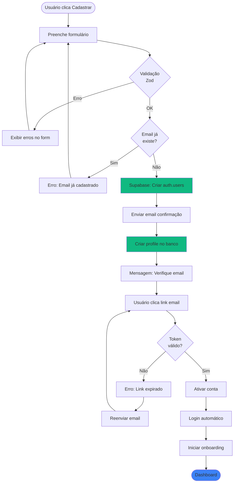

---

### 1.2 Fluxo de Login com Google OAuth

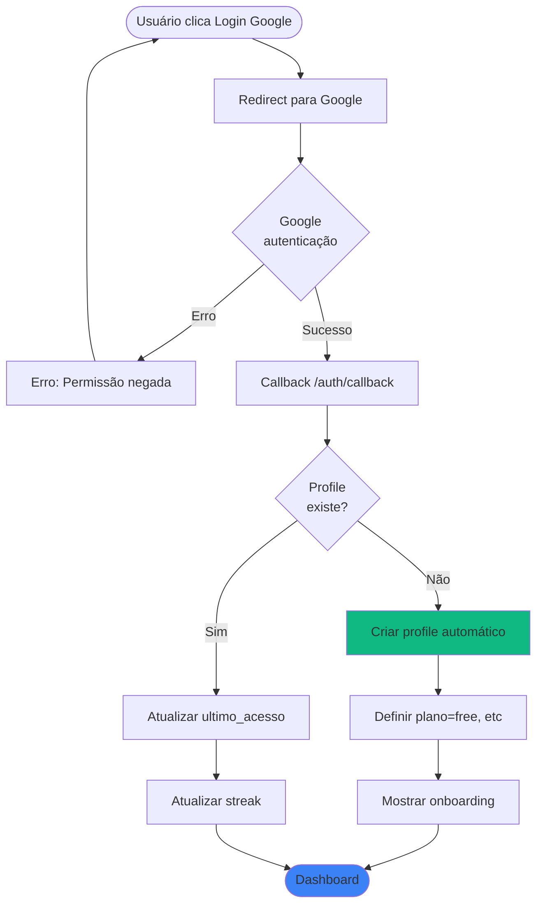

---

### 1.3 Fluxo de Onboarding (FTUE)

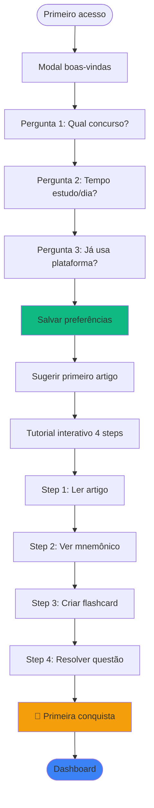

---

## 2. Estudo de Leis

### 2.1 Fluxo de Navegação na Biblioteca

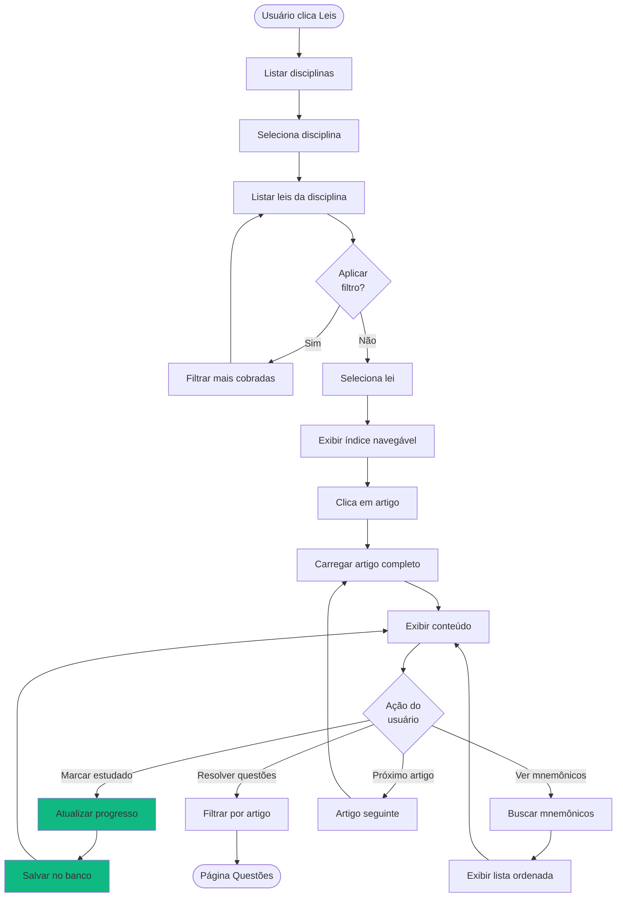

---

### 2.2 Fluxo de Busca de Artigo

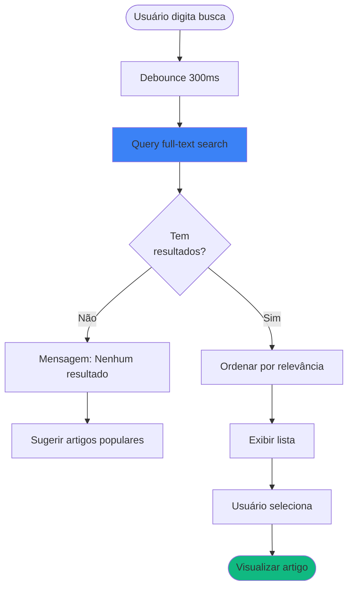

---

## 3. Sistema de Cadernos e Questões

> **⚠️ IMPORTANTE:** Questões avulsas foram **REMOVIDAS**. Todas as questões são resolvidas **EXCLUSIVAMENTE através de Cadernos Personalizados**.

### 3.1 Fluxo de Criar Caderno

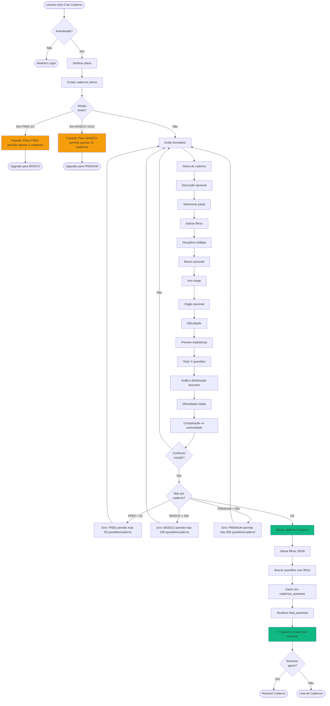

---

### 3.2 Fluxo de Resolver Caderno com Validação de Plano

```mermaid
flowchart TD
Start([Usuário abre caderno]) --> LoadCaderno[Carregar dados do caderno]
LoadCaderno --> LoadQuestoes[Buscar questões do caderno]
LoadQuestoes --> OrderByOrdem[Ordenar por ordem]
OrderByOrdem --> CheckProgress[Verificar progresso]

CheckProgress --> HasProgress{Já iniciou<br/>antes?}
HasProgress -->|Sim| ShowResume[Mostrar: Continuar de onde parou]
HasProgress -->|Não| ShowStart[Mostrar: Iniciar caderno]

ShowResume --> FilterOptions[Opções de filtro]
ShowStart --> FilterOptions

FilterOptions --> ApplyFilter{Aplicar<br/>filtro?}
ApplyFilter -->|Apenas não respondidas| RemoveAnswered[Remover respondidas]
ApplyFilter -->|Apenas erradas| FilterWrong[Filtrar apenas erradas]
ApplyFilter -->|Todas| ShowAll[Mostrar todas]

RemoveAnswered --> StartSession
FilterWrong --> StartSession
ShowAll --> StartSession

StartSession[Iniciar sessão]
StartSession --> CheckDailyLimit{FREE +<br/>limite diário?}

CheckDailyLimit -->|Sim 5/5| ShowDailyPaywall[Paywall: Limite de 5 questões/dia atingido]
ShowDailyPaywall --> UpgradeBasico([Upgrade para BÁSICO])

CheckDailyLimit -->|Não| ShowProgress[Barra progresso: X/Y questões]
ShowProgress --> ShowQ1[Exibir questão 1]

ShowQ1 --> ReadQuestion[Usuário lê enunciado]
ReadQuestion --> SelectAlternative[Seleciona alternativa A-E]
SelectAlternative --> ClickResponder[Clica Responder]

ClickResponder --> IncrementDaily[Incrementar contador diário]
IncrementDaily --> SaveResposta[Salvar resposta + caderno_id]
SaveResposta --> TriggerStats[Trigger: Atualizar estatísticas]
TriggerStats --> UpdateCaderno[Atualizar questoes_respondidas]

UpdateCaderno --> ShowFeedback{Correto?}
ShowFeedback -->|Sim| ShowCorrect[✅ Feedback positivo]
ShowCorrect --> AddPoints[+10 pontos]

ShowFeedback -->|Não| ShowIncorrect[❌ Feedback negativo]
ShowIncorrect --> ShowGabarito[Mostrar gabarito correto]

AddPoints --> ShowExplicacao[Exibir explicação]
ShowGabarito --> ShowExplicacao

ShowExplicacao --> ShowRelated[Link artigo relacionado]
ShowRelated --> SuggestMnemonic[Sugerir mnemônico]

SuggestMnemonic --> ShowComments{Plano permite<br/>comentários?}
ShowComments -->|FREE| ShowCommentPaywall[🔒 Ver comentários: Assine BÁSICO]
ShowCommentPaywall --> ShowMaterials

ShowComments -->|BÁSICO/PREMIUM| LoadComments[Carregar comentários]
LoadComments --> ShowCommentsList[Exibir comentários comunidade + professor]
ShowCommentsList --> ShowMaterials

ShowMaterials{Plano permite<br/>materiais?}
ShowMaterials -->|FREE/BÁSICO| ShowMaterialPaywall[🔒 Materiais extras: Assine PREMIUM]
ShowMaterialPaywall --> NextQuestion

ShowMaterials -->|PREMIUM| LoadMaterials[Carregar materiais extras]
LoadMaterials --> ShowVideos[Exibir vídeo-aulas, PDFs, links]
ShowVideos --> NextQuestion

NextQuestion{Próxima<br/>questão?}
NextQuestion -->|Sim| CheckDailyLimit
NextQuestion -->|Não| CheckComplete{Todas<br/>respondidas?}

CheckComplete -->|Sim| MarkComplete[Marcar caderno concluído]
MarkComplete --> CalculateTaxa[Calcular taxa_acerto]
CalculateTaxa --> ShowReport[Exibir relatório desempenho]
ShowReport --> AddBadge[Badge: Caderno Completo +50 pontos]
AddBadge --> Finish([Dashboard])

CheckComplete -->|Não| SavePartial[Salvar progresso]
SavePartial --> Finish

style SaveResposta fill:#10B981
style ShowCorrect fill:#10B981
style ShowIncorrect fill:#EF4444
style ShowCommentPaywall fill:#F59E0B
style ShowMaterialPaywall fill:#F59E0B
style ShowDailyPaywall fill:#EF4444
```

---

### 3.3 Fluxo de Comentários (BÁSICO e PREMIUM)

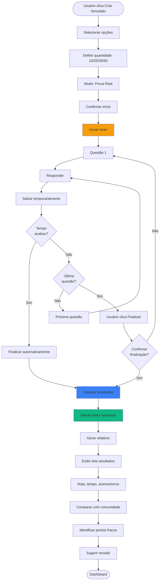

---

### 3.3 Fluxo de Comentários (BÁSICO e PREMIUM)

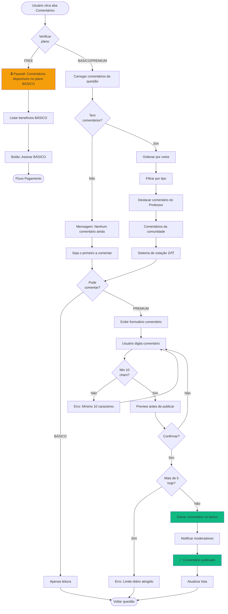

---

### 3.4 Fluxo de Materiais Extras (PREMIUM)

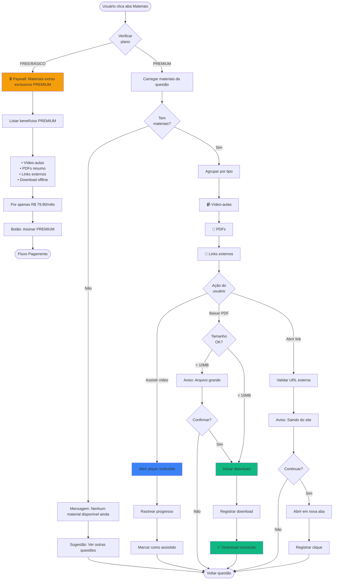

---

## 4. Mnemônicos

### 4.1 Fluxo de Visualizar Mnemônicos

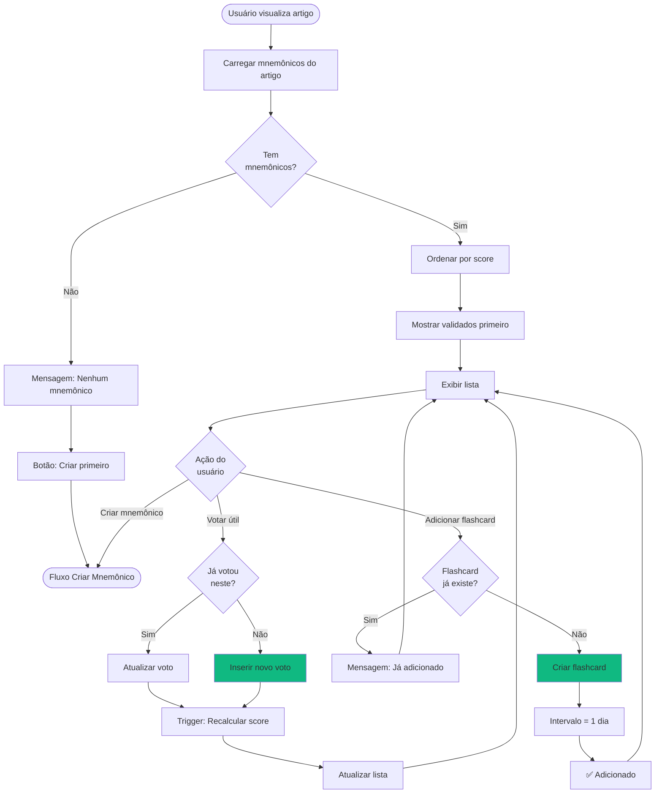

---

### 4.2 Fluxo de Criar Mnemônico

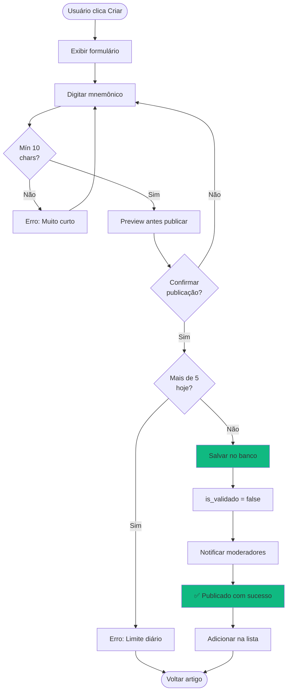

---

### 4.3 Fluxo de Moderação de Mnemônicos (Admin)

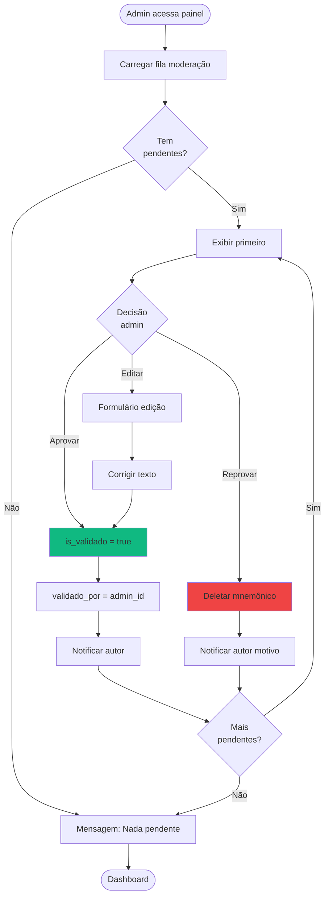

---

## 5. Flashcards e Repetição Espaçada

### 5.1 Fluxo de Criar Flashcard

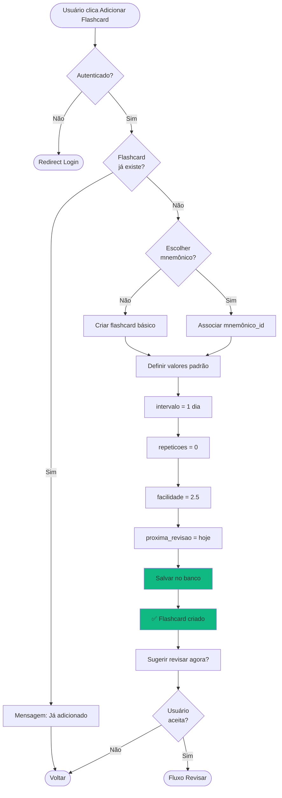

---

### 5.2 Fluxo de Revisar Flashcards (Algoritmo SM-2)

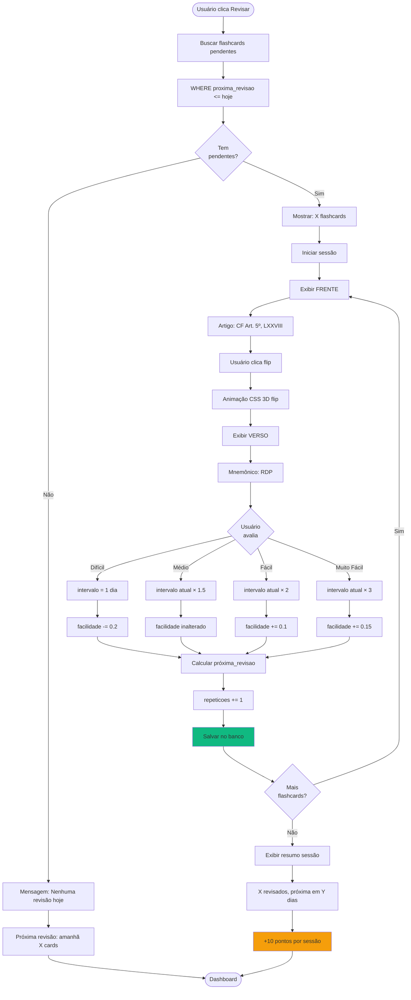

---

## 6. Cadernos Personalizados

### 6.1 Fluxo de Criar Caderno

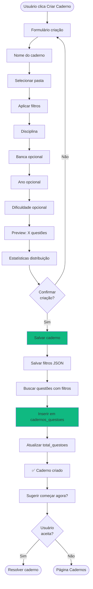

---

### 6.2 Fluxo de Resolver Caderno

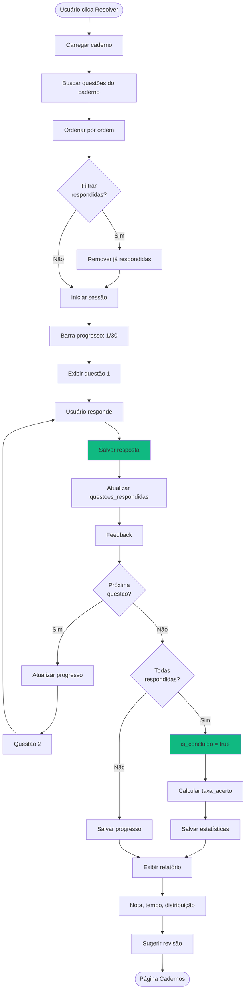

---

## 7. Pagamentos e Assinaturas

### 7.1 Fluxo de Upgrade para Plano Pago

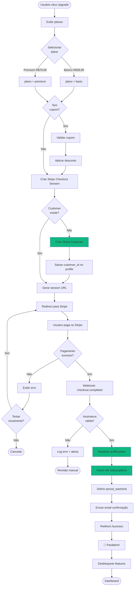

---

### 7.2 Fluxo de Cancelamento de Assinatura

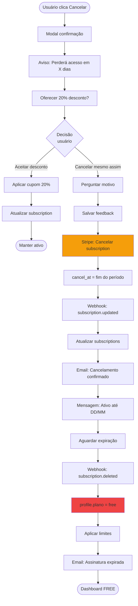

---

### 7.3 Fluxo de Webhook Stripe (Pagamento Falhou)

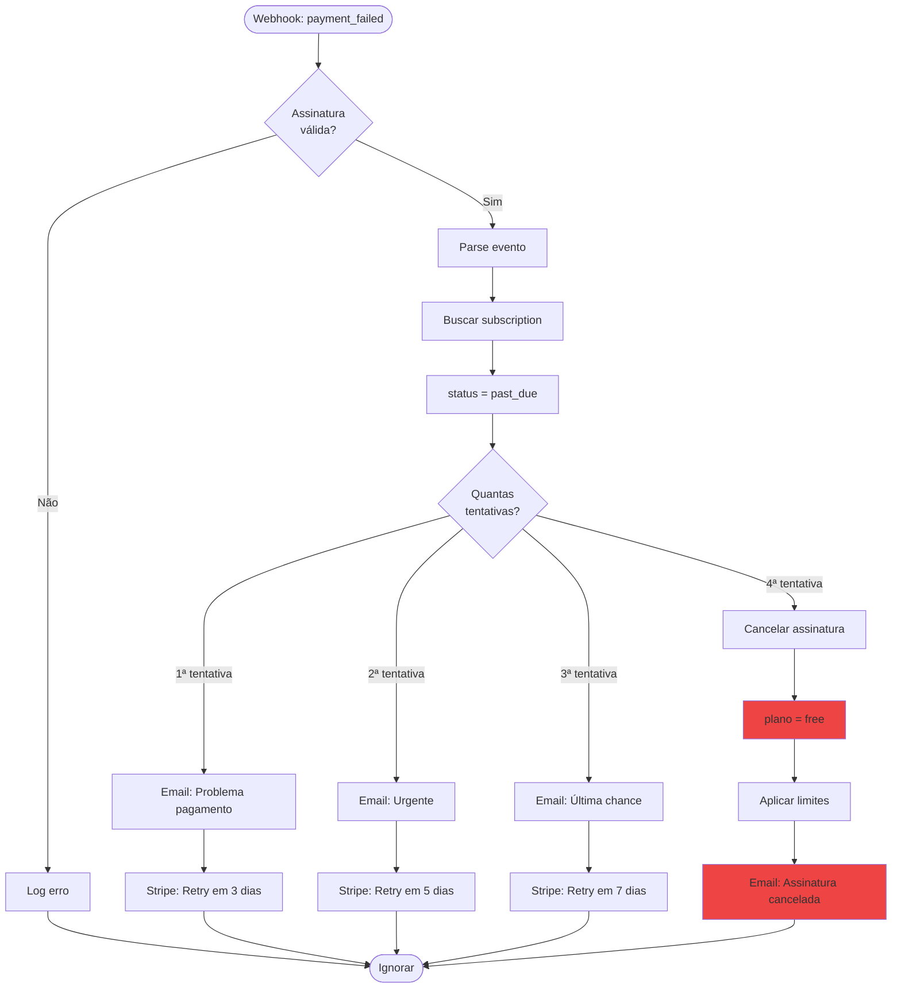

---

## 8. Dashboard e Estatísticas

### 8.1 Fluxo de Carregamento do Dashboard

```mermaid
flowchart TD
Start([Usuário acessa /dashboard]) --> CheckAuth{Autenticado?}
CheckAuth -->|Não| RedirectLogin([Redirect /login])

CheckAuth -->|Sim| LoadProfile[Buscar profile]
LoadProfile --> ParallelQueries{Queries<br/>paralelas}

ParallelQueries --> Q1[Query: Estatísticas gerais]
ParallelQueries --> Q2[Query: Leis em progresso]
ParallelQueries --> Q3[Query: Flashcards pendentes]
ParallelQueries --> Q4[Query: Últimas 7 respostas]
ParallelQueries --> Q5[Query: Conquistas]

Q1 --> WaitAll[Aguardar todas queries]
Q2 --> WaitAll
Q3 --> WaitAll
Q4 --> WaitAll
Q5 --> WaitAll

WaitAll --> ProcessData[Processar dados]
ProcessData --> CalculateStreak[Calcular streak]
CalculateStreak --> UpdateStreak{Precisa<br/>atualizar?}

UpdateStreak -->|Sim| UpdateDB[Atualizar banco]
UpdateDB --> RenderComponents

UpdateStreak -->|Não| RenderComponents[Renderizar componentes]

RenderComponents --> ShowCards[Cards de métricas]
ShowCards --> ShowChart[Gráfico evolução]
ShowChart --> ShowProgress[Progresso leis]
ShowProgress --> ShowPending[Revisões pendentes]
ShowPending --> ShowActions[Ações rápidas]
ShowActions --> End([Dashboard pronto])

style LoadProfile fill:#3B82F6
style RenderComponents fill:#10B981

```

---

### 8.2 Fluxo de Gerar Relatório de Desempenho

```mermaid
flowchart TD
Start([Usuário clica Estatísticas]) --> SelectPeriod[Selecionar período]
SelectPeriod --> Period{Qual
período?}

Period -->|Últimos 7 dias| Set7Days[date_start = hoje - 7]
Period -->|Últimos 30 dias| Set30Days[date_start = hoje - 30]
Period -->|Personalizado| CustomRange[Usuário define range]

Set7Days --> QueryRespostas
Set30Days --> QueryRespostas
CustomRange --> QueryRespostas

QueryRespostas[Buscar respostas do período]
QueryRespostas --> GroupByDisciplina[GROUP BY disciplina]
GroupByDisciplina --> CalculateStats[Calcular estatísticas]

CalculateStats --> CalcTotal[total_respondidas]
CalcTotal --> CalcAcertos[total_acertos]
CalcAcertos --> CalcTaxa[taxa_acerto]
CalcTaxa --> CalcMedia[média_tempo_resposta]

CalcMedia --> GetCommunity[Buscar média comunidade]
GetCommunity --> CompareData[Comparar dados]
CompareData --> IdentifyWeak[Identificar pontos fracos]

IdentifyWeak --> GenerateCharts[Gerar gráficos]
GenerateCharts --> Chart1[Pizza: Distribuição disciplinas]
Chart1 --> Chart2[Barras: Taxa acerto]
Chart2 --> Chart3[Linha: Evolução temporal]

Chart3 --> GenerateInsights[Gerar insights]
GenerateInsights --> Insight1[Você melhorou 15% em X]
Insight1 --> Insight2[Ponto fraco: Y - 45% acerto]
Insight2 --> Insight3[Sugestão: Revisar Z]

Insight3 --> RenderPage[Renderizar página]
RenderPage --> ShowExport[Botão: Exportar PDF]
ShowExport --> End([Estatísticas exibidas])

style CalculateStats fill:#3B82F6
style GenerateInsights fill:#F59E0B

```

---

## 9. Sistema de Inteligência de Bancas

### 9.1 Fluxo de Análise de Banca

```mermaid
flowchart TD
Start([Usuário seleciona Banca + Disciplina]) --> LoadData[Buscar estatisticas_banca_assunto]
LoadData --> HasData{Dados
existem?}

HasData -->|Não| ShowEmpty[Mensagem: Sem dados]
ShowEmpty --> SuggestOther[Sugerir outras bancas]
SuggestOther --> End([Voltar])

HasData -->|Sim| OrderByProb[Ordenar por probabilidade]
OrderByProb --> ShowTop10[Exibir top 10 assuntos]

ShowTop10 --> ForEachAssunto[Para cada assunto]
ForEachAssunto --> DisplayName[Nome do assunto]
DisplayName --> DisplayTotal[Total de questões]
DisplayTotal --> DisplayPercent[Percentual do total]
DisplayPercent --> DisplayDifficulty[Dificuldade]
DisplayDifficulty --> DisplayTrend[Tendência 2 anos]
DisplayTrend --> DisplayProb[Probabilidade %]
DisplayProb --> DisplayArticles[Top artigos cobrados]

DisplayArticles --> CheckUser{Tem<br/>histórico?}
CheckUser -->|Sim| GetUserPerf[Buscar desempenho usuário]
GetUserPerf --> Compare[Comparar com média]
Compare --> ShowComparison[Exibir comparação]

CheckUser -->|Não| ShowAverage[Exibir apenas média]

ShowComparison --> NextAssunto{Mais<br/>assuntos?}
ShowAverage --> NextAssunto

NextAssunto -->|Sim| ForEachAssunto
NextAssunto -->|Não| GenerateRecs[Gerar recomendações]

GenerateRecs --> AnalyzeWeak[Identificar pontos fracos]
AnalyzeWeak --> AnalyzeTrends[Identificar tendências]
AnalyzeTrends --> CreateSuggestions[Criar sugestões]

CreateSuggestions --> Suggest1[Priorizar assunto X: alta prob + você abaixo]
Suggest1 --> Suggest2[Revisar assunto Y: você domina mas tendência crescente]
Suggest2 --> Suggest3[Ignorar assunto Z: baixa prob + você acima]

Suggest3 --> ShowHeatmap[Exibir heatmap artigos]
ShowHeatmap --> ShowChart[Gráfico temporal]
ShowChart --> ButtonAction[Botão: Criar caderno inteligente]
ButtonAction --> End

style GenerateRecs fill:#3B82F6
style CreateSuggestions fill:#F59E0B

```

---

### 9.2 Fluxo de Criar Caderno Inteligente (IA)

```mermaid
flowchart TD
Start([Usuário clica Caderno Inteligente]) --> GetContext[Buscar contexto usuário]
GetContext --> GetConcurso[Concurso alvo]
GetConcurso --> GetEdital[Edital se disponível]
GetEdital --> GetHistorico[Histórico respostas]

GetHistorico --> AnalyzeData[Analisar dados]
AnalyzeData --> GetWeakPoints[Identificar pontos fracos]
GetWeakPoints --> GetBancaStats[Estatísticas da banca]
GetBancaStats --> CrossData[Cruzar dados]

CrossData --> PrioritizeTopics[Priorizar assuntos]
PrioritizeTopics --> CalcScore[Calcular score prioridade]

CalcScore --> Formula[Score = \\n
incidencia_banca × 0.35 +\\n
relevancia_edital × 0.25 +\\n
dificuldade_usuario × 0.25 +\\n
tendencia_crescimento × 0.15]

Formula --> OrderTopics[Ordenar por score DESC]
OrderTopics --> SelectQuestoes[Selecionar questões]

SelectQuestoes --> Distribute[Distribuir por assunto]
Distribute --> BalanceDifficulty[Balancear dificuldade]
BalanceDifficulty --> Mix[40% fácil + 40% médio + 20% difícil]

Mix --> CreateCaderno[Criar caderno]
CreateCaderno --> SetName[Nome: Caderno Inteligente - Concurso X]
SetName --> SaveFilters[Salvar filtros + algoritmo usado]
SaveFilters --> LinkQuestoes[Linkar questões]

LinkQuestoes --> ShowPreview[Exibir preview]
ShowPreview --> ShowDistribution[Distribuição por assunto]
ShowDistribution --> ShowJustification[Justificativa da seleção]
ShowJustification --> ShowExpected[Resultado esperado: +20% taxa acerto]

ShowExpected --> ConfirmCreate{Confirmar<br/>criação?}
ConfirmCreate -->|Não| AdjustFilters[Ajustar filtros]
AdjustFilters --> SelectQuestoes

ConfirmCreate -->|Sim| SaveFinal[Salvar caderno final]
SaveFinal --> ShowSuccess[✅ Caderno criado com IA]
ShowSuccess --> SuggestStart[Começar agora?]
SuggestStart --> End([Resolver caderno])

style AnalyzeData fill:#3B82F6
style CrossData fill:#3B82F6
style CalcScore fill:#F59E0B
style SaveFinal fill:#10B981

```

---

## 10. Administração

### 10.1 Fluxo de Adicionar Nova Questão (Admin)

```mermaid
flowchart TD
Start([Admin clica Adicionar Questão]) --> CheckRole{Role =
admin?}
CheckRole -->|Não| AccessDenied([Erro 403])

CheckRole -->|Sim| ShowForm[Formulário completo]
ShowForm --> InputEnunciado[Enunciado]
InputEnunciado --> Input5Alt[5 Alternativas A-E]
Input5Alt --> SelectGabarito[Selecionar gabarito]
SelectGabarito --> InputExplicacao[Explicação opcional]

InputExplicacao --> SelectBanca[Selecionar banca]
SelectBanca --> SelectOrgao[Selecionar órgão opcional]
SelectOrgao --> SelectDisciplina[Selecionar disciplina]
SelectDisciplina --> SelectArtigo[Associar artigo opcional]
SelectArtigo --> SelectAssuntos[Selecionar assuntos tags]

SelectAssuntos --> InputAno[Ano da prova]
InputAno --> SelectDificuldade[Dificuldade opcional]
SelectDificuldade --> PreviewQuestion[Preview da questão]

PreviewQuestion --> ValidateForm{Validação<br/>Zod}
ValidateForm -->|Erro| ShowErrors[Exibir erros]
ShowErrors --> ShowForm

ValidateForm -->|OK| ConfirmSave{Confirmar<br/>salvamento?}
ConfirmSave -->|Não| ShowForm

ConfirmSave -->|Sim| SaveQuestao[Inserir em questoes]
SaveQuestao --> LinkAssuntos[Inserir em questoes_assuntos]
LinkAssuntos --> UpdateCount[Incrementar contadores]
UpdateCount --> ShowSuccess[✅ Questão adicionada]

ShowSuccess --> NextAction{Próxima<br/>ação?}
NextAction -->|Adicionar outra| ShowForm
NextAction -->|Ver lista| RedirectList([Lista questões])
NextAction -->|Dashboard| RedirectDash([Dashboard admin])

style SaveQuestao fill:#10B981
style LinkAssuntos fill:#10B981

```

---

### 10.2 Fluxo de Importar Questões em Lote (CSV)

```mermaid
flowchart TD
Start([Admin clica Importar CSV]) --> ShowUpload[Form upload arquivo]
ShowUpload --> SelectFile[Usuário seleciona CSV]
SelectFile --> ValidateFile{Arquivo
válido?}

ValidateFile -->|Não| ShowError[Erro: Formato inválido]
ShowError --> ShowUpload

ValidateFile -->|Sim| ReadFile[Ler conteúdo CSV]
ReadFile --> ParseCSV[Parse CSV to JSON]
ParseCSV --> ValidateStructure{Estrutura<br/>correta?}

ValidateStructure -->|Não| ShowErrorFormat[Erro: Colunas obrigatórias faltando]
ShowErrorFormat --> ShowExample[Mostrar exemplo CSV]
ShowExample --> ShowUpload

ValidateStructure -->|Sim| ValidateRows[Validar cada linha]
ValidateRows --> CheckDuplicates[Verificar duplicatas]
CheckDuplicates --> ShowPreview[Preview: X questões válidas]

ShowPreview --> ShowInvalid[Y questões inválidas]
ShowInvalid --> ConfirmImport{Confirmar<br/>importação?}

ConfirmImport -->|Não| Cancel([Cancelar])

ConfirmImport -->|Sim| StartImport[Iniciar importação]
StartImport --> ShowProgress[Barra progresso 0/X]

ShowProgress --> ForEachRow[Para cada linha]
ForEachRow --> InsertQuestao[Inserir questão]
InsertQuestao --> UpdateProgress[Atualizar progresso]
UpdateProgress --> NextRow{Mais<br/>linhas?}

NextRow -->|Sim| ForEachRow
NextRow -->|Não| FinishImport[Finalizar importação]

FinishImport --> ShowResults[Exibir resultados]
ShowResults --> ShowSuccess[✅ X questões importadas]
ShowSuccess --> ShowFailed[❌ Y questões falharam]
ShowFailed --> DownloadLog[Botão: Download log erros]
DownloadLog --> End([Dashboard admin])

style InsertQuestao fill:#10B981
style ShowSuccess fill:#10B981

```

---

## 🎯 Conclusão

Estes fluxogramas cobrem **todos os fluxos críticos** da aplicação. Use como referência para:

1. **Desenvolvimento:** Implementar cada fluxo exatamente como especificado
2. **Testes:** Criar casos de teste baseados nos caminhos
3. **Documentação:** Explicar funcionalidades para novos devs
4. **Debugging:** Identificar onde o fluxo quebrou

---

**Próximos Passos:**

- Consulte `05-COMPONENTES-UI.md` para especificação visual de cada tela
- Consulte `06-API-ENDPOINTS.md` para contratos de API
- Consulte `07-REGRAS-NEGOCIO.md` para regras específicas

---

**Fim do arquivo `04-FLUXOGRAMAS-MERMAID.md`**
