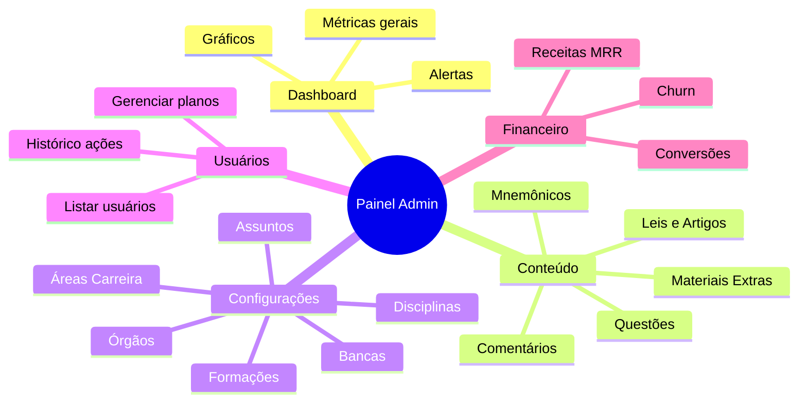
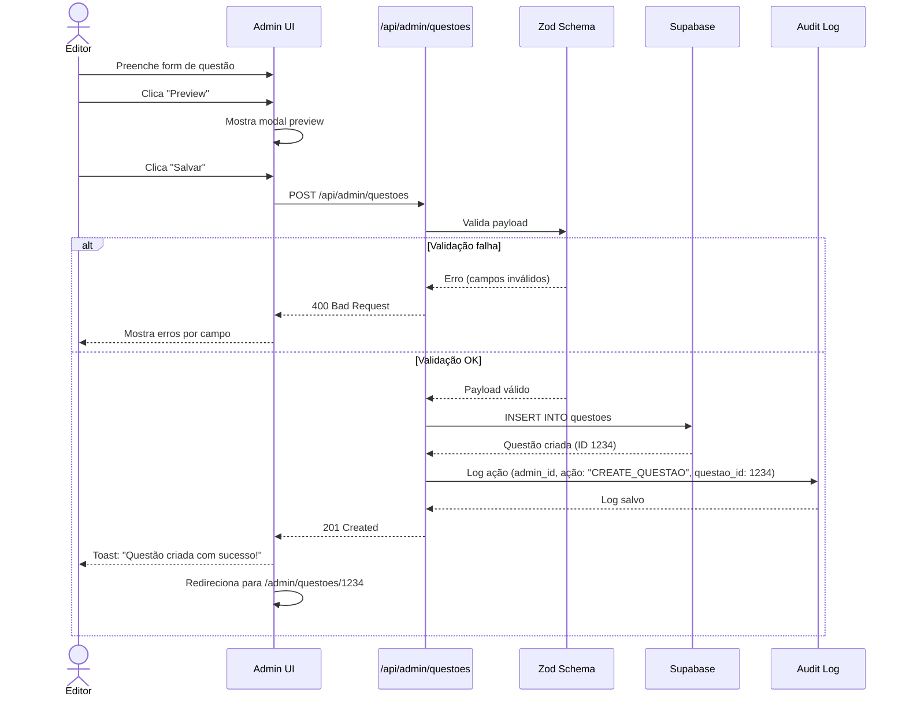
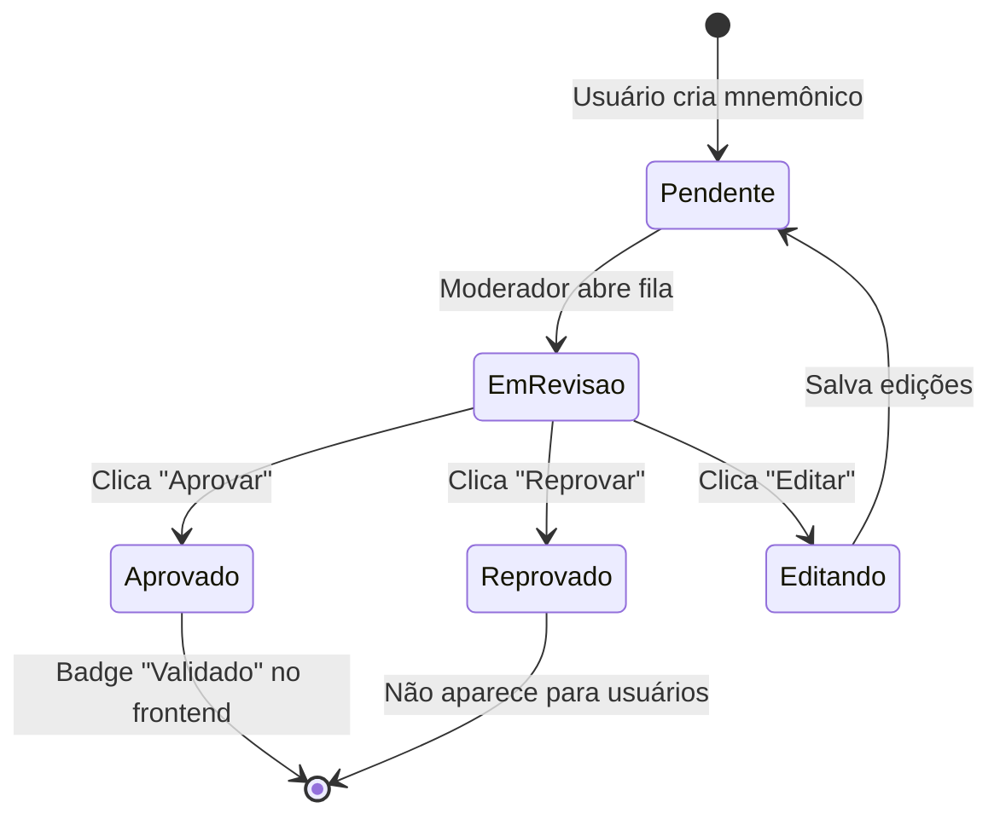
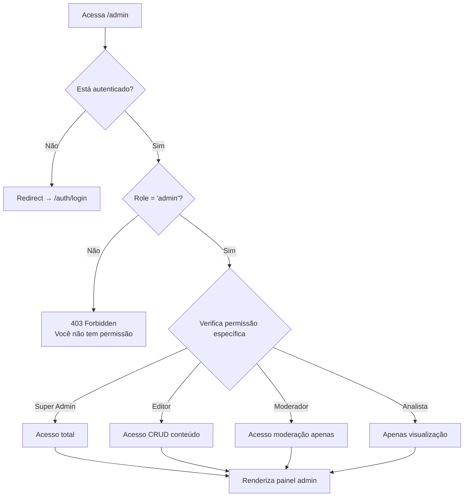
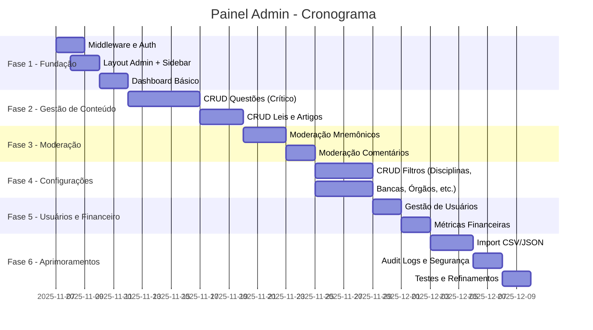

# Painel Administrativo - Especificação Completa

**Versão:** 1.0
**Data:** 06/11/2025
**Status:** Planejamento
**Prioridade:** 🔴 Alta (Crítico para operação)

---

## 📑 Índice

1. [Visão Geral](#1-visão-geral)
2. [Objetivos e Justificativa](#2-objetivos-e-justificativa)
3. [Requisitos Funcionais](#3-requisitos-funcionais)
4. [User Stories](#4-user-stories)
5. [Arquitetura e Fluxos](#5-arquitetura-e-fluxos)
6. [Data Schema](#6-data-schema)
7. [Rotas e Endpoints](#7-rotas-e-endpoints)
8. [Segurança e Permissões](#8-segurança-e-permissões)
9. [Design e Wireframes](#9-design-e-wireframes)
10. [Roadmap de Implementação](#10-roadmap-de-implementação)

---

## 1. Visão Geral

### 1.1 Propósito

O **Painel Administrativo** é a interface de gerenciamento de conteúdo do KAV Concursos, permitindo que administradores:

- **Gerenciem todo o conteúdo**: Leis, artigos, questões, mnemônicos
- **Moderem interações**: Comentários, materiais enviados por usuários
- **Configurem filtros**: Disciplinas, bancas, órgãos, áreas, formações
- **Monitorem métricas**: Usuários, receitas, engajamento, conversão
- **Garantam qualidade**: Validação de conteúdo antes de publicação

### 1.2 Usuários do Sistema

| Papel | Permissões | Quantidade Estimada |
|-------|-----------|---------------------|
| **Super Admin** | Acesso total (CRUD todos os módulos) | 1-2 pessoas |
| **Editor de Conteúdo** | CRUD leis, artigos, questões | 2-5 pessoas |
| **Moderador** | Aprovar/reprovar mnemônicos e comentários | 3-10 pessoas |
| **Analista** | Apenas visualização (read-only) | Ilimitado |

### 1.3 Módulos Principais



---

## 2. Objetivos e Justificativa

### 2.1 Por que o Painel Admin é Crítico?

**Problema atual:**
- ❌ Nenhuma interface para cadastrar questões
- ❌ Filtros estão estáticos (seed data manual)
- ❌ Impossível adicionar novos conteúdos sem SQL direto
- ❌ Sem moderação de conteúdo gerado por usuários

**Com o Painel Admin:**
- ✅ **Escalabilidade**: Adicionar 1000+ questões rapidamente
- ✅ **Qualidade**: Validar conteúdo antes de publicação
- ✅ **Autonomia**: Não depender de desenvolvedores para conteúdo
- ✅ **Segurança**: Auditoria de todas as ações administrativas
- ✅ **Dinamismo**: Filtros 100% gerenciáveis

### 2.2 Impacto no Negócio

| Métrica | Sem Painel Admin | Com Painel Admin |
|---------|------------------|------------------|
| **Tempo para cadastrar 100 questões** | ~8 horas (SQL manual) | ~2 horas (interface) |
| **Risco de erros** | Alto (SQL injection, typos) | Baixo (validação frontend + backend) |
| **Custo operacional** | 1 dev @ R$ 150/h = R$ 1.200 | 1 editor @ R$ 50/h = R$ 100 |
| **Tempo de resposta moderação** | Dias (dev precisa revisar código) | Minutos (interface de aprovação) |

---

## 3. Requisitos Funcionais

### 3.1 Módulo: Dashboard

| ID | Requisito | Prioridade | Descrição |
|----|-----------|------------|-----------|
| **ADMIN-001** | Visão geral de métricas | 🔴 Must Have | Cards com: Total usuários (free/basic/premium), MRR, churn mensal, conversão %, conteúdo pendente |
| **ADMIN-002** | Gráfico de crescimento | 🟡 Should Have | Linha do tempo: Novos usuários/dia, receita/dia (últimos 30 dias) |
| **ADMIN-003** | Alertas de atenção | 🟡 Should Have | Notificações: "20 mnemônicos aguardando moderação", "Churn acima de 15%" |
| **ADMIN-004** | Filtros de período | 🟢 Nice to Have | Selector: Hoje, 7 dias, 30 dias, 90 dias, Ano, Custom |
| **ADMIN-005** | Export de relatórios | 🟢 Nice to Have | Download CSV/PDF com dados selecionados |

### 3.2 Módulo: Questões (CRÍTICO)

| ID | Requisito | Prioridade | Descrição |
|----|-----------|------------|-----------|
| **ADMIN-010** | Listar questões | 🔴 Must Have | Tabela: ID, Enunciado (truncado), Banca, Órgão, Ano, Status (Ativa/Inativa), Ações |
| **ADMIN-011** | Filtros avançados | 🔴 Must Have | Filtrar por: Disciplina, Banca, Órgão, Ano, Dificuldade, Status |
| **ADMIN-012** | Busca por texto | 🔴 Must Have | Pesquisa full-text no enunciado e alternativas |
| **ADMIN-013** | Criar questão | 🔴 Must Have | Form: Enunciado, 5 alternativas (A-E), gabarito, explicação, metadados (banca, órgão, ano, disciplina, assunto, área carreira, formação, escolaridade, dificuldade) |
| **ADMIN-014** | Editar questão | 🔴 Must Have | Mesmo form de criação, pré-preenchido |
| **ADMIN-015** | Deletar questão | 🔴 Must Have | Soft delete (is_active = false), com confirmação |
| **ADMIN-016** | Preview questão | 🔴 Must Have | Modal mostrando como usuário vê a questão |
| **ADMIN-017** | Associar a artigo | 🟡 Should Have | Autocomplete para vincular questão a artigo da lei |
| **ADMIN-018** | Adicionar comentário professor | 🟡 Should Have | Texto markdown, visível para planos BASIC+ |
| **ADMIN-019** | Upload materiais extras | 🟡 Should Have | Vídeos (URL YouTube/Vimeo), PDFs (Supabase Storage) - PREMIUM only |
| **ADMIN-020** | Importar questões CSV/JSON | 🟢 Nice to Have | Bulk upload com validação |
| **ADMIN-021** | Estatísticas questão | 🟢 Nice to Have | Taxa de acerto, tempo médio, comentários, favoritos |

### 3.3 Módulo: Leis e Artigos

| ID | Requisito | Prioridade | Descrição |
|----|-----------|------------|-----------|
| **ADMIN-030** | CRUD de leis | 🔴 Must Have | Criar, editar, deletar leis (nome, número, ano, ementa, link oficial) |
| **ADMIN-031** | CRUD de artigos | 🔴 Must Have | Adicionar artigos a leis (número, texto completo, palavras-chave) |
| **ADMIN-032** | Marcar "Muito Cobrado" | 🔴 Must Have | Flag is_muito_cobrado para destacar no frontend |
| **ADMIN-033** | Importar artigos CSV | 🟡 Should Have | Bulk upload de artigos de uma lei |
| **ADMIN-034** | Associar mnemônicos | 🟢 Nice to Have | Vincular mnemônicos validados a artigos |

### 3.4 Módulo: Mnemônicos (Moderação)

| ID | Requisito | Prioridade | Descrição |
|----|-----------|------------|-----------|
| **ADMIN-040** | Fila de moderação | 🔴 Must Have | Listar mnemônicos com status "pendente" |
| **ADMIN-041** | Aprovar mnemônico | 🔴 Must Have | Marcar como "validado", badge verde no frontend |
| **ADMIN-042** | Reprovar mnemônico | 🔴 Must Have | Marcar como "reprovado", não aparece para usuários |
| **ADMIN-043** | Editar mnemônico | 🔴 Must Have | Corrigir erros antes de aprovar |
| **ADMIN-044** | Deletar spam | 🔴 Must Have | Remover definitivamente conteúdo inadequado |
| **ADMIN-045** | Histórico de moderação | 🟡 Should Have | Log: Quem aprovou/reprovou, quando, motivo |

### 3.5 Módulo: Comentários (Moderação)

| ID | Requisito | Prioridade | Descrição |
|----|-----------|------------|-----------|
| **ADMIN-050** | Fila de comentários reportados | 🔴 Must Have | Listar comentários com flag "reportado" |
| **ADMIN-051** | Deletar comentário | 🔴 Must Have | Remover comentário inadequado |
| **ADMIN-052** | Banir usuário | 🔴 Must Have | Suspender usuário por spam/abuso (temporário ou permanente) |
| **ADMIN-053** | Responder como "Professor" | 🟡 Should Have | Badge especial, destaque visual |
| **ADMIN-054** | Filtrar por tipo | 🟡 Should Have | Todos, Reportados, Respondidos, Sem resposta |

### 3.6 Módulo: Configurações de Filtros

| ID | Requisito | Prioridade | Descrição |
|----|-----------|------------|-----------|
| **ADMIN-060** | CRUD Disciplinas | 🔴 Must Have | Nome, slug, descrição, ícone, ordem, cor |
| **ADMIN-061** | CRUD Bancas | 🔴 Must Have | Nome, sigla, website, logo |
| **ADMIN-062** | CRUD Órgãos | 🔴 Must Have | Nome, sigla, esfera, área, UF, região |
| **ADMIN-063** | CRUD Áreas Carreira | 🔴 Must Have | Nome, slug, descrição, ordem |
| **ADMIN-064** | CRUD Formações | 🔴 Must Have | Nome, slug, área conhecimento, ordem |
| **ADMIN-065** | CRUD Assuntos | 🔴 Must Have | Nome, disciplina_id, parent_id (hierárquico), ordem |
| **ADMIN-066** | Ordenação drag-and-drop | 🟡 Should Have | Reordenar visualmente com @dnd-kit |
| **ADMIN-067** | Ativar/desativar filtros | 🟡 Should Have | Toggle is_active sem deletar |

### 3.7 Módulo: Usuários

| ID | Requisito | Prioridade | Descrição |
|----|-----------|------------|-----------|
| **ADMIN-070** | Listar usuários | 🔴 Must Have | Tabela: Nome, Email, Plano, Data cadastro, Último acesso, Ações |
| **ADMIN-071** | Filtros | 🔴 Must Have | Por plano, data cadastro, status (ativo/inativo) |
| **ADMIN-072** | Buscar usuário | 🔴 Must Have | Por email ou nome |
| **ADMIN-073** | Ver detalhes | 🟡 Should Have | Perfil completo, histórico de respostas, estatísticas |
| **ADMIN-074** | Alterar plano manualmente | 🟡 Should Have | Override plano (ex: dar PREMIUM grátis) |
| **ADMIN-075** | Desativar usuário | 🟡 Should Have | Banir temporariamente (não consegue fazer login) |
| **ADMIN-076** | Histórico de pagamentos | 🟢 Nice to Have | Faturas Stripe |

### 3.8 Módulo: Materiais Extras (PREMIUM)

| ID | Requisito | Prioridade | Descrição |
|----|-----------|------------|-----------|
| **ADMIN-080** | CRUD materiais | 🟡 Should Have | Tipo (vídeo/PDF/link), título, descrição, URL, questão associada |
| **ADMIN-081** | Upload PDFs | 🟡 Should Have | Supabase Storage, max 10 MB |
| **ADMIN-082** | Validação vídeos | 🟡 Should Have | Apenas YouTube/Vimeo URLs |
| **ADMIN-083** | Aprovar materiais enviados | 🟢 Nice to Have | Se usuários puderem sugerir (futura feature) |

---

## 4. User Stories

### 4.1 Como Editor de Conteúdo

```
📝 US-001: Cadastrar Questão
COMO Editor de Conteúdo
QUERO cadastrar uma nova questão de concurso
PARA disponibilizar para os usuários estudarem

CRITÉRIOS DE ACEITAÇÃO:
- [ ] Posso preencher enunciado, 5 alternativas, gabarito
- [ ] Posso selecionar banca, órgão, ano, disciplina, assunto
- [ ] Posso selecionar área carreira, formação, escolaridade, dificuldade
- [ ] Preview mostra exatamente como usuário verá
- [ ] Validação impede envio com campos vazios
- [ ] Confirmação visual de sucesso após salvar
```

```
📝 US-002: Importar Questões em Lote
COMO Editor de Conteúdo
QUERO importar 100+ questões via CSV
PARA economizar tempo de cadastro manual

CRITÉRIOS DE ACEITAÇÃO:
- [ ] Template CSV disponível para download
- [ ] Validação mostra erros por linha
- [ ] Preview das questões antes de confirmar
- [ ] Opção de pular duplicatas
- [ ] Log de importação (X sucessos, Y erros)
```

### 4.2 Como Moderador

```
📝 US-003: Moderar Mnemônico
COMO Moderador
QUERO aprovar/reprovar mnemônicos criados por usuários
PARA garantir qualidade do conteúdo

CRITÉRIOS DE ACEITAÇÃO:
- [ ] Vejo fila ordenada por data de criação
- [ ] Posso ler mnemônico, ver artigo associado
- [ ] Botões claros: Aprovar (verde) / Reprovar (vermelho) / Editar
- [ ] Após aprovar, badge "Validado" aparece no frontend
- [ ] Histórico registra minha ação
```

### 4.3 Como Super Admin

```
📝 US-004: Configurar Nova Banca
COMO Super Admin
QUERO adicionar uma nova banca ao sistema
PARA que editores possam cadastrar questões dessa banca

CRITÉRIOS DE ACEITAÇÃO:
- [ ] Form simples: Nome, Sigla, Website
- [ ] Slug gerado automaticamente (ex: "CESPE" → "cespe")
- [ ] Logo upload opcional
- [ ] Banca aparece instantaneamente no dropdown de criação de questões
- [ ] Validação impede sigla duplicada
```

```
📝 US-005: Visualizar Métricas de Negócio
COMO Super Admin
QUERO ver dashboard com métricas-chave
PARA tomar decisões baseadas em dados

CRITÉRIOS DE ACEITAÇÃO:
- [ ] Cards: Total usuários (free/basic/premium), MRR, churn, conversão
- [ ] Gráfico: Crescimento de usuários (últimos 30 dias)
- [ ] Alertas: Conteúdo pendente moderação, churn acima do normal
- [ ] Filtros de período funcionais
```

---

## 5. Arquitetura e Fluxos

### 5.1 Arquitetura de Alto Nível

```mermaid
graph TB
    subgraph "Frontend - Admin Panel"
        A[Dashboard] --> B[Layout Admin]
        C[Questões] --> B
        D[Leis/Artigos] --> B
        E[Mnemônicos] --> B
        F[Comentários] --> B
        G[Configurações] --> B
        H[Usuários] --> B
    end

    subgraph "Middleware"
        I[Auth Check]
        J[Role Verification]
        K[Audit Log]
    end

    subgraph "Backend API Routes"
        L[/api/admin/questoes]
        M[/api/admin/leis]
        N[/api/admin/mnemonicos]
        O[/api/admin/comentarios]
        P[/api/admin/configuracoes]
        Q[/api/admin/usuarios]
        R[/api/admin/dashboard]
    end

    subgraph "Database - Supabase"
        S[(questoes)]
        T[(leis)]
        U[(mnemonicos)]
        V[(comentarios)]
        W[(profiles)]
        X[(audit_logs)]
    end

    B --> I
    I --> J
    J --> K
    K --> L
    K --> M
    K --> N
    K --> O
    K --> P
    K --> Q
    K --> R

    L --> S
    M --> T
    N --> U
    O --> V
    P --> S
    Q --> W
    R --> W
    K --> X
```

### 5.2 Fluxo: Criar Questão



### 5.3 Fluxo: Moderar Mnemônico



### 5.4 Fluxo: Autenticação Admin



---

## 6. Data Schema

### 6.1 Tabela de Auditoria (Nova)

```sql
-- Tabela para registrar TODAS as ações administrativas
CREATE TABLE admin_audit_logs (
  id BIGSERIAL PRIMARY KEY,
  admin_id UUID NOT NULL REFERENCES profiles(id) ON DELETE SET NULL,
  acao TEXT NOT NULL, -- Ex: "CREATE_QUESTAO", "APPROVE_MNEMONICO", "DELETE_COMENTARIO"
  tabela_afetada TEXT, -- Ex: "questoes", "mnemonicos", "comentarios"
  registro_id INT, -- ID do registro afetado
  dados_anteriores JSONB, -- Estado antes da mudança (para edições/deleções)
  dados_novos JSONB, -- Estado após a mudança
  ip_address TEXT,
  user_agent TEXT,
  created_at TIMESTAMPTZ DEFAULT NOW()
);

-- Índices
CREATE INDEX idx_audit_admin ON admin_audit_logs(admin_id);
CREATE INDEX idx_audit_acao ON admin_audit_logs(acao);
CREATE INDEX idx_audit_tabela ON admin_audit_logs(tabela_afetada, registro_id);
CREATE INDEX idx_audit_created_at ON admin_audit_logs(created_at DESC);

COMMENT ON TABLE admin_audit_logs IS 'Registro de auditoria de todas as ações administrativas';
```

### 6.2 Extensões na Tabela `profiles`

```sql
-- Adicionar campo de role (já existe, mas garantir)
ALTER TABLE profiles
ADD COLUMN IF NOT EXISTS role TEXT DEFAULT 'user'
CHECK (role IN ('user', 'admin', 'super_admin', 'editor', 'moderador', 'analista'));

-- Adicionar campos de controle admin
ALTER TABLE profiles
ADD COLUMN IF NOT EXISTS admin_permissions JSONB DEFAULT '{}',
ADD COLUMN IF NOT EXISTS is_banned BOOLEAN DEFAULT FALSE,
ADD COLUMN IF NOT EXISTS banned_at TIMESTAMPTZ,
ADD COLUMN IF NOT EXISTS banned_reason TEXT;

COMMENT ON COLUMN profiles.admin_permissions IS 'Permissões granulares JSON: {"can_create_questoes": true, "can_moderate": false}';
COMMENT ON COLUMN profiles.is_banned IS 'Usuário banido temporária ou permanentemente';
```

### 6.3 Status de Moderação em Mnemônicos

```sql
-- Adicionar campo status em mnemonicos (se não existir)
ALTER TABLE mnemonicos
ADD COLUMN IF NOT EXISTS status TEXT DEFAULT 'pendente'
CHECK (status IN ('pendente', 'aprovado', 'reprovado'));

ALTER TABLE mnemonicos
ADD COLUMN IF NOT EXISTS moderado_por UUID REFERENCES profiles(id),
ADD COLUMN IF NOT EXISTS moderado_em TIMESTAMPTZ,
ADD COLUMN IF NOT EXISTS motivo_reprovacao TEXT;

CREATE INDEX idx_mnemonicos_status ON mnemonicos(status);
```

### 6.4 Relacionamento: Questões ↔ Materiais Extras

```sql
-- Tabela já existe (migration 20251105), mas garantir estrutura
CREATE TABLE IF NOT EXISTS questoes_materiais_extras (
  id SERIAL PRIMARY KEY,
  questao_id INT NOT NULL REFERENCES questoes(id) ON DELETE CASCADE,
  tipo TEXT NOT NULL CHECK (tipo IN ('video', 'pdf', 'link')),
  titulo TEXT NOT NULL,
  descricao TEXT,
  url TEXT NOT NULL, -- YouTube/Vimeo URL ou caminho Supabase Storage
  ordem INT DEFAULT 0,
  criado_por UUID REFERENCES profiles(id),
  status TEXT DEFAULT 'ativo' CHECK (status IN ('ativo', 'inativo')),
  created_at TIMESTAMPTZ DEFAULT NOW()
);

CREATE INDEX idx_materiais_questao ON questoes_materiais_extras(questao_id);
```

---

## 7. Rotas e Endpoints

### 7.1 Estrutura de Pastas

```
src/app/
├── admin/                          ← NOVO (protegido por middleware)
│   ├── layout.tsx                  → Layout admin (sidebar, header)
│   ├── page.tsx                    → Dashboard principal
│   ├── questoes/
│   │   ├── page.tsx                → Listar questões
│   │   ├── nova/page.tsx           → Criar questão
│   │   └── [id]/page.tsx           → Editar questão
│   ├── leis/
│   │   ├── page.tsx                → Listar leis
│   │   ├── nova/page.tsx           → Criar lei
│   │   ├── [id]/page.tsx           → Editar lei
│   │   └── [id]/artigos/page.tsx   → Artigos da lei
│   ├── mnemonicos/
│   │   ├── page.tsx                → Fila de moderação
│   │   └── [id]/page.tsx           → Moderar mnemônico específico
│   ├── comentarios/
│   │   └── page.tsx                → Fila de comentários reportados
│   ├── configuracoes/
│   │   ├── disciplinas/page.tsx
│   │   ├── bancas/page.tsx
│   │   ├── orgaos/page.tsx
│   │   ├── areas-carreira/page.tsx
│   │   ├── formacoes/page.tsx
│   │   └── assuntos/page.tsx
│   └── usuarios/
│       ├── page.tsx                → Listar usuários
│       └── [id]/page.tsx           → Detalhes usuário

src/app/api/admin/                  ← NOVO (protegido por middleware)
├── questoes/
│   ├── route.ts                    → GET (list), POST (create)
│   ├── [id]/route.ts               → GET, PUT, DELETE
│   ├── import/route.ts             → POST (CSV/JSON bulk)
│   └── preview/route.ts            → POST (preview antes de salvar)
├── leis/
│   ├── route.ts                    → GET (list), POST (create)
│   └── [id]/
│       ├── route.ts                → GET, PUT, DELETE
│       └── artigos/route.ts        → GET, POST (adicionar artigo)
├── mnemonicos/
│   ├── pendentes/route.ts          → GET (fila moderação)
│   └── [id]/
│       ├── aprovar/route.ts        → POST
│       └── reprovar/route.ts       → POST
├── comentarios/
│   ├── reportados/route.ts         → GET (fila)
│   └── [id]/
│       ├── deletar/route.ts        → DELETE
│       └── responder/route.ts      → POST (responder como professor)
├── configuracoes/
│   ├── disciplinas/route.ts        → GET, POST
│   ├── disciplinas/[id]/route.ts   → GET, PUT, DELETE
│   ├── bancas/route.ts             → GET, POST
│   ├── bancas/[id]/route.ts        → GET, PUT, DELETE
│   └── ... (mesma estrutura para outros filtros)
├── usuarios/
│   ├── route.ts                    → GET (list), filtros
│   └── [id]/
│       ├── route.ts                → GET (detalhes)
│       ├── plano/route.ts          → PUT (alterar plano)
│       └── banir/route.ts          → POST (banir), DELETE (desbanir)
└── dashboard/
    └── route.ts                    → GET (métricas para dashboard)
```

### 7.2 Exemplos de Endpoints

#### Criar Questão

```typescript
// POST /api/admin/questoes
// Body (JSON):
{
  "enunciado": "Uma forma de interação social...",
  "alternativa_a": "Competição.",
  "alternativa_b": "Conflito.",
  "alternativa_c": "Disputa.",
  "alternativa_d": "Embate.",
  "alternativa_e": "Cooperação.",
  "gabarito": "B",
  "explicacao": "Alternativa B está correta pois...",
  "banca_id": 1,
  "orgao_id": 5,
  "disciplina_id": 3,
  "assunto_id": 12,
  "area_carreira_id": 2,
  "formacao_id": null,
  "ano": 2023,
  "cargo": "Soldado PM",
  "escolaridade": "medio",
  "dificuldade": "medio"
}

// Response (201 Created):
{
  "id": 1234,
  "message": "Questão criada com sucesso",
  "questao": { /* objeto completo */ }
}
```

#### Listar Questões (com filtros)

```typescript
// GET /api/admin/questoes?disciplina_id=3&banca_id=1&page=1&limit=50
// Response (200 OK):
{
  "questoes": [
    {
      "id": 1234,
      "enunciado": "Uma forma de interação social...",
      "gabarito": "B",
      "banca": { "id": 1, "nome": "CESPE" },
      "orgao": { "id": 5, "nome": "PM-CE" },
      "ano": 2023,
      "is_active": true,
      "total_respostas": 150,
      "taxa_acerto": 68.5,
      "created_at": "2025-11-05T10:30:00Z"
    },
    // ...
  ],
  "pagination": {
    "total": 500,
    "page": 1,
    "limit": 50,
    "pages": 10
  }
}
```

#### Aprovar Mnemônico

```typescript
// POST /api/admin/mnemonicos/[id]/aprovar
// Response (200 OK):
{
  "id": 42,
  "status": "aprovado",
  "moderado_por": "uuid-admin",
  "moderado_em": "2025-11-06T14:20:00Z",
  "message": "Mnemônico aprovado com sucesso"
}
```

#### Métricas Dashboard

```typescript
// GET /api/admin/dashboard?periodo=30d
// Response (200 OK):
{
  "usuarios": {
    "total": 1250,
    "free": 800,
    "basic": 350,
    "premium": 100,
    "novos_periodo": 120
  },
  "financeiro": {
    "mrr": 31450.00, // R$
    "churn_mensal": 12.5, // %
    "conversao_free_pago": 8.2 // %
  },
  "conteudo": {
    "questoes_ativas": 1850,
    "mnemonicos_pendentes": 23,
    "comentarios_reportados": 7
  },
  "grafico_crescimento": [
    { "data": "2025-10-07", "usuarios": 1130 },
    { "data": "2025-10-08", "usuarios": 1142 },
    // ... últimos 30 dias
  ]
}
```

---

## 8. Segurança e Permissões

### 8.1 Middleware de Autenticação

```typescript
// src/middleware.ts (atualizar)
export async function middleware(request: NextRequest) {
  const { pathname } = request.nextUrl

  // Proteger rotas /admin
  if (pathname.startsWith('/admin')) {
    const supabase = createMiddlewareClient({ req: request, res: NextResponse.next() })
    const { data: { user } } = await supabase.auth.getUser()

    if (!user) {
      return NextResponse.redirect(new URL('/auth/login', request.url))
    }

    // Verificar role admin
    const { data: profile } = await supabase
      .from('profiles')
      .select('role, is_banned')
      .eq('id', user.id)
      .single()

    if (profile?.is_banned) {
      return NextResponse.json({ error: 'Conta suspensa' }, { status: 403 })
    }

    if (!['admin', 'super_admin', 'editor', 'moderador'].includes(profile?.role || '')) {
      return NextResponse.json({ error: 'Acesso negado' }, { status: 403 })
    }
  }

  return NextResponse.next()
}
```

### 8.2 Verificação de Permissões Granulares

```typescript
// src/lib/admin/permissions.ts
export const PERMISSIONS = {
  // Questões
  CREATE_QUESTOES: ['super_admin', 'editor'],
  EDIT_QUESTOES: ['super_admin', 'editor'],
  DELETE_QUESTOES: ['super_admin'],

  // Mnemônicos
  MODERATE_MNEMONICOS: ['super_admin', 'editor', 'moderador'],

  // Comentários
  MODERATE_COMENTARIOS: ['super_admin', 'moderador'],

  // Configurações
  EDIT_CONFIGURACOES: ['super_admin'],

  // Usuários
  VIEW_USUARIOS: ['super_admin', 'analista'],
  EDIT_USUARIOS: ['super_admin'],
  BAN_USUARIOS: ['super_admin'],

  // Dashboard
  VIEW_DASHBOARD: ['super_admin', 'analista'],
}

export function hasPermission(userRole: string, permission: keyof typeof PERMISSIONS): boolean {
  return PERMISSIONS[permission].includes(userRole)
}

// Uso em API routes:
// if (!hasPermission(userRole, 'CREATE_QUESTOES')) {
//   return NextResponse.json({ error: 'Sem permissão' }, { status: 403 })
// }
```

### 8.3 RLS Policies (Supabase)

```sql
-- Garantir que apenas admins acessem dados sensíveis
CREATE POLICY "Admins can view all users"
ON profiles FOR SELECT
TO authenticated
USING (
  auth.uid() IN (
    SELECT id FROM profiles WHERE role IN ('admin', 'super_admin', 'analista')
  )
);

-- Audit logs apenas para super_admins
CREATE POLICY "Only super admins can view audit logs"
ON admin_audit_logs FOR SELECT
TO authenticated
USING (
  auth.uid() IN (
    SELECT id FROM profiles WHERE role = 'super_admin'
  )
);
```

### 8.4 Auditoria Automática

```typescript
// src/lib/admin/audit.ts
export async function logAdminAction(params: {
  adminId: string
  acao: string
  tabelaAfetada: string
  registroId: number
  dadosAnteriores?: any
  dadosNovos?: any
  ipAddress: string
  userAgent: string
}) {
  const supabase = createClient()

  await supabase.from('admin_audit_logs').insert({
    admin_id: params.adminId,
    acao: params.acao,
    tabela_afetada: params.tabelaAfetada,
    registro_id: params.registroId,
    dados_anteriores: params.dadosAnteriores,
    dados_novos: params.dadosNovos,
    ip_address: params.ipAddress,
    user_agent: params.userAgent,
  })
}
```

---

## 9. Design e Wireframes

### 9.1 Paleta de Cores Admin

| Elemento | Cor | Uso |
|----------|-----|-----|
| **Background** | `#0a0a0a` | Fundo principal |
| **Sidebar** | `#111111` | Navegação lateral |
| **Cards** | `#1a1a1a` | Containers |
| **Primary (Admin)** | `#3b82f6` (blue-500) | Botões principais, links |
| **Success** | `#10b981` (emerald-500) | Aprovar, sucesso |
| **Danger** | `#ef4444` (red-500) | Deletar, reprovar |
| **Warning** | `#f59e0b` (amber-500) | Alertas |
| **Text** | `#ffffff` / `#d1d5db` | Títulos / corpo |

### 9.2 Layout Principal

```
┌─────────────────────────────────────────────────────────┐
│  KAV ADMIN         [Notificações] [Perfil ▼]           │
├──────────┬─────────────────────────────────────────────┤
│          │                                              │
│ Dashboard│  📊 Dashboard - Visão Geral                 │
│ ────────│                                              │
│ Conteúdo │  ┌─────────┐ ┌─────────┐ ┌─────────┐      │
│ Questões │  │1.250    │ │R$31.450 │ │23       │      │
│ Leis     │  │Usuários │ │MRR      │ │Pendentes│      │
│ Mnemôni. │  └─────────┘ └─────────┘ └─────────┘      │
│ Comentá. │                                              │
│ ────────│  📈 Crescimento (Últimos 30 dias)           │
│ Config.  │  [Gráfico de linha]                         │
│ Discipli.│                                              │
│ Bancas   │  ⚠️ Alertas                                 │
│ Órgãos   │  • 23 mnemônicos aguardando moderação      │
│ ...      │  • Churn mensal em 12.5% (alerta: >15%)    │
│ ────────│                                              │
│ Usuários │                                              │
│ ────────│                                              │
│ Financei.│                                              │
│          │                                              │
└──────────┴─────────────────────────────────────────────┘
```

### 9.3 Tela: Listar Questões

```
┌─────────────────────────────────────────────────────────┐
│ Questões                             [+ Nova Questão]   │
├─────────────────────────────────────────────────────────┤
│ 🔍 Buscar... [Filtros ▼]                               │
│ Disciplina: [Todas ▼] Banca: [Todas ▼] Ano: [Todos ▼] │
├──┬─────────────────────┬───────┬───────┬────────┬──────┤
│ID│Enunciado (trunc.)   │Banca  │Ano    │Acertos │Ações │
├──┼─────────────────────┼───────┼───────┼────────┼──────┤
│42│Uma forma de inter...│CESPE  │2023   │68.5%   │✏️🗑️👁│
│41│O artigo 5º da CF...│FGV    │2024   │45.2%   │✏️🗑️👁│
│40│Segundo a Lei 13.0...│VUNESP │2022   │82.1%   │✏️🗑️👁│
└──┴─────────────────────┴───────┴───────┴────────┴──────┘
  Página 1 de 10       [< Anterior] [Próxima >]
```

### 9.4 Tela: Criar/Editar Questão

```
┌─────────────────────────────────────────────────────────┐
│ Nova Questão                                            │
├─────────────────────────────────────────────────────────┤
│ Enunciado *                                             │
│ ┌─────────────────────────────────────────────────────┐│
│ │                                                       ││
│ │ [Editor de texto rico com formatação]                ││
│ │                                                       ││
│ └─────────────────────────────────────────────────────┘│
│                                                         │
│ Alternativas *                                          │
│ 🅰️ [________________________________]                   │
│ 🅱️ [________________________________]                   │
│ 🅲 [________________________________]                   │
│ 🅳 [________________________________]                   │
│ 🅴 [________________________________]                   │
│                                                         │
│ Gabarito * [B ▼]                                        │
│                                                         │
│ Explicação                                              │
│ ┌─────────────────────────────────────────────────────┐│
│ │ [Markdown editor]                                    ││
│ └─────────────────────────────────────────────────────┘│
│                                                         │
│ ┌─────────────┬─────────────┬─────────────┐           │
│ │Banca *      │Órgão *      │Ano *        │           │
│ │[CESPE ▼]    │[PM-CE ▼]    │[2023]       │           │
│ └─────────────┴─────────────┴─────────────┘           │
│                                                         │
│ ┌─────────────┬─────────────┬─────────────┐           │
│ │Disciplina * │Assunto      │Área Carreira│           │
│ │[Dir.Penal▼] │[Buscar...] │[PM ▼]       │           │
│ └─────────────┴─────────────┴─────────────┘           │
│                                                         │
│ ┌─────────────┬─────────────┬─────────────┐           │
│ │Escolaridade │Formação     │Dificuldade  │           │
│ │[Médio ▼]    │[Nenhuma ▼]  │[Médio ▼]    │           │
│ └─────────────┴─────────────┴─────────────┘           │
│                                                         │
│          [Cancelar] [Preview] [Salvar Questão]         │
└─────────────────────────────────────────────────────────┘
```

### 9.5 Tela: Fila de Moderação (Mnemônicos)

```
┌─────────────────────────────────────────────────────────┐
│ Moderação de Mnemônicos                                 │
├─────────────────────────────────────────────────────────┤
│ 📋 23 mnemônicos pendentes                              │
├─────────────────────────────────────────────────────────┤
│ ┌───────────────────────────────────────────────────┐ │
│ │ CF/88 - Art. 5º, VI                               │ │
│ │ ───────────────────────────────────────────────── │ │
│ │ Criado por: João Silva (@joao.s)                  │ │
│ │ Data: 05/11/2025 14:30                            │ │
│ │                                                    │ │
│ │ Mnemônico:                                         │ │
│ │ "Liberdade de Consciência e Crença"               │ │
│ │ LIBERAL:                                           │ │
│ │ L - Liberdade                                      │ │
│ │ I - Inviolável                                     │ │
│ │ ...                                                │ │
│ │                                                    │ │
│ │ Votos: 👍 12   👎 2                                │ │
│ │                                                    │ │
│ │ [✏️ Editar] [✅ Aprovar] [❌ Reprovar]             │ │
│ └───────────────────────────────────────────────────┘ │
│                                                         │
│ [Próximo mnemônico] (22 restantes)                     │
└─────────────────────────────────────────────────────────┘
```

---

## 10. Roadmap de Implementação

### 10.1 Fases de Desenvolvimento



### 10.2 Fase 1: Fundação (4 dias)

**Objetivo:** Estrutura base do painel admin funcional

**Tarefas:**
- [ ] Atualizar middleware para proteger `/admin/*` e `/api/admin/*`
- [ ] Criar layout admin com sidebar (componentes: `AdminSidebar`, `AdminHeader`)
- [ ] Implementar verificação de role (`role IN ('admin', 'super_admin', 'editor', 'moderador')`)
- [ ] Criar página `/admin` (dashboard básico com cards estáticos)
- [ ] Adicionar navegação no sidebar (links para módulos)

**Entregável:** Admin consegue fazer login e ver dashboard vazio

### 10.3 Fase 2: Gestão de Conteúdo (8 dias) 🔴 CRÍTICO

**Objetivo:** CRUD completo de questões e leis

**Tarefas - Questões:**
- [ ] **Dia 1-2:** Criar página `/admin/questoes` (listar com tabela)
  - Busca, filtros (disciplina, banca, ano)
  - Paginação (50 por página)
  - Ações: Editar, Deletar, Preview
- [ ] **Dia 3-4:** Criar página `/admin/questoes/nova` (form de criação)
  - Form com validação Zod
  - Dropdowns dinâmicos (busca do banco: disciplinas, bancas, órgãos, etc.)
  - Preview modal
- [ ] **Dia 4:** API `/api/admin/questoes` (GET list, POST create)
- [ ] **Dia 5:** API `/api/admin/questoes/[id]` (GET, PUT, DELETE)
  - Soft delete (is_active = false)
  - Audit log de ações

**Tarefas - Leis/Artigos:**
- [ ] **Dia 6-7:** Páginas `/admin/leis` e `/admin/leis/nova`
- [ ] **Dia 8:** Páginas `/admin/leis/[id]` e `/admin/leis/[id]/artigos`
- [ ] APIs correspondentes

**Entregável:** Admin consegue criar, editar, deletar questões e leis

### 10.4 Fase 3: Moderação (5 dias)

**Objetivo:** Aprovar/reprovar mnemônicos e comentários

**Tarefas - Mnemônicos:**
- [ ] **Dia 1:** Adicionar campos `status`, `moderado_por`, `moderado_em` em `mnemonicos`
- [ ] **Dia 2:** Página `/admin/mnemonicos` (fila com status = 'pendente')
- [ ] **Dia 3:** API `/api/admin/mnemonicos/[id]/aprovar` e `reprovar`
- [ ] **Dia 3:** Botões de ação na interface

**Tarefas - Comentários:**
- [ ] **Dia 4:** Adicionar campo `is_reported` em `questoes_comentarios`
- [ ] **Dia 4:** Página `/admin/comentarios` (fila com is_reported = true)
- [ ] **Dia 5:** API `/api/admin/comentarios/[id]/deletar`

**Entregável:** Moderadores conseguem aprovar/reprovar conteúdo

### 10.5 Fase 4: Configurações de Filtros (4 dias)

**Objetivo:** CRUD de todas as tabelas de filtros

**Tarefas:**
- [ ] **Dia 1:** Template genérico de CRUD (reutilizar para todos os filtros)
- [ ] **Dia 2:** Implementar CRUD Disciplinas, Bancas
- [ ] **Dia 3:** Implementar CRUD Órgãos, Áreas Carreira
- [ ] **Dia 4:** Implementar CRUD Formações, Assuntos (hierárquico)

**Entregável:** Admin gerencia todos os filtros dinamicamente

### 10.6 Fase 5: Usuários e Financeiro (4 dias)

**Objetivo:** Visualizar usuários e métricas de negócio

**Tarefas:**
- [ ] **Dia 1-2:** Página `/admin/usuarios` (listar, buscar, filtrar)
- [ ] **Dia 2:** Página `/admin/usuarios/[id]` (detalhes, alterar plano, banir)
- [ ] **Dia 3:** Dashboard com métricas reais (total users, MRR, churn)
- [ ] **Dia 4:** Gráfico de crescimento (Recharts)

**Entregável:** Admin visualiza métricas de negócio

### 10.7 Fase 6: Aprimoramentos (7 dias)

**Objetivo:** Features avançadas e polimento

**Tarefas:**
- [ ] **Dia 1-3:** Import CSV/JSON de questões em lote
- [ ] **Dia 4-5:** Audit logs (tabela + UI para visualizar)
- [ ] **Dia 6-7:** Testes E2E (Playwright), refinamentos UX

**Entregável:** Sistema completo e testado

---

## 11. Considerações Finais

### 11.1 Prioridades

1. 🔴 **P0 (Blocker):** CRUD Questões - Sem isso, nenhum conteúdo novo pode ser adicionado
2. 🔴 **P0 (Blocker):** Moderação Mnemônicos - Qualidade de conteúdo crítica
3. 🟡 **P1 (High):** CRUD Filtros - Necessário para escalabilidade
4. 🟡 **P1 (High):** Dashboard Métricas - Decisões baseadas em dados
5. 🟢 **P2 (Medium):** CRUD Leis/Artigos - Pode usar SQL temporariamente
6. 🟢 **P2 (Medium):** Gestão Usuários - Stripe já gerencia assinaturas
7. ⚪ **P3 (Low):** Import CSV - Nice to have, pode esperar

### 11.2 Estimativa Total

- **Desenvolvimento:** 30-35 dias úteis (~7 semanas)
- **Testes e QA:** +5 dias
- **Total:** ~8 semanas para painel completo

### 11.3 Riscos e Mitigações

| Risco | Probabilidade | Impacto | Mitigação |
|-------|---------------|---------|-----------|
| Atraso no CRUD Questões | Média | 🔴 Alto | Começar por este módulo, priorizar MVP |
| Complexidade RLS Policies | Alta | 🟡 Médio | Testar exaustivamente, documentar |
| Performance com muitas questões | Média | 🟡 Médio | Paginação, índices no banco, cache |
| Integração Audit Logs | Baixa | 🟢 Baixo | Implementar aos poucos, não bloqueia MVP |

### 11.4 Dependências Externas

- ✅ Supabase (já em uso)
- ✅ Shadcn/ui (já em uso)
- ✅ React Query (já em uso)
- 🆕 Recharts (já instalado, usar para gráficos)
- 🆕 @dnd-kit (opcional, para drag-and-drop de ordenação)

---

## 12. Aprovação

**Este documento está pronto para aprovação e implementação.**

Após revisão e aprovação pelo stakeholder (Pedro), iniciaremos o desenvolvimento seguindo o roadmap definido.

**Próximos passos:**
1. ✅ Revisão e aprovação deste documento
2. [ ] Criar issues no GitHub (uma por fase)
3. [ ] Iniciar Fase 1 (Fundação)

---

**Fim do Documento**
